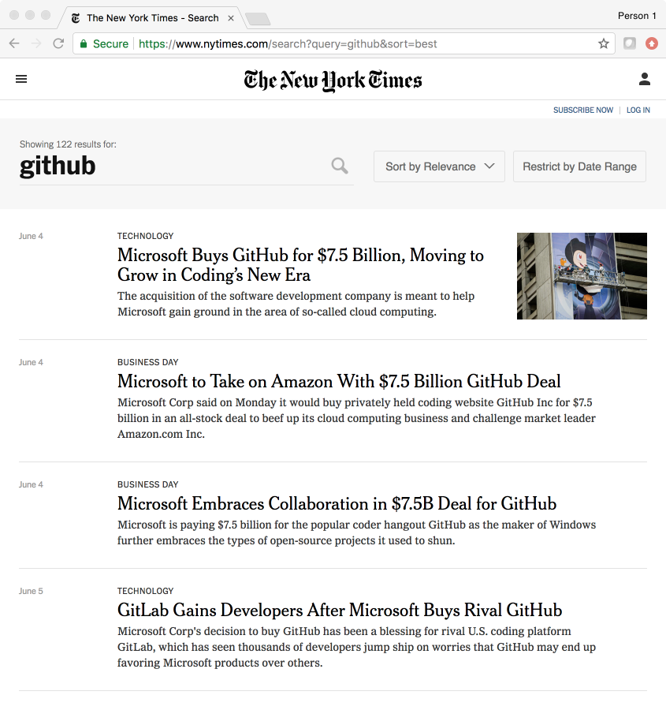
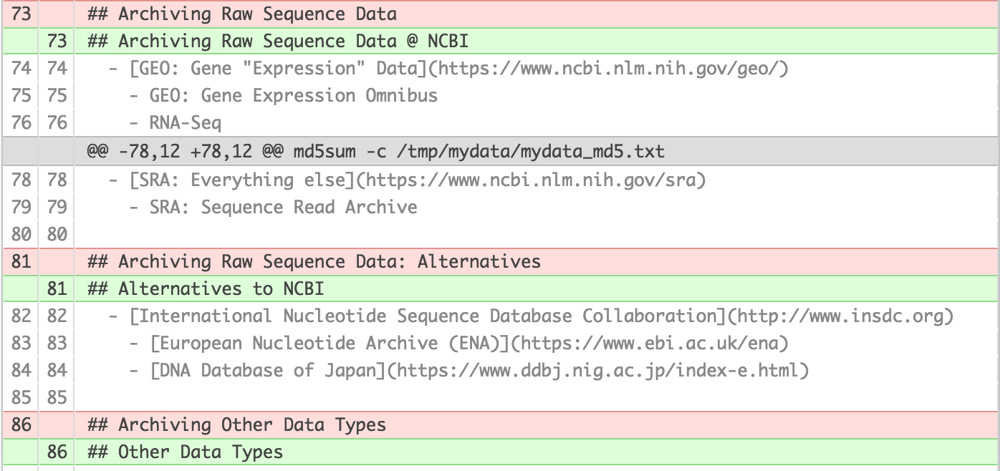

```{r setup, include=FALSE}
knitr::opts_chunk$set(echo = FALSE)
library(readr)
library(tibble)
```

# Start Docker Demo

# Overview

## What is Reproducible Analysis? {.build}
  "Reproducible Analysis is an important part of reproducible research.  Reproducible analysis requires that all components of the analysis be archived so that _anyone_ can independently repeat the analysis and arrive at exactly the same results" 
  - Josh Granek

### Who is "anyone"
> - Labmates
> - Collaborators
> - Competitors
> - Everyone else interested in your work
> - Someone who wants to apply your analysis to their own data
> - You, 6 months from now

## Not Covered Here
  - Reproducibility in the Wet Lab
  - Lots of Other Stuff
  - Many Other Valid Approaches
  - Important Details

## Soapbox
  1. Setup
  2. Stand on

## Reproducible Analysis
  . . . is like eating your vegetables

## Three Pillars of Reproducible Analysis  {.build}
  - Raw Data
  - Compute Environment
  - Analysis Process
  
### Executive Summary
  - Archive the Necessary Components!

# TLDR

# Raw Data

## Care and Handling of Raw Data
  1. Download
  2. Provenance
    - Verify checksum 
    - Generate checksum if it didn't come with the data
  3. Protection
    - Set *READ-ONLY* permissions on data files and data directory
    - Archive ASAP

## Switch to RStudio

```{r include=FALSE}
rawdata_dir = file.path(tempdir(), "rr_raw_data")
dir.create(rawdata_dir)
datafile_1 = file.path(rawdata_dir, "data1.csv")
datafile_2 = file.path(rawdata_dir, "data2.csv")

Sys.setenv(RAWDATA_DIR = rawdata_dir)
Sys.setenv(DATA1 = datafile_1)
Sys.setenv(DATA2 = datafile_2)

write_csv(as_tibble(seq(1,4)), 
          datafile_1)

write_csv(as_tibble(seq(5,8)), 
          datafile_2)
```
## Checksums
```{bash echo=TRUE, include=TRUE}
cd $RAWDATA_DIR
head *.csv
```

## Checksums
```{bash echo=TRUE, include=TRUE}
cd $RAWDATA_DIR
md5sum *.csv
```
  
## Checksums File

```{bash echo=TRUE, include=TRUE}
cd $RAWDATA_DIR
md5sum *.csv > mydata_md5.txt
md5sum -c mydata_md5.txt
```

## Catching Changes
```{bash echo=TRUE, error=TRUE}
sed -i s/7/3/ $DATA2
cat $DATA2
```

```{bash echo=TRUE, error=TRUE}
cd $RAWDATA_DIR
md5sum -c mydata_md5.txt
```


## READ-ONLY

```{bash echo=TRUE}
ls -ld $RAWDATA_DIR
ls -ltr $RAWDATA_DIR
```

```{bash echo=TRUE}
chmod -R a-w $RAWDATA_DIR
ls -ld $RAWDATA_DIR
ls -ltr $RAWDATA_DIR
```

## Preventing Modification

```{bash echo=TRUE, error=TRUE}
echo "This is not the data you are looking for" > $DATA2
```

```{bash echo=TRUE, error=TRUE}
sed s/7/3/ -i $DATA2
```

## Preventing Deletion

```{bash echo=TRUE, error=TRUE}
rm -rf $RAWDATA_DIR
```

```{bash include=FALSE}
# If we don't reset permissions, knitr fails when it is trying to clean up
chmod -R a+w $RAWDATA_DIR
rm -rf $RAWDATA_DIR
```


## Archiving Raw Sequence Data @ NCBI
  - [GEO: Gene "Expression" Data](https://www.ncbi.nlm.nih.gov/geo/)
    - GEO: Gene Expression Omnibus
        - RNA-Seq
        - ChIP-Seq
  - [SRA: Everything else](https://www.ncbi.nlm.nih.gov/sra)
    - SRA: Sequence Read Archive
    
## "Archive First" Movement
  - Free Backup
  - Organize metadata

## Alternatives to NCBI
  - [International Nucleotide Sequence Database Collaboration](http://www.insdc.org)
    - [European Nucleotide Archive (ENA)](https://www.ebi.ac.uk/ena)
    - [DNA Database of Japan](https://www.ddbj.nig.ac.jp/index-e.html)

## Other Data Types
  ???????????????

# Compute Environment
## Reproducible Computing Environment {.build}
### Containerization for Reproducible Research

  - *Versioning*: Lock down the specific computing environment used for an analysis
  - Portability: Runs on Linux, Mac, and Windows
  - Sharebility: [Docker Hub](https://hub.docker.com)/[Singularity Hub](https://singularity-hub.org)
  - Scalability: Runs on a laptop, massive server, and everything in between
  
### Container Platforms
  - [Docker](https://docs.docker.com/get-started/#docker-concepts)
  - [Singularity](http://singularity.lbl.gov/)
  - Etc

## Docker Demo


# Analysis Process
## Analysis Process
  - Script Everything
  - Share Everything
  - Version Control
  
## Script Everything
  - R, Python, Shell Scripts, Rmarkdown, Makefiles, Jupyter, etc
  - [No Excel](https://www.bloomberg.com/news/articles/2013-04-18/faq-reinhart-rogoff-and-the-excel-error-that-changed-history)

## Share Everything
  - Scripts
    - run parameters are embedded
  - Metadata
  - Documentation
  - Manuscript (optional)
  
## Version Control {.build}
### Heard of Version Control?
### Heard of Github? 

```{r, out.height = "600px"}

```

## What is Version Control?
```{r, out.width = "400px"}
knitr::include_graphics("http://www.phdcomics.com/comics/archive/phd101212s.gif")
```

https://stackoverflow.com/a/1408464  

## What is Version Control?
  - Track
  - Backup
  - Rewind
  - Branch
  - Collaborate
  - Publish


## What is Version Control?
```{r, out.height = "400px"}

```
    
## Version Control Software
  - [Git](https://git-scm.com/)
  - [Mercurial](https://www.mercurial-scm.org/)
  - etc

## Git-repository Hosts
  - Github ([Education Discount](https://help.github.com/categories/teaching-and-learning-with-github-education/))
  - [Bitbucket](https://bitbucket.org)
  - [Gitlab](https://about.gitlab.com)
    - [Duke Gitlab](https://gitlab.oit.duke.edu)

# Organization
## My strategy
1. Raw Data directory: must be *read-only*
2. Output directory: everything generated by a script
3. Git repository: Code and metadata 

## Alternatives
1. [ProjectTemplate](https://swcarpentry.github.io/r-novice-gapminder/02-project-intro/#tip-projecttemplate---a-possible-solution)
2. [Resources on Project Directory Organization](https://discuss.ropensci.org/t/resources-on-project-directory-organization/340)
3. [A Quick Guide to Organizing Computational Biology Projects](https://doi.org/10.1371/journal.pcbi.1000424)
4. [Designing projects](https://nicercode.github.io/blog/2013-04-05-projects/)

# Resources
## Version Control
  - [Why should I use version control?](https://stackoverflow.com/questions/1408450/why-should-i-use-version-control)

### Git for Version Control
  - Hands On: [Introduction to Version Control with Git](https://swcarpentry.github.io/git-novice/)
  - [Installing Git](https://swcarpentry.github.io/workshop-template/#git)
  - [Sourcetree: a free GUI for git](https://www.sourcetreeapp.com)
  - [Git in RStudio](https://gitlab.oit.duke.edu/IBIEM/IBIEM_2017_2018/blob/master/git_material/git_overview.md)
  - [Happy Git and GitHub for the useR](http://happygitwithr.com)
  - [Excuse me, do you have a moment to talk about version control?](https://doi.org/10.7287/peerj.preprints.3159v2)

## Scientific Computing Advice
  - [Good enough practices in scientific computing](https://doi.org/10.1371/journal.pcbi.1005510)
  - [Best Practices for Scientific Computing](https://doi.org/10.1371/journal.pbio.1001745)

