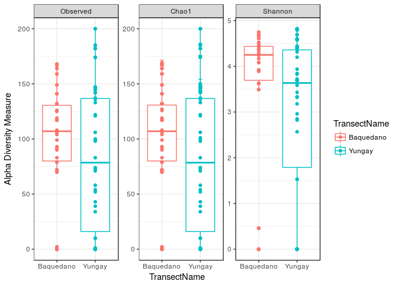
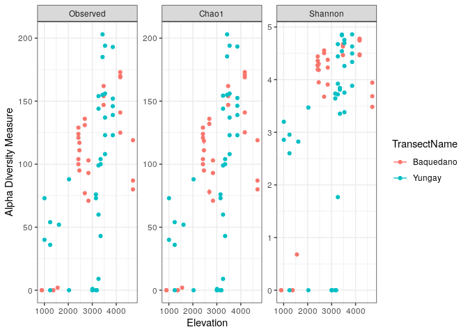
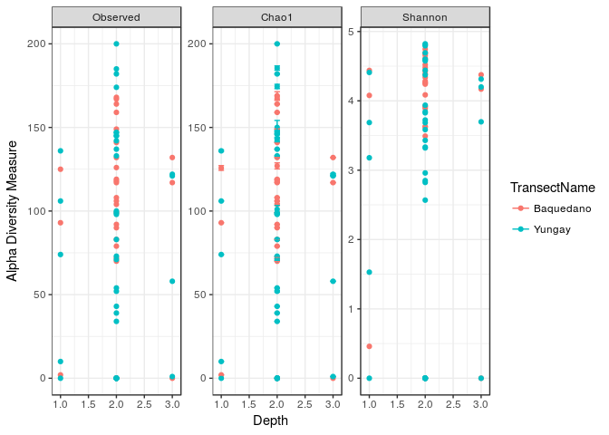

Resources
---------

This draws from [phyloseq plot\_bar
tutorial](https://joey711.github.io/phyloseq/plot_bar-examples.html).

Data
----

This tutorial uses the 10% Atacama subset data (note that for the demux
and dada2 tutorial we used the 1% Atacama subset)

Getting ready
=============

First we load libraries.

``` r
library(readr)
library(phyloseq)
library(ggplot2)
```

``` r
atacama.ps = read_rds(atacama.ps.rds)
print(atacama.ps)
```

    ## phyloseq-class experiment-level object
    ## otu_table()   OTU Table:         [ 3508 taxa and 68 samples ]
    ## sample_data() Sample Data:       [ 68 samples by 22 sample variables ]
    ## tax_table()   Taxonomy Table:    [ 3508 taxa by 7 taxonomic ranks ]

Visualize alpha-diversity
=========================

``` r
plot_richness(atacama.ps, x="TransectName", 
              measures=c("Observed", "Shannon", "Chao1"), color="TransectName") + theme_bw()
```


Alpha-Diversity Boxplots
------------------------

It is a bit hard to compare the two different transects because many
points are overlapping, let’s add a boxplot layer so we can compare the
distribution of alpha-diversity values between the transects.

``` r
plot_richness(atacama.ps, x="TransectName", 
              measures=c("Observed", "Shannon", "Chao1"), color="TransectName") + 
              geom_boxplot() +
              geom_point() +
              theme_bw() 
```



Alpha-Diversity as a function of other parameters
-------------------------------------------------

It also might be interesting to explore whether other parameters have an
effect on alpha-diversity

``` r
sample_variables(atacama.ps)
```

    ##  [1] "BarcodeSequence"                 "LinkerPrimerSequence"           
    ##  [3] "Elevation"                       "ExtractConcen"                  
    ##  [5] "AmpliconConcentration"           "ExtractGroupNo"                 
    ##  [7] "TransectName"                    "SiteName"                       
    ##  [9] "Depth"                           "pH"                             
    ## [11] "TOC"                             "EC"                             
    ## [13] "AverageSoilRelativeHumidity"     "RelativeHumiditySoilHigh"       
    ## [15] "RelativeHumiditySoilLow"         "PercentRelativeHumiditySoil_100"
    ## [17] "AverageSoilTemperature"          "TemperatureSoilHigh"            
    ## [19] "TemperatureSoilLow"              "Vegetation"                     
    ## [21] "PercentCover"                    "Description"

### Elevation

``` r
plot_richness(atacama.ps, x="Elevation", 
              measures=c("Observed", "Shannon", "Chao1"), color="TransectName") + theme_bw()
```



### Depth

``` r
plot_richness(atacama.ps, x="Depth", 
              measures=c("Observed", "Shannon", "Chao1"), color="TransectName") + theme_bw()
```



Session Info
============

Always print `sessionInfo` for reproducibility!

``` r
sessionInfo()
```

    ## R version 3.6.1 (2019-07-05)
    ## Platform: x86_64-pc-linux-gnu (64-bit)
    ## Running under: Ubuntu 18.04.3 LTS
    ## 
    ## Matrix products: default
    ## BLAS:   /usr/lib/x86_64-linux-gnu/blas/libblas.so.3.7.1
    ## LAPACK: /usr/lib/x86_64-linux-gnu/lapack/liblapack.so.3.7.1
    ## 
    ## locale:
    ##  [1] LC_CTYPE=en_US.UTF-8       LC_NUMERIC=C              
    ##  [3] LC_TIME=en_US.UTF-8        LC_COLLATE=en_US.UTF-8    
    ##  [5] LC_MONETARY=en_US.UTF-8    LC_MESSAGES=en_US.UTF-8   
    ##  [7] LC_PAPER=en_US.UTF-8       LC_NAME=C                 
    ##  [9] LC_ADDRESS=C               LC_TELEPHONE=C            
    ## [11] LC_MEASUREMENT=en_US.UTF-8 LC_IDENTIFICATION=C       
    ## 
    ## attached base packages:
    ## [1] stats     graphics  grDevices utils     datasets  methods   base     
    ## 
    ## other attached packages:
    ## [1] ggplot2_3.2.1   phyloseq_1.28.0 readr_1.3.1     knitr_1.24     
    ## 
    ## loaded via a namespace (and not attached):
    ##  [1] tidyselect_0.2.5    xfun_0.9            purrr_0.3.2        
    ##  [4] reshape2_1.4.3      splines_3.6.1       lattice_0.20-38    
    ##  [7] rhdf5_2.28.0        colorspace_1.4-1    vctrs_0.2.0        
    ## [10] htmltools_0.3.6     stats4_3.6.1        mgcv_1.8-28        
    ## [13] yaml_2.2.0          survival_2.44-1.1   rlang_0.4.0        
    ## [16] pillar_1.4.2        withr_2.1.2         glue_1.3.1         
    ## [19] BiocGenerics_0.30.0 foreach_1.4.7       plyr_1.8.4         
    ## [22] stringr_1.4.0       zlibbioc_1.30.0     Biostrings_2.52.0  
    ## [25] munsell_0.5.0       gtable_0.3.0        codetools_0.2-16   
    ## [28] evaluate_0.14       labeling_0.3        Biobase_2.44.0     
    ## [31] permute_0.9-5       IRanges_2.18.2      biomformat_1.12.0  
    ## [34] parallel_3.6.1      Rcpp_1.0.2          backports_1.1.4    
    ## [37] scales_1.0.0        vegan_2.5-6         S4Vectors_0.22.0   
    ## [40] jsonlite_1.6        XVector_0.24.0      hms_0.5.1          
    ## [43] digest_0.6.20       stringi_1.4.3       dplyr_0.8.3        
    ## [46] ade4_1.7-13         grid_3.6.1          tools_3.6.1        
    ## [49] magrittr_1.5        lazyeval_0.2.2      tibble_2.1.3       
    ## [52] cluster_2.1.0       crayon_1.3.4        ape_5.3            
    ## [55] pkgconfig_2.0.2     zeallot_0.1.0       MASS_7.3-51.4      
    ## [58] Matrix_1.2-17       data.table_1.12.2   assertthat_0.2.1   
    ## [61] rmarkdown_1.15      iterators_1.0.12    Rhdf5lib_1.6.0     
    ## [64] R6_2.4.0            multtest_2.40.0     igraph_1.2.4.1     
    ## [67] nlme_3.1-141        compiler_3.6.1

Start Time: 2019-10-18 04:05:05

End Time: 2019-10-18 04:05:14

Total Knit Time: 9 seconds

Total Knit Time: 0.15 minutes
