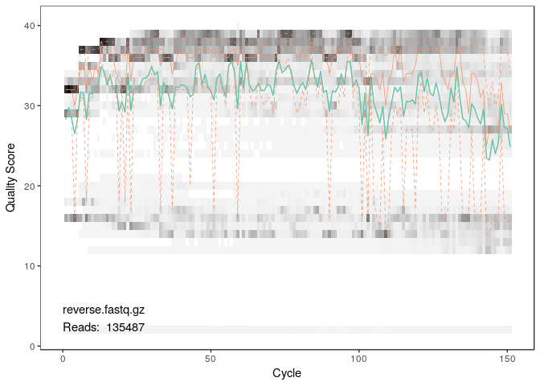

Here we walk through version 1.6 of the DADA2 pipeline on a small
multi-sample dataset. Our starting point is a set of Illumina-sequenced
paired-end fastq files that have been split (or “demultiplexed”) by
sample and from which the barcodes/adapters have already been removed.
The end product is an **amplicon sequence variant (ASV) table**, a
higher-resolution analogue of the traditional “OTU table”, which records
the number of times each amplicon sequence variant was observed in each
sample. We also assign taxonomy to the output sequences, and demonstrate
how the data can be imported into the popular
[phyloseq](https://joey711.github.io/phyloseq/) R package for the
analysis of microbiome data.

------------------------------------------------------------------------

Starting point
==============

This workflow assumes that your sequencing data meets certain criteria:

-   Samples have been demultiplexed, i.e. split into individual
    per-sample fastq files.
-   Non-biological nucleotides have been removed, e.g. primers,
    adapters, linkers, etc.
-   If paired-end sequencing data, the forward and reverse fastq files
    contain reads in matched order.

If these criteria are not true for your data (**are you sure there
aren’t any primers hanging around?**) you need to remedy those issues
before beginning this workflow. See DADA2 FAQ for some recommendations
for common issues.

Getting ready
=============

Load Libraries
--------------

First we load libraries.

``` r
library(dada2)
library(readr)
library(stringr)
library(dplyr)
library(tibble)
library(magrittr)
library(phyloseq)
library(ggplot2)
library(fs)
```

We will work with are the [Atacama data (1%
subsampled)](https://docs.qiime2.org/2018.11/tutorials/atacama-soils/#subsample-data).
This Notebook assumes that you have followed the [Demultiplexing
Tutorial](demultiplex_tutorial.md) to generate demultiplexed FASTQs.

``` r
output.dir = path.expand("~/scratch/atacama_1pct")
demux.dir = file.path(output.dir, "demux")
list.files(demux.dir)
```

    ##   [1] "BAQ1370.1.3.forward.fastq.gz" "BAQ1370.1.3.reverse.fastq.gz"
    ##   [3] "BAQ1552.1.1.forward.fastq.gz" "BAQ1552.1.1.reverse.fastq.gz"
    ##   [5] "BAQ2420.1.1.forward.fastq.gz" "BAQ2420.1.1.reverse.fastq.gz"
    ##   [7] "BAQ2420.1.2.forward.fastq.gz" "BAQ2420.1.2.reverse.fastq.gz"
    ##   [9] "BAQ2420.1.3.forward.fastq.gz" "BAQ2420.1.3.reverse.fastq.gz"
    ##  [11] "BAQ2420.2.forward.fastq.gz"   "BAQ2420.2.reverse.fastq.gz"  
    ##  [13] "BAQ2420.3.forward.fastq.gz"   "BAQ2420.3.reverse.fastq.gz"  
    ##  [15] "BAQ2462.1.forward.fastq.gz"   "BAQ2462.1.reverse.fastq.gz"  
    ##  [17] "BAQ2462.2.forward.fastq.gz"   "BAQ2462.2.reverse.fastq.gz"  
    ##  [19] "BAQ2462.3.forward.fastq.gz"   "BAQ2462.3.reverse.fastq.gz"  
    ##  [21] "BAQ2687.1.forward.fastq.gz"   "BAQ2687.1.reverse.fastq.gz"  
    ##  [23] "BAQ2687.2.forward.fastq.gz"   "BAQ2687.2.reverse.fastq.gz"  
    ##  [25] "BAQ2687.3.forward.fastq.gz"   "BAQ2687.3.reverse.fastq.gz"  
    ##  [27] "BAQ2838.1.forward.fastq.gz"   "BAQ2838.1.reverse.fastq.gz"  
    ##  [29] "BAQ2838.2.forward.fastq.gz"   "BAQ2838.2.reverse.fastq.gz"  
    ##  [31] "BAQ2838.3.forward.fastq.gz"   "BAQ2838.3.reverse.fastq.gz"  
    ##  [33] "BAQ3473.1.forward.fastq.gz"   "BAQ3473.1.reverse.fastq.gz"  
    ##  [35] "BAQ3473.2.forward.fastq.gz"   "BAQ3473.2.reverse.fastq.gz"  
    ##  [37] "BAQ3473.3.forward.fastq.gz"   "BAQ3473.3.reverse.fastq.gz"  
    ##  [39] "BAQ4166.1.1.forward.fastq.gz" "BAQ4166.1.1.reverse.fastq.gz"
    ##  [41] "BAQ4166.1.2.forward.fastq.gz" "BAQ4166.1.2.reverse.fastq.gz"
    ##  [43] "BAQ4166.1.3.forward.fastq.gz" "BAQ4166.1.3.reverse.fastq.gz"
    ##  [45] "BAQ4166.2.forward.fastq.gz"   "BAQ4166.2.reverse.fastq.gz"  
    ##  [47] "BAQ4166.3.forward.fastq.gz"   "BAQ4166.3.reverse.fastq.gz"  
    ##  [49] "BAQ4697.1.forward.fastq.gz"   "BAQ4697.1.reverse.fastq.gz"  
    ##  [51] "BAQ4697.2.forward.fastq.gz"   "BAQ4697.2.reverse.fastq.gz"  
    ##  [53] "BAQ4697.3.forward.fastq.gz"   "BAQ4697.3.reverse.fastq.gz"  
    ##  [55] "forward"                      "reverse"                     
    ##  [57] "split_4"                      "tagged_1"                    
    ##  [59] "tagged_2"                     "tagged_3"                    
    ##  [61] "tagged_4"                     "YUN1005.1.1.forward.fastq.gz"
    ##  [63] "YUN1005.1.1.reverse.fastq.gz" "YUN1005.3.forward.fastq.gz"  
    ##  [65] "YUN1005.3.reverse.fastq.gz"   "YUN1242.1.forward.fastq.gz"  
    ##  [67] "YUN1242.1.reverse.fastq.gz"   "YUN1242.2.forward.fastq.gz"  
    ##  [69] "YUN1242.2.reverse.fastq.gz"   "YUN1242.3.forward.fastq.gz"  
    ##  [71] "YUN1242.3.reverse.fastq.gz"   "YUN1609.1.forward.fastq.gz"  
    ##  [73] "YUN1609.1.reverse.fastq.gz"   "YUN2029.1.forward.fastq.gz"  
    ##  [75] "YUN2029.1.reverse.fastq.gz"   "YUN2029.2.forward.fastq.gz"  
    ##  [77] "YUN2029.2.reverse.fastq.gz"   "YUN2029.3.forward.fastq.gz"  
    ##  [79] "YUN2029.3.reverse.fastq.gz"   "YUN3008.1.3.forward.fastq.gz"
    ##  [81] "YUN3008.1.3.reverse.fastq.gz" "YUN3008.3.forward.fastq.gz"  
    ##  [83] "YUN3008.3.reverse.fastq.gz"   "YUN3153.2.forward.fastq.gz"  
    ##  [85] "YUN3153.2.reverse.fastq.gz"   "YUN3153.3.forward.fastq.gz"  
    ##  [87] "YUN3153.3.reverse.fastq.gz"   "YUN3184.2.forward.fastq.gz"  
    ##  [89] "YUN3184.2.reverse.fastq.gz"   "YUN3259.1.1.forward.fastq.gz"
    ##  [91] "YUN3259.1.1.reverse.fastq.gz" "YUN3259.1.2.forward.fastq.gz"
    ##  [93] "YUN3259.1.2.reverse.fastq.gz" "YUN3259.1.3.forward.fastq.gz"
    ##  [95] "YUN3259.1.3.reverse.fastq.gz" "YUN3259.2.forward.fastq.gz"  
    ##  [97] "YUN3259.2.reverse.fastq.gz"   "YUN3259.3.forward.fastq.gz"  
    ##  [99] "YUN3259.3.reverse.fastq.gz"   "YUN3346.1.forward.fastq.gz"  
    ## [101] "YUN3346.1.reverse.fastq.gz"   "YUN3346.2.forward.fastq.gz"  
    ## [103] "YUN3346.2.reverse.fastq.gz"   "YUN3346.3.forward.fastq.gz"  
    ## [105] "YUN3346.3.reverse.fastq.gz"   "YUN3428.1.forward.fastq.gz"  
    ## [107] "YUN3428.1.reverse.fastq.gz"   "YUN3428.2.forward.fastq.gz"  
    ## [109] "YUN3428.2.reverse.fastq.gz"   "YUN3428.3.forward.fastq.gz"  
    ## [111] "YUN3428.3.reverse.fastq.gz"   "YUN3533.1.1.forward.fastq.gz"
    ## [113] "YUN3533.1.1.reverse.fastq.gz" "YUN3533.1.2.forward.fastq.gz"
    ## [115] "YUN3533.1.2.reverse.fastq.gz" "YUN3533.1.3.forward.fastq.gz"
    ## [117] "YUN3533.1.3.reverse.fastq.gz" "YUN3533.2.forward.fastq.gz"  
    ## [119] "YUN3533.2.reverse.fastq.gz"   "YUN3533.3.forward.fastq.gz"  
    ## [121] "YUN3533.3.reverse.fastq.gz"   "YUN3856.1.1.forward.fastq.gz"
    ## [123] "YUN3856.1.1.reverse.fastq.gz" "YUN3856.1.2.forward.fastq.gz"
    ## [125] "YUN3856.1.2.reverse.fastq.gz" "YUN3856.1.3.forward.fastq.gz"
    ## [127] "YUN3856.1.3.reverse.fastq.gz" "YUN3856.2.forward.fastq.gz"  
    ## [129] "YUN3856.2.reverse.fastq.gz"   "YUN3856.3.forward.fastq.gz"  
    ## [131] "YUN3856.3.reverse.fastq.gz"

If the package successfully loaded and your listed files match those
here, you are ready to go through the DADA2 pipeline.

Set Up Paths
------------

We need to set up a “scratch” directory for saving files that we
generate while running dada2, but don’t need to save long term.

``` r
scratch.dir = file.path(output.dir, "dada2")

data.dir = "/data/tutorial_data/atacama_1pct"
map.file = file.path(data.dir,"sample_metadata.tsv")

# make directory for output
# make directory for output
if (dir_exists(scratch.dir)) {
  dir_delete(scratch.dir)
}
dir_create(scratch.dir)

ps.rds = file.path(scratch.dir, "atacama_1pct.rds")

silva.ref = "/data/references/dada/silva_nr_v132_train_set.fa.gz"
silva.species.ref = "/data/references/dada/silva_species_assignment_v132.fa.gz"
```

 

Filter and Trim
===============

First we read in the names of the fastq files, and perform some string
manipulation to get lists of the forward and reverse fastq files in
matched order:

``` r
# Forward and reverse fastq filenames have format: 
# SAMPLENAME.forward.fastq.gz
# SAMPLENAME.reverse.fastq.gz
fnFs <- sort(list.files(demux.dir, pattern="forward.fastq", full.names = TRUE))
fnRs <- sort(list.files(demux.dir, pattern="reverse.fastq", full.names = TRUE))

# Extract sample names, assuming filenames have format: SAMPLENAME.X.fastq, where X is reverse or forward
# sample.names <- sapply(strsplit(basename(fnFs), "_"), `[`, 1)

forward_fastq_suffix = ".forward.fastq.gz"

sample.names = fnFs %>% 
  basename %>%
  str_replace(forward_fastq_suffix,"") 
```

**<span style="color:red">If using this workflow on your own
data:</span>** The string manipulations may have to be modified if using
a different filename format.

Sanity Check on Lists
---------------------

### Forward FASTQs

``` r
print(fnFs)
```

    ##  [1] "/home/guest/scratch/atacama_1pct/demux/BAQ1370.1.3.forward.fastq.gz"
    ##  [2] "/home/guest/scratch/atacama_1pct/demux/BAQ1552.1.1.forward.fastq.gz"
    ##  [3] "/home/guest/scratch/atacama_1pct/demux/BAQ2420.1.1.forward.fastq.gz"
    ##  [4] "/home/guest/scratch/atacama_1pct/demux/BAQ2420.1.2.forward.fastq.gz"
    ##  [5] "/home/guest/scratch/atacama_1pct/demux/BAQ2420.1.3.forward.fastq.gz"
    ##  [6] "/home/guest/scratch/atacama_1pct/demux/BAQ2420.2.forward.fastq.gz"  
    ##  [7] "/home/guest/scratch/atacama_1pct/demux/BAQ2420.3.forward.fastq.gz"  
    ##  [8] "/home/guest/scratch/atacama_1pct/demux/BAQ2462.1.forward.fastq.gz"  
    ##  [9] "/home/guest/scratch/atacama_1pct/demux/BAQ2462.2.forward.fastq.gz"  
    ## [10] "/home/guest/scratch/atacama_1pct/demux/BAQ2462.3.forward.fastq.gz"  
    ## [11] "/home/guest/scratch/atacama_1pct/demux/BAQ2687.1.forward.fastq.gz"  
    ## [12] "/home/guest/scratch/atacama_1pct/demux/BAQ2687.2.forward.fastq.gz"  
    ## [13] "/home/guest/scratch/atacama_1pct/demux/BAQ2687.3.forward.fastq.gz"  
    ## [14] "/home/guest/scratch/atacama_1pct/demux/BAQ2838.1.forward.fastq.gz"  
    ## [15] "/home/guest/scratch/atacama_1pct/demux/BAQ2838.2.forward.fastq.gz"  
    ## [16] "/home/guest/scratch/atacama_1pct/demux/BAQ2838.3.forward.fastq.gz"  
    ## [17] "/home/guest/scratch/atacama_1pct/demux/BAQ3473.1.forward.fastq.gz"  
    ## [18] "/home/guest/scratch/atacama_1pct/demux/BAQ3473.2.forward.fastq.gz"  
    ## [19] "/home/guest/scratch/atacama_1pct/demux/BAQ3473.3.forward.fastq.gz"  
    ## [20] "/home/guest/scratch/atacama_1pct/demux/BAQ4166.1.1.forward.fastq.gz"
    ## [21] "/home/guest/scratch/atacama_1pct/demux/BAQ4166.1.2.forward.fastq.gz"
    ## [22] "/home/guest/scratch/atacama_1pct/demux/BAQ4166.1.3.forward.fastq.gz"
    ## [23] "/home/guest/scratch/atacama_1pct/demux/BAQ4166.2.forward.fastq.gz"  
    ## [24] "/home/guest/scratch/atacama_1pct/demux/BAQ4166.3.forward.fastq.gz"  
    ## [25] "/home/guest/scratch/atacama_1pct/demux/BAQ4697.1.forward.fastq.gz"  
    ## [26] "/home/guest/scratch/atacama_1pct/demux/BAQ4697.2.forward.fastq.gz"  
    ## [27] "/home/guest/scratch/atacama_1pct/demux/BAQ4697.3.forward.fastq.gz"  
    ## [28] "/home/guest/scratch/atacama_1pct/demux/YUN1005.1.1.forward.fastq.gz"
    ## [29] "/home/guest/scratch/atacama_1pct/demux/YUN1005.3.forward.fastq.gz"  
    ## [30] "/home/guest/scratch/atacama_1pct/demux/YUN1242.1.forward.fastq.gz"  
    ## [31] "/home/guest/scratch/atacama_1pct/demux/YUN1242.2.forward.fastq.gz"  
    ## [32] "/home/guest/scratch/atacama_1pct/demux/YUN1242.3.forward.fastq.gz"  
    ## [33] "/home/guest/scratch/atacama_1pct/demux/YUN1609.1.forward.fastq.gz"  
    ## [34] "/home/guest/scratch/atacama_1pct/demux/YUN2029.1.forward.fastq.gz"  
    ## [35] "/home/guest/scratch/atacama_1pct/demux/YUN2029.2.forward.fastq.gz"  
    ## [36] "/home/guest/scratch/atacama_1pct/demux/YUN2029.3.forward.fastq.gz"  
    ## [37] "/home/guest/scratch/atacama_1pct/demux/YUN3008.1.3.forward.fastq.gz"
    ## [38] "/home/guest/scratch/atacama_1pct/demux/YUN3008.3.forward.fastq.gz"  
    ## [39] "/home/guest/scratch/atacama_1pct/demux/YUN3153.2.forward.fastq.gz"  
    ## [40] "/home/guest/scratch/atacama_1pct/demux/YUN3153.3.forward.fastq.gz"  
    ## [41] "/home/guest/scratch/atacama_1pct/demux/YUN3184.2.forward.fastq.gz"  
    ## [42] "/home/guest/scratch/atacama_1pct/demux/YUN3259.1.1.forward.fastq.gz"
    ## [43] "/home/guest/scratch/atacama_1pct/demux/YUN3259.1.2.forward.fastq.gz"
    ## [44] "/home/guest/scratch/atacama_1pct/demux/YUN3259.1.3.forward.fastq.gz"
    ## [45] "/home/guest/scratch/atacama_1pct/demux/YUN3259.2.forward.fastq.gz"  
    ## [46] "/home/guest/scratch/atacama_1pct/demux/YUN3259.3.forward.fastq.gz"  
    ## [47] "/home/guest/scratch/atacama_1pct/demux/YUN3346.1.forward.fastq.gz"  
    ## [48] "/home/guest/scratch/atacama_1pct/demux/YUN3346.2.forward.fastq.gz"  
    ## [49] "/home/guest/scratch/atacama_1pct/demux/YUN3346.3.forward.fastq.gz"  
    ## [50] "/home/guest/scratch/atacama_1pct/demux/YUN3428.1.forward.fastq.gz"  
    ## [51] "/home/guest/scratch/atacama_1pct/demux/YUN3428.2.forward.fastq.gz"  
    ## [52] "/home/guest/scratch/atacama_1pct/demux/YUN3428.3.forward.fastq.gz"  
    ## [53] "/home/guest/scratch/atacama_1pct/demux/YUN3533.1.1.forward.fastq.gz"
    ## [54] "/home/guest/scratch/atacama_1pct/demux/YUN3533.1.2.forward.fastq.gz"
    ## [55] "/home/guest/scratch/atacama_1pct/demux/YUN3533.1.3.forward.fastq.gz"
    ## [56] "/home/guest/scratch/atacama_1pct/demux/YUN3533.2.forward.fastq.gz"  
    ## [57] "/home/guest/scratch/atacama_1pct/demux/YUN3533.3.forward.fastq.gz"  
    ## [58] "/home/guest/scratch/atacama_1pct/demux/YUN3856.1.1.forward.fastq.gz"
    ## [59] "/home/guest/scratch/atacama_1pct/demux/YUN3856.1.2.forward.fastq.gz"
    ## [60] "/home/guest/scratch/atacama_1pct/demux/YUN3856.1.3.forward.fastq.gz"
    ## [61] "/home/guest/scratch/atacama_1pct/demux/YUN3856.2.forward.fastq.gz"  
    ## [62] "/home/guest/scratch/atacama_1pct/demux/YUN3856.3.forward.fastq.gz"

### Reverse FASTQs

``` r
print(fnRs)
```

    ##  [1] "/home/guest/scratch/atacama_1pct/demux/BAQ1370.1.3.reverse.fastq.gz"
    ##  [2] "/home/guest/scratch/atacama_1pct/demux/BAQ1552.1.1.reverse.fastq.gz"
    ##  [3] "/home/guest/scratch/atacama_1pct/demux/BAQ2420.1.1.reverse.fastq.gz"
    ##  [4] "/home/guest/scratch/atacama_1pct/demux/BAQ2420.1.2.reverse.fastq.gz"
    ##  [5] "/home/guest/scratch/atacama_1pct/demux/BAQ2420.1.3.reverse.fastq.gz"
    ##  [6] "/home/guest/scratch/atacama_1pct/demux/BAQ2420.2.reverse.fastq.gz"  
    ##  [7] "/home/guest/scratch/atacama_1pct/demux/BAQ2420.3.reverse.fastq.gz"  
    ##  [8] "/home/guest/scratch/atacama_1pct/demux/BAQ2462.1.reverse.fastq.gz"  
    ##  [9] "/home/guest/scratch/atacama_1pct/demux/BAQ2462.2.reverse.fastq.gz"  
    ## [10] "/home/guest/scratch/atacama_1pct/demux/BAQ2462.3.reverse.fastq.gz"  
    ## [11] "/home/guest/scratch/atacama_1pct/demux/BAQ2687.1.reverse.fastq.gz"  
    ## [12] "/home/guest/scratch/atacama_1pct/demux/BAQ2687.2.reverse.fastq.gz"  
    ## [13] "/home/guest/scratch/atacama_1pct/demux/BAQ2687.3.reverse.fastq.gz"  
    ## [14] "/home/guest/scratch/atacama_1pct/demux/BAQ2838.1.reverse.fastq.gz"  
    ## [15] "/home/guest/scratch/atacama_1pct/demux/BAQ2838.2.reverse.fastq.gz"  
    ## [16] "/home/guest/scratch/atacama_1pct/demux/BAQ2838.3.reverse.fastq.gz"  
    ## [17] "/home/guest/scratch/atacama_1pct/demux/BAQ3473.1.reverse.fastq.gz"  
    ## [18] "/home/guest/scratch/atacama_1pct/demux/BAQ3473.2.reverse.fastq.gz"  
    ## [19] "/home/guest/scratch/atacama_1pct/demux/BAQ3473.3.reverse.fastq.gz"  
    ## [20] "/home/guest/scratch/atacama_1pct/demux/BAQ4166.1.1.reverse.fastq.gz"
    ## [21] "/home/guest/scratch/atacama_1pct/demux/BAQ4166.1.2.reverse.fastq.gz"
    ## [22] "/home/guest/scratch/atacama_1pct/demux/BAQ4166.1.3.reverse.fastq.gz"
    ## [23] "/home/guest/scratch/atacama_1pct/demux/BAQ4166.2.reverse.fastq.gz"  
    ## [24] "/home/guest/scratch/atacama_1pct/demux/BAQ4166.3.reverse.fastq.gz"  
    ## [25] "/home/guest/scratch/atacama_1pct/demux/BAQ4697.1.reverse.fastq.gz"  
    ## [26] "/home/guest/scratch/atacama_1pct/demux/BAQ4697.2.reverse.fastq.gz"  
    ## [27] "/home/guest/scratch/atacama_1pct/demux/BAQ4697.3.reverse.fastq.gz"  
    ## [28] "/home/guest/scratch/atacama_1pct/demux/YUN1005.1.1.reverse.fastq.gz"
    ## [29] "/home/guest/scratch/atacama_1pct/demux/YUN1005.3.reverse.fastq.gz"  
    ## [30] "/home/guest/scratch/atacama_1pct/demux/YUN1242.1.reverse.fastq.gz"  
    ## [31] "/home/guest/scratch/atacama_1pct/demux/YUN1242.2.reverse.fastq.gz"  
    ## [32] "/home/guest/scratch/atacama_1pct/demux/YUN1242.3.reverse.fastq.gz"  
    ## [33] "/home/guest/scratch/atacama_1pct/demux/YUN1609.1.reverse.fastq.gz"  
    ## [34] "/home/guest/scratch/atacama_1pct/demux/YUN2029.1.reverse.fastq.gz"  
    ## [35] "/home/guest/scratch/atacama_1pct/demux/YUN2029.2.reverse.fastq.gz"  
    ## [36] "/home/guest/scratch/atacama_1pct/demux/YUN2029.3.reverse.fastq.gz"  
    ## [37] "/home/guest/scratch/atacama_1pct/demux/YUN3008.1.3.reverse.fastq.gz"
    ## [38] "/home/guest/scratch/atacama_1pct/demux/YUN3008.3.reverse.fastq.gz"  
    ## [39] "/home/guest/scratch/atacama_1pct/demux/YUN3153.2.reverse.fastq.gz"  
    ## [40] "/home/guest/scratch/atacama_1pct/demux/YUN3153.3.reverse.fastq.gz"  
    ## [41] "/home/guest/scratch/atacama_1pct/demux/YUN3184.2.reverse.fastq.gz"  
    ## [42] "/home/guest/scratch/atacama_1pct/demux/YUN3259.1.1.reverse.fastq.gz"
    ## [43] "/home/guest/scratch/atacama_1pct/demux/YUN3259.1.2.reverse.fastq.gz"
    ## [44] "/home/guest/scratch/atacama_1pct/demux/YUN3259.1.3.reverse.fastq.gz"
    ## [45] "/home/guest/scratch/atacama_1pct/demux/YUN3259.2.reverse.fastq.gz"  
    ## [46] "/home/guest/scratch/atacama_1pct/demux/YUN3259.3.reverse.fastq.gz"  
    ## [47] "/home/guest/scratch/atacama_1pct/demux/YUN3346.1.reverse.fastq.gz"  
    ## [48] "/home/guest/scratch/atacama_1pct/demux/YUN3346.2.reverse.fastq.gz"  
    ## [49] "/home/guest/scratch/atacama_1pct/demux/YUN3346.3.reverse.fastq.gz"  
    ## [50] "/home/guest/scratch/atacama_1pct/demux/YUN3428.1.reverse.fastq.gz"  
    ## [51] "/home/guest/scratch/atacama_1pct/demux/YUN3428.2.reverse.fastq.gz"  
    ## [52] "/home/guest/scratch/atacama_1pct/demux/YUN3428.3.reverse.fastq.gz"  
    ## [53] "/home/guest/scratch/atacama_1pct/demux/YUN3533.1.1.reverse.fastq.gz"
    ## [54] "/home/guest/scratch/atacama_1pct/demux/YUN3533.1.2.reverse.fastq.gz"
    ## [55] "/home/guest/scratch/atacama_1pct/demux/YUN3533.1.3.reverse.fastq.gz"
    ## [56] "/home/guest/scratch/atacama_1pct/demux/YUN3533.2.reverse.fastq.gz"  
    ## [57] "/home/guest/scratch/atacama_1pct/demux/YUN3533.3.reverse.fastq.gz"  
    ## [58] "/home/guest/scratch/atacama_1pct/demux/YUN3856.1.1.reverse.fastq.gz"
    ## [59] "/home/guest/scratch/atacama_1pct/demux/YUN3856.1.2.reverse.fastq.gz"
    ## [60] "/home/guest/scratch/atacama_1pct/demux/YUN3856.1.3.reverse.fastq.gz"
    ## [61] "/home/guest/scratch/atacama_1pct/demux/YUN3856.2.reverse.fastq.gz"  
    ## [62] "/home/guest/scratch/atacama_1pct/demux/YUN3856.3.reverse.fastq.gz"

### Sample Names

``` r
print(sample.names)
```

    ##  [1] "BAQ1370.1.3" "BAQ1552.1.1" "BAQ2420.1.1" "BAQ2420.1.2" "BAQ2420.1.3"
    ##  [6] "BAQ2420.2"   "BAQ2420.3"   "BAQ2462.1"   "BAQ2462.2"   "BAQ2462.3"  
    ## [11] "BAQ2687.1"   "BAQ2687.2"   "BAQ2687.3"   "BAQ2838.1"   "BAQ2838.2"  
    ## [16] "BAQ2838.3"   "BAQ3473.1"   "BAQ3473.2"   "BAQ3473.3"   "BAQ4166.1.1"
    ## [21] "BAQ4166.1.2" "BAQ4166.1.3" "BAQ4166.2"   "BAQ4166.3"   "BAQ4697.1"  
    ## [26] "BAQ4697.2"   "BAQ4697.3"   "YUN1005.1.1" "YUN1005.3"   "YUN1242.1"  
    ## [31] "YUN1242.2"   "YUN1242.3"   "YUN1609.1"   "YUN2029.1"   "YUN2029.2"  
    ## [36] "YUN2029.3"   "YUN3008.1.3" "YUN3008.3"   "YUN3153.2"   "YUN3153.3"  
    ## [41] "YUN3184.2"   "YUN3259.1.1" "YUN3259.1.2" "YUN3259.1.3" "YUN3259.2"  
    ## [46] "YUN3259.3"   "YUN3346.1"   "YUN3346.2"   "YUN3346.3"   "YUN3428.1"  
    ## [51] "YUN3428.2"   "YUN3428.3"   "YUN3533.1.1" "YUN3533.1.2" "YUN3533.1.3"
    ## [56] "YUN3533.2"   "YUN3533.3"   "YUN3856.1.1" "YUN3856.1.2" "YUN3856.1.3"
    ## [61] "YUN3856.2"   "YUN3856.3"

 

Examine quality profiles of forward and reverse reads
-----------------------------------------------------

We start by visualizing the quality profiles of the forward reads:

``` r
list.files(data.dir)
```

    ## [1] "barcodes.fastq.gz"   "forward.fastq.gz"    "md5sum.txt"         
    ## [4] "reverse.fastq.gz"    "sample_metadata.tsv"

``` r
plotQualityProfile(fnFs[1:2])
```


These samples only have one read each, so let’s look at the full dataset
(before demultiplexing)

``` r
plotQualityProfile(file.path(data.dir, "forward.fastq.gz"))
```


The forward reads are good quality. We generally advise trimming the
last few nucleotides to avoid less well-controlled errors that can arise
there. These quality profiles do not suggest that any additional
trimming is needed, so we will truncate the forward reads at position
145 (trimming the last 5 nucleotides).

Now we visualize the quality profile of the reverse reads:

``` r
plotQualityProfile(fnRs[1:2])
```


These samples only have one read each, so let’s look at the full dataset
(before demultiplexing)

``` r
plotQualityProfile(file.path(data.dir, "reverse.fastq.gz"))
```



The reverse reads are of significantly worse quality, and it drops off a
little at the end, which is common in Illumina sequencing. This isn’t
too worrisome, as DADA2 incorporates quality information into its error
model which makes the algorithm [robust to lower quality
sequence](https://twitter.com/bejcal/status/771010634074820608), but
trimming as the average qualities drop off will improve the algorithm’s
sensitivity to rare sequence variants. Based on these profiles, we will
truncate the reverse reads at position 140 where the quality
distribution dips down. As with the forward reads, the first \~10bp are
somewhat lower quality so we will trim 10bp from the left also.

**<span style="color:red">If using this workflow on your own
data:</span>** **Your reads must still overlap after truncation in order
to merge them later!** The tutorial is using 150bp PE V4 sequence data,
so the forward and reverse reads overlap by about 50bp. When using data
with limited overlap `truncLen` must be large enough to maintain
`20 + biological.length.variation` nucleotides of overlap between them.
When using data that overlap more (e.g. 250 PE V4) trimming can be
completely guided by the quality scores.

Non-overlapping primer sets are supported as well with
`mergePairs(..., justConcatenate=TRUE)` when performing merging.

 

Perform filtering and trimming
------------------------------

Assign the filenames for the filtered fastq.gz files.

``` r
filt_path <- file.path(scratch.dir, "filtered") # Place filtered files in filtered/ subdirectory
filtFs <- file.path(filt_path, paste0(sample.names, "_F_filt.fastq.gz"))
filtRs <- file.path(filt_path, paste0(sample.names, "_R_filt.fastq.gz"))
```

We’ll use standard filtering parameters: `maxN=0` (DADA2 requires no
Ns), `truncQ=2`, `rm.phix=TRUE` and `maxEE=2`. The `maxEE` parameter
sets the maximum number of “expected errors” allowed in a read, which is
[a better filter than simply averaging quality
scores](http://www.drive5.com/usearch/manual/expected_errors.html).

### Filter the forward and reverse reads

Filtering (e.g. removing a read because it has overall bad quality) must
be done in such a way that forward and reverse reads are kept in sync:
if a reverse read is filtered out because of low quality, its partner
forward read must *also* be removed, even if it passes. `filterAndTrim`
does this if you pass it the forward and reverse FASTQs.

The first \~10bp of R1 and R2 are somewhat lower quality, which is very
common for Illumina data. Let’s trim this with `trimLeft=10` (note: this
will result in shorter amplicons, where trimming on right end of a read
should not change amplicon length after it is filtered).

``` r
filt.out <- filterAndTrim(fnFs, filtFs, fnRs, filtRs, trimLeft=10, truncLen=c(145,140),
              maxN=0, maxEE=c(2,2), truncQ=2, rm.phix=TRUE,
              compress=TRUE, multithread=FALSE) # On Windows set multithread=FALSE
head(filt.out)
```

    ##                              reads.in reads.out
    ## BAQ1370.1.3.forward.fastq.gz        1         0
    ## BAQ1552.1.1.forward.fastq.gz        1         1
    ## BAQ2420.1.1.forward.fastq.gz      721       672
    ## BAQ2420.1.2.forward.fastq.gz      640       601
    ## BAQ2420.1.3.forward.fastq.gz      656       633
    ## BAQ2420.2.forward.fastq.gz        611       567

**<span style="color:red">If using this workflow on your own
data:</span>** The standard filtering parameters are starting points,
not set in stone. For example, if too few reads are passing the filter,
considering relaxing `maxEE`, perhaps especially on the reverse reads
(eg. `maxEE=c(2,5)`). If you want to speed up downstream computation,
consider tightening `maxEE`. For paired-end reads consider the length of
your amplicon when choosing `truncLen` as your reads must overlap after
truncation in order to merge them later.

**<span style="color:red">If using this workflow on your own
data:</span>** For common ITS amplicon strategies, it is undesirable to
truncate reads to a fixed length due to the large amount of length
variation at that locus. That is OK, just leave out `truncLen`. Make
sure you removed the forward and reverse primers from both the forward
and reverse reads though!

 

Learn the Error Rates
=====================

The DADA2 algorithm depends on a parametric error model (`err`) and
every amplicon dataset has a different set of error rates. The
`learnErrors` method learns the error model from the data, by
alternating estimation of the error rates and inference of sample
composition until they converge on a jointly consistent solution. As in
many optimization problems, the algorithm must begin with an initial
guess, for which the maximum possible error rates in this data are used
(the error rates if only the most abundant sequence is correct and all
the rest are errors).

``` r
errF <- learnErrors(filtFs, multithread=TRUE)
```

    ## Error in derepFastq(fls[[i]], qualityType = qualityType): Not all provided files exist.

``` r
errR <- learnErrors(filtRs, multithread=TRUE)
```

    ## Error in derepFastq(fls[[i]], qualityType = qualityType): Not all provided files exist.

Oops! learnErrors can’t find some of the files! Probably because some
samples ended up with zero reads, so `filterAndTrim` didn’t create empty
filtered FASTQs. Let’s check:

``` r
file_exists(filtFs)
```

    ## /home/guest/scratch/atacama_1pct/dada2/filtered/BAQ1370.1.3_F_filt.fastq.gz 
    ##                                                                       FALSE 
    ## /home/guest/scratch/atacama_1pct/dada2/filtered/BAQ1552.1.1_F_filt.fastq.gz 
    ##                                                                        TRUE 
    ## /home/guest/scratch/atacama_1pct/dada2/filtered/BAQ2420.1.1_F_filt.fastq.gz 
    ##                                                                        TRUE 
    ## /home/guest/scratch/atacama_1pct/dada2/filtered/BAQ2420.1.2_F_filt.fastq.gz 
    ##                                                                        TRUE 
    ## /home/guest/scratch/atacama_1pct/dada2/filtered/BAQ2420.1.3_F_filt.fastq.gz 
    ##                                                                        TRUE 
    ##   /home/guest/scratch/atacama_1pct/dada2/filtered/BAQ2420.2_F_filt.fastq.gz 
    ##                                                                        TRUE 
    ##   /home/guest/scratch/atacama_1pct/dada2/filtered/BAQ2420.3_F_filt.fastq.gz 
    ##                                                                        TRUE 
    ##   /home/guest/scratch/atacama_1pct/dada2/filtered/BAQ2462.1_F_filt.fastq.gz 
    ##                                                                        TRUE 
    ##   /home/guest/scratch/atacama_1pct/dada2/filtered/BAQ2462.2_F_filt.fastq.gz 
    ##                                                                        TRUE 
    ##   /home/guest/scratch/atacama_1pct/dada2/filtered/BAQ2462.3_F_filt.fastq.gz 
    ##                                                                        TRUE 
    ##   /home/guest/scratch/atacama_1pct/dada2/filtered/BAQ2687.1_F_filt.fastq.gz 
    ##                                                                        TRUE 
    ##   /home/guest/scratch/atacama_1pct/dada2/filtered/BAQ2687.2_F_filt.fastq.gz 
    ##                                                                        TRUE 
    ##   /home/guest/scratch/atacama_1pct/dada2/filtered/BAQ2687.3_F_filt.fastq.gz 
    ##                                                                        TRUE 
    ##   /home/guest/scratch/atacama_1pct/dada2/filtered/BAQ2838.1_F_filt.fastq.gz 
    ##                                                                        TRUE 
    ##   /home/guest/scratch/atacama_1pct/dada2/filtered/BAQ2838.2_F_filt.fastq.gz 
    ##                                                                        TRUE 
    ##   /home/guest/scratch/atacama_1pct/dada2/filtered/BAQ2838.3_F_filt.fastq.gz 
    ##                                                                        TRUE 
    ##   /home/guest/scratch/atacama_1pct/dada2/filtered/BAQ3473.1_F_filt.fastq.gz 
    ##                                                                        TRUE 
    ##   /home/guest/scratch/atacama_1pct/dada2/filtered/BAQ3473.2_F_filt.fastq.gz 
    ##                                                                        TRUE 
    ##   /home/guest/scratch/atacama_1pct/dada2/filtered/BAQ3473.3_F_filt.fastq.gz 
    ##                                                                        TRUE 
    ## /home/guest/scratch/atacama_1pct/dada2/filtered/BAQ4166.1.1_F_filt.fastq.gz 
    ##                                                                        TRUE 
    ## /home/guest/scratch/atacama_1pct/dada2/filtered/BAQ4166.1.2_F_filt.fastq.gz 
    ##                                                                        TRUE 
    ## /home/guest/scratch/atacama_1pct/dada2/filtered/BAQ4166.1.3_F_filt.fastq.gz 
    ##                                                                        TRUE 
    ##   /home/guest/scratch/atacama_1pct/dada2/filtered/BAQ4166.2_F_filt.fastq.gz 
    ##                                                                        TRUE 
    ##   /home/guest/scratch/atacama_1pct/dada2/filtered/BAQ4166.3_F_filt.fastq.gz 
    ##                                                                        TRUE 
    ##   /home/guest/scratch/atacama_1pct/dada2/filtered/BAQ4697.1_F_filt.fastq.gz 
    ##                                                                        TRUE 
    ##   /home/guest/scratch/atacama_1pct/dada2/filtered/BAQ4697.2_F_filt.fastq.gz 
    ##                                                                        TRUE 
    ##   /home/guest/scratch/atacama_1pct/dada2/filtered/BAQ4697.3_F_filt.fastq.gz 
    ##                                                                        TRUE 
    ## /home/guest/scratch/atacama_1pct/dada2/filtered/YUN1005.1.1_F_filt.fastq.gz 
    ##                                                                        TRUE 
    ##   /home/guest/scratch/atacama_1pct/dada2/filtered/YUN1005.3_F_filt.fastq.gz 
    ##                                                                        TRUE 
    ##   /home/guest/scratch/atacama_1pct/dada2/filtered/YUN1242.1_F_filt.fastq.gz 
    ##                                                                        TRUE 
    ##   /home/guest/scratch/atacama_1pct/dada2/filtered/YUN1242.2_F_filt.fastq.gz 
    ##                                                                        TRUE 
    ##   /home/guest/scratch/atacama_1pct/dada2/filtered/YUN1242.3_F_filt.fastq.gz 
    ##                                                                        TRUE 
    ##   /home/guest/scratch/atacama_1pct/dada2/filtered/YUN1609.1_F_filt.fastq.gz 
    ##                                                                        TRUE 
    ##   /home/guest/scratch/atacama_1pct/dada2/filtered/YUN2029.1_F_filt.fastq.gz 
    ##                                                                        TRUE 
    ##   /home/guest/scratch/atacama_1pct/dada2/filtered/YUN2029.2_F_filt.fastq.gz 
    ##                                                                        TRUE 
    ##   /home/guest/scratch/atacama_1pct/dada2/filtered/YUN2029.3_F_filt.fastq.gz 
    ##                                                                        TRUE 
    ## /home/guest/scratch/atacama_1pct/dada2/filtered/YUN3008.1.3_F_filt.fastq.gz 
    ##                                                                        TRUE 
    ##   /home/guest/scratch/atacama_1pct/dada2/filtered/YUN3008.3_F_filt.fastq.gz 
    ##                                                                        TRUE 
    ##   /home/guest/scratch/atacama_1pct/dada2/filtered/YUN3153.2_F_filt.fastq.gz 
    ##                                                                        TRUE 
    ##   /home/guest/scratch/atacama_1pct/dada2/filtered/YUN3153.3_F_filt.fastq.gz 
    ##                                                                        TRUE 
    ##   /home/guest/scratch/atacama_1pct/dada2/filtered/YUN3184.2_F_filt.fastq.gz 
    ##                                                                        TRUE 
    ## /home/guest/scratch/atacama_1pct/dada2/filtered/YUN3259.1.1_F_filt.fastq.gz 
    ##                                                                        TRUE 
    ## /home/guest/scratch/atacama_1pct/dada2/filtered/YUN3259.1.2_F_filt.fastq.gz 
    ##                                                                        TRUE 
    ## /home/guest/scratch/atacama_1pct/dada2/filtered/YUN3259.1.3_F_filt.fastq.gz 
    ##                                                                        TRUE 
    ##   /home/guest/scratch/atacama_1pct/dada2/filtered/YUN3259.2_F_filt.fastq.gz 
    ##                                                                        TRUE 
    ##   /home/guest/scratch/atacama_1pct/dada2/filtered/YUN3259.3_F_filt.fastq.gz 
    ##                                                                        TRUE 
    ##   /home/guest/scratch/atacama_1pct/dada2/filtered/YUN3346.1_F_filt.fastq.gz 
    ##                                                                        TRUE 
    ##   /home/guest/scratch/atacama_1pct/dada2/filtered/YUN3346.2_F_filt.fastq.gz 
    ##                                                                        TRUE 
    ##   /home/guest/scratch/atacama_1pct/dada2/filtered/YUN3346.3_F_filt.fastq.gz 
    ##                                                                        TRUE 
    ##   /home/guest/scratch/atacama_1pct/dada2/filtered/YUN3428.1_F_filt.fastq.gz 
    ##                                                                        TRUE 
    ##   /home/guest/scratch/atacama_1pct/dada2/filtered/YUN3428.2_F_filt.fastq.gz 
    ##                                                                        TRUE 
    ##   /home/guest/scratch/atacama_1pct/dada2/filtered/YUN3428.3_F_filt.fastq.gz 
    ##                                                                        TRUE 
    ## /home/guest/scratch/atacama_1pct/dada2/filtered/YUN3533.1.1_F_filt.fastq.gz 
    ##                                                                        TRUE 
    ## /home/guest/scratch/atacama_1pct/dada2/filtered/YUN3533.1.2_F_filt.fastq.gz 
    ##                                                                        TRUE 
    ## /home/guest/scratch/atacama_1pct/dada2/filtered/YUN3533.1.3_F_filt.fastq.gz 
    ##                                                                        TRUE 
    ##   /home/guest/scratch/atacama_1pct/dada2/filtered/YUN3533.2_F_filt.fastq.gz 
    ##                                                                        TRUE 
    ##   /home/guest/scratch/atacama_1pct/dada2/filtered/YUN3533.3_F_filt.fastq.gz 
    ##                                                                        TRUE 
    ## /home/guest/scratch/atacama_1pct/dada2/filtered/YUN3856.1.1_F_filt.fastq.gz 
    ##                                                                        TRUE 
    ## /home/guest/scratch/atacama_1pct/dada2/filtered/YUN3856.1.2_F_filt.fastq.gz 
    ##                                                                        TRUE 
    ## /home/guest/scratch/atacama_1pct/dada2/filtered/YUN3856.1.3_F_filt.fastq.gz 
    ##                                                                        TRUE 
    ##   /home/guest/scratch/atacama_1pct/dada2/filtered/YUN3856.2_F_filt.fastq.gz 
    ##                                                                        TRUE 
    ##   /home/guest/scratch/atacama_1pct/dada2/filtered/YUN3856.3_F_filt.fastq.gz 
    ##                                                                        TRUE

Yep, `BAQ1370.1.3_F_filt.fastq.gz` doesn’t exist, that’s the one with
zero reads after filtering. Let’s clean up filtFs and filtRs to remove
missing files.

``` r
filtFs = filtFs[file_exists(filtFs)]
filtRs = filtRs[file_exists(filtRs)]
```

Now let’s try it again

``` r
errF <- learnErrors(filtFs, multithread=TRUE)
```

    ## 5524875 total bases in 40925 reads from 61 samples will be used for learning the error rates.

``` r
errR <- learnErrors(filtRs, multithread=TRUE)
```

    ## 5320250 total bases in 40925 reads from 61 samples will be used for learning the error rates.

It is always worthwhile, as a sanity check if nothing else, to visualize
the estimated error rates:

``` r
plotErrors(errF, nominalQ=TRUE)
```


The error rates for each possible transition (eg. A-&gt;C, A-&gt;G, …)
are shown. Points are the observed error rates for each consensus
quality score. The black line shows the estimated error rates after
convergence. The red line shows the error rates expected under the
nominal definition of the Q-value. Here the black line (the estimated
rates) fits the observed rates well, and the error rates drop with
increased quality as expected. Everything looks reasonable and we
proceed with confidence.

**<span style="color:red">If using this workflow on your own
data:</span>** Parameter learning is computationally intensive, so by
default the `learnErrors` function uses only a subset of the data (the
first 1M reads). If the plotted error model does not look like a good
fit, try increasing the `nreads` parameter to see if the fit improves.

 

Dereplication
=============

Dereplication combines all identical sequencing reads into into “unique
sequences” with a corresponding “abundance”: the number of reads with
that unique sequence. Dereplication substantially reduces computation
time by eliminating redundant comparisons.

Dereplication in the DADA2 pipeline has one crucial addition from other
pipelines: **DADA2 retains a summary of the quality information
associated with each unique sequence**. The consensus quality profile of
a unique sequence is the average of the positional qualities from the
dereplicated reads. These quality profiles inform the error model of the
subsequent denoising step, significantly increasing DADA2’s accuracy.

**Dereplicate the filtered fastq files**

``` r
derepFs <- derepFastq(filtFs, verbose=TRUE)
derepRs <- derepFastq(filtRs, verbose=TRUE)
# Name the derep-class objects by the sample names
names(derepFs) <- sample.names
```

    ## Error in names(derepFs) <- sample.names: 'names' attribute [62] must be the same length as the vector [61]

``` r
names(derepRs) <- sample.names
```

    ## Error in names(derepRs) <- sample.names: 'names' attribute [62] must be the same length as the vector [61]

Oops, we generated our “sample.names” from the original list of FASTQs,
but we dropped one out. We need to do it again based on the list of
filtered FASTQs

``` r
filtFs %>% 
  basename %>%
  str_replace("_F_filt.fastq.gz","") ->
  sample.names
```

Now let’s try the dereplication again

``` r
derepFs <- derepFastq(filtFs, verbose=TRUE)
derepRs <- derepFastq(filtRs, verbose=TRUE)
# Name the derep-class objects by the sample names
names(derepFs) <- sample.names
names(derepRs) <- sample.names
```

**<span style="color:red">If using this workflow on your own
data:</span>** The tutorial dataset is small enough to easily load into
memory. If your dataset exceeds available RAM, it is preferable to
process samples one-by-one in a streaming fashion: see the [DADA2
Workflow on Big Data](bigdata.html) for an example.

 

Sample Inference
================

We are now ready to apply the core sequence-variant inference algorithm
to the dereplicated data.

**Infer the sequence variants in each sample**

``` r
dadaFs <- dada(derepFs, err=errF, multithread=TRUE)
```

    ## Sample 1 - 1 reads in 1 unique sequences.
    ## Sample 2 - 672 reads in 566 unique sequences.
    ## Sample 3 - 601 reads in 469 unique sequences.
    ## Sample 4 - 633 reads in 468 unique sequences.
    ## Sample 5 - 567 reads in 394 unique sequences.
    ## Sample 6 - 607 reads in 397 unique sequences.
    ## Sample 7 - 805 reads in 519 unique sequences.
    ## Sample 8 - 547 reads in 360 unique sequences.
    ## Sample 9 - 434 reads in 280 unique sequences.
    ## Sample 10 - 820 reads in 662 unique sequences.
    ## Sample 11 - 607 reads in 365 unique sequences.
    ## Sample 12 - 785 reads in 555 unique sequences.
    ## Sample 13 - 542 reads in 432 unique sequences.
    ## Sample 14 - 449 reads in 380 unique sequences.
    ## Sample 15 - 331 reads in 254 unique sequences.
    ## Sample 16 - 1020 reads in 785 unique sequences.
    ## Sample 17 - 790 reads in 655 unique sequences.
    ## Sample 18 - 1121 reads in 740 unique sequences.
    ## Sample 19 - 965 reads in 744 unique sequences.
    ## Sample 20 - 1203 reads in 905 unique sequences.
    ## Sample 21 - 990 reads in 718 unique sequences.
    ## Sample 22 - 1195 reads in 877 unique sequences.
    ## Sample 23 - 1144 reads in 888 unique sequences.
    ## Sample 24 - 783 reads in 413 unique sequences.
    ## Sample 25 - 723 reads in 428 unique sequences.
    ## Sample 26 - 1018 reads in 552 unique sequences.
    ## Sample 27 - 819 reads in 397 unique sequences.
    ## Sample 28 - 387 reads in 169 unique sequences.
    ## Sample 29 - 503 reads in 229 unique sequences.
    ## Sample 30 - 1 reads in 1 unique sequences.
    ## Sample 31 - 688 reads in 306 unique sequences.
    ## Sample 32 - 656 reads in 277 unique sequences.
    ## Sample 33 - 6 reads in 6 unique sequences.
    ## Sample 34 - 792 reads in 394 unique sequences.
    ## Sample 35 - 1 reads in 1 unique sequences.
    ## Sample 36 - 1 reads in 1 unique sequences.
    ## Sample 37 - 1 reads in 1 unique sequences.
    ## Sample 38 - 415 reads in 270 unique sequences.
    ## Sample 39 - 533 reads in 290 unique sequences.
    ## Sample 40 - 1 reads in 1 unique sequences.
    ## Sample 41 - 53 reads in 52 unique sequences.
    ## Sample 42 - 645 reads in 434 unique sequences.
    ## Sample 43 - 251 reads in 180 unique sequences.
    ## Sample 44 - 901 reads in 751 unique sequences.
    ## Sample 45 - 986 reads in 714 unique sequences.
    ## Sample 46 - 606 reads in 379 unique sequences.
    ## Sample 47 - 166 reads in 136 unique sequences.
    ## Sample 48 - 720 reads in 495 unique sequences.
    ## Sample 49 - 970 reads in 723 unique sequences.
    ## Sample 50 - 1278 reads in 934 unique sequences.
    ## Sample 51 - 951 reads in 739 unique sequences.
    ## Sample 52 - 892 reads in 645 unique sequences.
    ## Sample 53 - 846 reads in 681 unique sequences.
    ## Sample 54 - 732 reads in 548 unique sequences.
    ## Sample 55 - 1093 reads in 674 unique sequences.
    ## Sample 56 - 1190 reads in 839 unique sequences.
    ## Sample 57 - 872 reads in 665 unique sequences.
    ## Sample 58 - 917 reads in 598 unique sequences.
    ## Sample 59 - 612 reads in 404 unique sequences.
    ## Sample 60 - 921 reads in 657 unique sequences.
    ## Sample 61 - 1166 reads in 829 unique sequences.

``` r
dadaRs <- dada(derepRs, err=errR, multithread=TRUE)
```

    ## Sample 1 - 1 reads in 1 unique sequences.
    ## Sample 2 - 672 reads in 592 unique sequences.
    ## Sample 3 - 601 reads in 519 unique sequences.
    ## Sample 4 - 633 reads in 527 unique sequences.
    ## Sample 5 - 567 reads in 444 unique sequences.
    ## Sample 6 - 607 reads in 473 unique sequences.
    ## Sample 7 - 805 reads in 624 unique sequences.
    ## Sample 8 - 547 reads in 441 unique sequences.
    ## Sample 9 - 434 reads in 359 unique sequences.
    ## Sample 10 - 820 reads in 715 unique sequences.
    ## Sample 11 - 607 reads in 463 unique sequences.
    ## Sample 12 - 785 reads in 657 unique sequences.
    ## Sample 13 - 542 reads in 473 unique sequences.
    ## Sample 14 - 449 reads in 404 unique sequences.
    ## Sample 15 - 331 reads in 284 unique sequences.
    ## Sample 16 - 1020 reads in 893 unique sequences.
    ## Sample 17 - 790 reads in 711 unique sequences.
    ## Sample 18 - 1121 reads in 905 unique sequences.
    ## Sample 19 - 965 reads in 839 unique sequences.
    ## Sample 20 - 1203 reads in 1066 unique sequences.
    ## Sample 21 - 990 reads in 818 unique sequences.
    ## Sample 22 - 1195 reads in 1021 unique sequences.
    ## Sample 23 - 1144 reads in 985 unique sequences.
    ## Sample 24 - 783 reads in 526 unique sequences.
    ## Sample 25 - 723 reads in 528 unique sequences.
    ## Sample 26 - 1018 reads in 708 unique sequences.
    ## Sample 27 - 819 reads in 552 unique sequences.
    ## Sample 28 - 387 reads in 244 unique sequences.
    ## Sample 29 - 503 reads in 319 unique sequences.
    ## Sample 30 - 1 reads in 1 unique sequences.
    ## Sample 31 - 688 reads in 436 unique sequences.
    ## Sample 32 - 656 reads in 432 unique sequences.
    ## Sample 33 - 6 reads in 6 unique sequences.
    ## Sample 34 - 792 reads in 536 unique sequences.
    ## Sample 35 - 1 reads in 1 unique sequences.
    ## Sample 36 - 1 reads in 1 unique sequences.
    ## Sample 37 - 1 reads in 1 unique sequences.
    ## Sample 38 - 415 reads in 322 unique sequences.
    ## Sample 39 - 533 reads in 377 unique sequences.
    ## Sample 40 - 1 reads in 1 unique sequences.
    ## Sample 41 - 53 reads in 52 unique sequences.
    ## Sample 42 - 645 reads in 505 unique sequences.
    ## Sample 43 - 251 reads in 214 unique sequences.
    ## Sample 44 - 901 reads in 816 unique sequences.
    ## Sample 45 - 986 reads in 801 unique sequences.
    ## Sample 46 - 606 reads in 446 unique sequences.
    ## Sample 47 - 166 reads in 154 unique sequences.
    ## Sample 48 - 720 reads in 572 unique sequences.
    ## Sample 49 - 970 reads in 811 unique sequences.
    ## Sample 50 - 1278 reads in 1048 unique sequences.
    ## Sample 51 - 951 reads in 809 unique sequences.
    ## Sample 52 - 892 reads in 737 unique sequences.
    ## Sample 53 - 846 reads in 751 unique sequences.
    ## Sample 54 - 732 reads in 609 unique sequences.
    ## Sample 55 - 1093 reads in 762 unique sequences.
    ## Sample 56 - 1190 reads in 946 unique sequences.
    ## Sample 57 - 872 reads in 755 unique sequences.
    ## Sample 58 - 917 reads in 683 unique sequences.
    ## Sample 59 - 612 reads in 512 unique sequences.
    ## Sample 60 - 921 reads in 781 unique sequences.
    ## Sample 61 - 1166 reads in 948 unique sequences.

Inspecting the dada-class object returned by dada:

``` r
dadaFs[[1]]
```

    ## dada-class: object describing DADA2 denoising results
    ## 1 sequence variants were inferred from 1 input unique sequences.
    ## Key parameters: OMEGA_A = 1e-40, OMEGA_C = 1e-40, BAND_SIZE = 16

The DADA2 algorithm inferred 1 real sequence variants from the 1 unique
sequences in the first sample. There is much more to the `dada-class`
return object than this (see `help("dada-class")` for some info),
including multiple diagnostics about the quality of each inferred
sequence variant, but that is beyond the scope of an introductory
tutorial.

**<span style="color:red">If using this workflow on your own
data:</span>** All samples are simultaneously loaded into memory in the
tutorial. If you are dealing with datasets that approach or exceed
available RAM, it is preferable to process samples one-by-one in a
streaming fashion: see the **[DADA2 Workflow on Big
Data](bigdata.html)** for an example.

**<span style="color:red">If using this workflow on your own
data:</span>** By default, the `dada` function processes each sample
independently, but pooled processing is available with `pool=TRUE` and
that may give better results for low sampling depths at the cost of
increased computation time. See our [discussion about pooling samples
for sample inference](pool.html).

**<span style="color:red">If using this workflow on your own
data:</span>** DADA2 also supports 454 and Ion Torrent data, but [we
recommend some minor parameter
changes](faq.html#can-i-use-dada2-with-my-454-or-ion-torrent-data) for
those sequencing technologies. The adventurous can explore `?setDadaOpt`
for other adjustable algorithm parameters.

 

Merge paired reads
==================

Spurious sequence variants are further reduced by merging overlapping
reads. The core function here is `mergePairs`, which depends on the
forward and reverse reads being in matching order at the time they were
dereplicated.

**Merge the denoised forward and reverse reads**:

``` r
mergers <- mergePairs(dadaFs, derepFs, dadaRs, derepRs, verbose=TRUE)
# Inspect the merger data.frame from the first sample
head(mergers[[2]])
```

    ##                                                                                                                                                                                                                                     sequence
    ## 1  GCGAGCGTTGTCCGGAATTATTGGGCGTAAAGAGCGTGTAGGCGGTTCGGTAAGTCTGCCGTGAAAACCTGGGGCTCAACCCCGGGCGTGCGGTGGATACTGCCGGGCTAGAGGATGGTAGAGGCGAGTGGAATTCCCGGTGTAGCGGTGAAATGCGCAGATATCGGGAGGAACACCAGTAGCGAAGGCGGCTCGCTGGGCCATTCCTGACGCTGAGACGCGAAAGCTAGGGG
    ## 2  GCAAGCGTTGTCCGGAATCATTGGGCGTAAAGAGCGCGTAGGCGGCCCGACAAGTCCGCTGTGAAAGTCAGGGGCTTAACCCTTGAATGCCGGTGGATACTGTCGGGCTAGAGTCCGGAAGAGGCGAGTGGAATTCCTGGTGTAGCGGTGAAATGCGCAGATATCAGGAGGAACACCGATGGCGAAGGCAGCTCGCTGGGACGGTACTGACGCTGAGGCGCGAAAGCGTGGGG
    ## 3  GCTAGCGTTGTTCGGAATCACTGGGCGTAAAGGGCGCGTAGGCGGCTTTGTAAGTCGGGGGTGAAAGCCTGTGGCTCAACCACAGAATTGCCTTCGATACTGCATGGCTTGAGACCGGAAGAGGTAAGTGGAACTGCGAGTGTAGAGGTGAAATGCGTAGATATTCGCAAGAACACCAGTGGCGAAGGCGGCTTACTGGTCCGGATCTGACGCTGAGGCGCGAAAGCGTGGGG
    ## 6  GCAAGCGTTGTCCGGAATTATTGGGCGTAAAGCGCGCGCAGGCGGTTTCTTAAGTCTGATGTGAAAGCCCACGGCTCAACCGTGGAGGGTCATTGGAAACTGGGAAACTTGAGTGCAGAAGAGGAGAGTGGAATTCCACGTGTAGCGGTGAAATGCGTAGAGATGTGGAGGAACACCAGTGGCGAAGGCGACTCTCTGGTCTGTAACTGACGCTGAGGCGCGAAAGCGTGGGG
    ## 9  GCAAGCGTTGTCCGGAATTATTGGGCGTAAAGCGCGCGCAGGCGGCCTATTAAGTCTGATGTGAAAGCCCACGGCTCAACCGTGGAGGGCCATTGGAAACTGGTAGGCTTGAGTGCAGGAGAGGAGAGCGGAATTCCCGGTGTAGCGGTGAAATGCGTAGATATCGGGAGGAACACCCGTGGCGAAGGCGGCTCTCTGGCCTGTAACTGACGCTGAGGCGCGAAAGCGTGGGG
    ## 10 GCGAGCGTTGTCCGGAATCACTGGGCGTAAAGGGCGCGTAGGCGGCCTGATAAGTAGGGGGTGAAATCCTGCGGCTTAACCGCAGGGCTGCCTTCTAAACTGTCAGGCTCGAGCACAGTAGAGGCAGGTGGAATTCCCGGTGTAGCGGTGGAATGCGTAGAGATCGGGAAGAACATCAGTGGCGAAGGCGGCCTGCTGGGCTGTTGCTGACGCTGAGGCGCGACAGCGTGGGG
    ##    abundance forward reverse nmatch nmismatch nindel prefer accept
    ## 1         55       2       1     32         0      0      2   TRUE
    ## 2         26      12       6     32         0      0      2   TRUE
    ## 3         26       4      10     32         0      0      1   TRUE
    ## 6         18       1       2     32         0      0      2   TRUE
    ## 9         16      17       5     32         0      0      2   TRUE
    ## 10        15       3       3     32         0      0      1   TRUE

We now have a `data.frame` for each sample with the merged `$sequence`,
its `$abundance`, and the indices of the merged `$forward` and
`$reverse` denoised sequences. Paired reads that did not exactly overlap
were removed by `mergePairs`.

**<span style="color:red">If using this workflow on your own
data:</span>** Most of your **reads** should successfully merge. If that
is not the case upstream parameters may need to be revisited: Did you
trim away the overlap between your reads?

 

Construct sequence table
========================

We can now construct a sequence table of our mouse samples, a
higher-resolution version of the OTU table produced by traditional
methods.

``` r
seqtab <- makeSequenceTable(mergers)
dim(seqtab)
```

    ## [1]  61 470

``` r
# Inspect distribution of sequence lengths
table(nchar(getSequences(seqtab)))
```

    ## 
    ## 232 233 234 235 236 253 
    ##   8 426  32   1   1   2

The sequence table is a `matrix` with rows corresponding to (and named
by) the samples, and columns corresponding to (and named by) the
sequence variants. The lengths of our merged sequences all fall within
the expected range for this V4 amplicon.

**<span style="color:red">If using this workflow on your own
data:</span>** Sequences that are much longer or shorter than expected
may be the result of non-specific priming, and may be worth removing
(eg. `seqtab2 <- seqtab[,nchar(colnames(seqtab)) %in% seq(250,256)]`).
This is analogous to “cutting a band” in-silico to get amplicons of the
targeted length.

 

Remove chimeras
===============

The core `dada` method removes substitution and indel errors, but
chimeras remain. Fortunately, the accuracy of the sequences after
denoising makes identifying chimeras simpler than it is when dealing
with fuzzy OTUs: all sequences which can be exactly reconstructed as a
bimera (two-parent chimera) from more abundant sequences.

**Remove chimeric sequences**:

``` r
seqtab.nochim <- removeBimeraDenovo(seqtab, method="consensus", multithread=TRUE, verbose=TRUE)
dim(seqtab.nochim)
```

    ## [1]  61 459

``` r
sum(seqtab.nochim)/sum(seqtab)
```

    ## [1] 0.9932172

The fraction of chimeras varies based on factors including experimental
procedures and sample complexity, but can be substantial. Here chimeras
make up about 2% of the inferred sequence variants, but those variants
account for only about 1% of the total sequence reads.

**<span style="color:red">If using this workflow on your own
data:</span>** Most of your **reads** should remain after chimera
removal (it is not uncommon for a majority of **sequence variants** to
be removed though). If most of your reads were removed as chimeric,
upstream processing may need to be revisited. In almost all cases this
is caused by primer sequences with ambiguous nucleotides that were not
removed prior to beginning the DADA2 pipeline.

 

Track reads through the pipeline
================================

As a final check of our progress, we’ll look at the number of reads that
made it through each step in the pipeline:

``` r
getN <- function(x) sum(getUniques(x))
filt.out %>%
  as_tibble(rownames = "filename") %>%
  mutate(sample=str_replace(filename, forward_fastq_suffix,"")) %>%
  select(sample, input=reads.in, filtered=reads.out) ->
  track

sapply(dadaFs, getN) %>%
  enframe(name="sample", value="denoised") ->
  denoised
track %<>% full_join(denoised, by=c("sample"))

sapply(mergers, getN) %>%
  enframe(name="sample", value="merged") ->
  merged
track %<>% full_join(merged, by=c("sample"))

rowSums(seqtab) %>%
  enframe(name="sample", value="tabled") ->
  tabled
track %<>% full_join(tabled, by=c("sample"))

rowSums(seqtab.nochim) %>%
  enframe(name="sample", value="nonchim") ->
  nonchim
track %<>% full_join(nonchim, by=c("sample"))

track
```

    ## # A tibble: 62 x 7
    ##    sample      input filtered denoised merged tabled nonchim
    ##    <chr>       <dbl>    <dbl>    <int>  <int>  <dbl>   <dbl>
    ##  1 BAQ1370.1.3     1        0       NA     NA     NA      NA
    ##  2 BAQ1552.1.1     1        1        1      1      1       1
    ##  3 BAQ2420.1.1   721      672      414    178    178     178
    ##  4 BAQ2420.1.2   640      601      428    184    184     184
    ##  5 BAQ2420.1.3   656      633      478    223    223     223
    ##  6 BAQ2420.2     611      567      466    176    176     176
    ##  7 BAQ2420.3     647      607      518    258    258     258
    ##  8 BAQ2462.1     869      805      719    396    396     396
    ##  9 BAQ2462.2     598      547      464    323    323     323
    ## 10 BAQ2462.3     467      434      349    159    159     159
    ## # … with 52 more rows

**<span style="color:red">If using this workflow on your own
data:</span>** This is a great place to do a last **sanity check**.
Outside of filtering (depending on how stringent you want to be) there
should no step in which a majority of reads are lost. If a majority of
reads failed to merge, you may need to revisit the `truncLen` parameter
used in the filtering step and make sure that the truncated reads span
your amplicon. If a majority of reads failed to pass the chimera check,
you may need to revisit the removal of primers, as the ambiguous
nucleotides in unremoved primers interfere with chimera identification.

 

Assign taxonomy
===============

It is common at this point, especially in 16S/18S/ITS amplicon
sequencing, to classify sequence variants taxonomically. The DADA2
package provides a native implementation of [the RDP’s naive Bayesian
classifier](http://www.ncbi.nlm.nih.gov/pubmed/17586664) for this
purpose. The `assignTaxonomy` function takes a set of sequences and a
training set of taxonomically classified sequences, and outputs the
taxonomic assignments with at least `minBoot` bootstrap confidence.

The DADA2 developers maintain [formatted training fastas for the RDP
training set, GreenGenes clustered at 97% identity, and the Silva
reference database](training.html). For fungal taxonomy, the General
Fasta release files from the [UNITE ITS
database](https://unite.ut.ee/repository.php) can be used as is.

We have downloaded a shared IBIEM copy of of the DADA2 formated Silva
database and assigned its path to the `silva.ref` variable in the [Set
Up Paths](#set-up-paths) section above, so you don’t need to download
it!

``` r
taxa <- assignTaxonomy(seqtab.nochim, silva.ref, multithread=TRUE)
```

**Optional:** The dada2 package also implements a method to make
[species level assignments based on **exact
matching**](assign.html#species-assignment) between ASVs and sequenced
reference strains. Currently species-assignment training fastas are
available for the Silva and RDP 16S databases. To follow the optional
species addition step, download the
`silva_species_assignment_v132.fa.gz` file, and place it in the
directory with the fastq files.

``` r
taxa <- addSpecies(taxa, silva.species.ref)
```

Let’s inspect the taxonomic assignments:

``` r
taxa.print <- taxa # Removing sequence rownames for display only
rownames(taxa.print) <- NULL
head(taxa.print)
```

    ##      Kingdom    Phylum             Class                
    ## [1,] "Bacteria" "Proteobacteria"   "Gammaproteobacteria"
    ## [2,] "Bacteria" "Proteobacteria"   "Gammaproteobacteria"
    ## [3,] "Bacteria" "Proteobacteria"   "Gammaproteobacteria"
    ## [4,] "Bacteria" "Actinobacteria"   "Rubrobacteria"      
    ## [5,] "Bacteria" "Gemmatimonadetes" "Gemmatimonadetes"   
    ## [6,] "Bacteria" "Actinobacteria"   "Nitriliruptoria"    
    ##      Order               Family               Genus         Species
    ## [1,] "Nitrosococcales"   "Nitrosococcaceae"   "wb1-P19"     NA     
    ## [2,] "Nitrosococcales"   "Nitrosococcaceae"   "wb1-P19"     NA     
    ## [3,] "Nitrosococcales"   "Nitrosococcaceae"   "wb1-P19"     NA     
    ## [4,] "Rubrobacterales"   "Rubrobacteriaceae"  "Rubrobacter" NA     
    ## [5,] "Gemmatimonadales"  "Gemmatimonadaceae"  NA            NA     
    ## [6,] "Nitriliruptorales" "Nitriliruptoraceae" NA            NA

**<span style="color:red">If using this workflow on your own
data:</span>** If your reads do not seem to be appropriately assigned,
for example lots of your bacterial 16S sequences are being assigned as
`Eukaryota NA NA NA NA NA`, your reads may be in the opposite
orientation as the reference database. Tell dada2 to try the
reverse-complement orientation with `assignTaxonomy(..., tryRC=TRUE)`
and see if this fixes the assignments.

 

------------------------------------------------------------------------

Bonus: Handoff to phyloseq
==========================

The [phyloseq R package is a powerful framework for further analysis of
microbiome data](https://joey711.github.io/phyloseq/). We now
demosntrate how to straightforwardly import the tables produced by the
DADA2 pipeline into phyloseq. We’ll also add the small amount of
metadata we have – the samples are named by the gender (G), mouse
subject number (X) and the day post-weaning (Y) it was sampled (eg.
GXDY).

Make Phyloseq Object
--------------------

We can construct a simple sample data.frame based on the filenames.
Usually this step would instead involve reading the sample data in from
a file.

``` r
meta.df = read_tsv(map.file, comment= "#q2") %>%
  rename(Sample = "#SampleID") %>%
  column_to_rownames("Sample") %>%
  as.data.frame
```

    ## Parsed with column specification:
    ## cols(
    ##   .default = col_double(),
    ##   `#SampleID` = col_character(),
    ##   BarcodeSequence = col_character(),
    ##   LinkerPrimerSequence = col_character(),
    ##   ExtractGroupNo = col_character(),
    ##   TransectName = col_character(),
    ##   SiteName = col_character(),
    ##   Vegetation = col_character(),
    ##   Description = col_character()
    ## )

    ## See spec(...) for full column specifications.

``` r
meta.df
```

    ##             BarcodeSequence   LinkerPrimerSequence Elevation ExtractConcen
    ## BAQ1370.1.2    GCCCAAGTTCAC CCGGACTACHVGGGTWTCTAAT      1370         0.019
    ## BAQ1370.3      GCGCCGAATCTT CCGGACTACHVGGGTWTCTAAT      1370         0.124
    ## BAQ1370.1.3    ATAAAGAGGAGG CCGGACTACHVGGGTWTCTAAT      1370         1.200
    ## BAQ1552.1.1    ATCCCAGCATGC CCGGACTACHVGGGTWTCTAAT      1552         0.722
    ## BAQ1552.2      GCTTCCAGACAA CCGGACTACHVGGGTWTCTAAT      1552         0.017
    ## BAQ2420.1.1    ACACAGTCCTGA CCGGACTACHVGGGTWTCTAAT      2420         0.350
    ## BAQ2420.1.2    ATTATACGGCGC CCGGACTACHVGGGTWTCTAAT      2420         0.108
    ## BAQ2420.2      TAAACGCGACTC CCGGACTACHVGGGTWTCTAAT      2420         0.089
    ## BAQ2420.3      CCTCGGGTACTA CCGGACTACHVGGGTWTCTAAT      2420         0.083
    ## BAQ2420.1.3    ATTCAGATGGCA CCGGACTACHVGGGTWTCTAAT      2420         0.132
    ## BAQ2462.1      TTCACCTGTATC CCGGACTACHVGGGTWTCTAAT      2462         1.166
    ## BAQ2462.2      CTCCAGGTCATG CCGGACTACHVGGGTWTCTAAT      2462         0.049
    ## BAQ2462.3      CAGGATTCGTAC CCGGACTACHVGGGTWTCTAAT      2462         0.066
    ## BAQ2687.1      GTGGCCTACTAC CCGGACTACHVGGGTWTCTAAT      2687         1.223
    ## BAQ2687.2      TTCCCTTCTCCG CCGGACTACHVGGGTWTCTAAT      2687         0.251
    ## BAQ2687.3      CATTTGACGACG CCGGACTACHVGGGTWTCTAAT      2687         1.176
    ## BAQ2838.1      CGCATACGACCT CCGGACTACHVGGGTWTCTAAT      2838         0.467
    ## BAQ2838.2      GCCTCGTACTGA CCGGACTACHVGGGTWTCTAAT      2838         0.309
    ## BAQ2838.3      ACCAACAGATTG CCGGACTACHVGGGTWTCTAAT      2838         0.145
    ## BAQ3473.1      AAGTGAAGCGAG CCGGACTACHVGGGTWTCTAAT      3473        16.374
    ## BAQ3473.2      TGCCGCCGTAAT CCGGACTACHVGGGTWTCTAAT      3473         5.170
    ## BAQ3473.3      AACCTCGGATAA CCGGACTACHVGGGTWTCTAAT      3473         0.910
    ## BAQ4166.1.1    GTGCTTGTGTAG CCGGACTACHVGGGTWTCTAAT      4166        33.492
    ## BAQ4166.1.2    CAACTAGACTCG CCGGACTACHVGGGTWTCTAAT      4166        16.086
    ## BAQ4166.2      GGAACGACGTGA CCGGACTACHVGGGTWTCTAAT      4166         2.958
    ## BAQ4166.3      TGTCAGCTGTCG CCGGACTACHVGGGTWTCTAAT      4166        28.920
    ## BAQ4166.1.3    AGTGCCCTTGGT CCGGACTACHVGGGTWTCTAAT      4166        14.532
    ## BAQ4697.1      CTGGTGCTGAAT CCGGACTACHVGGGTWTCTAAT      4697        10.044
    ## BAQ4697.2      GACAGAGGTGCA CCGGACTACHVGGGTWTCTAAT      4697         5.864
    ## BAQ4697.3      TCAGACCAACTG CCGGACTACHVGGGTWTCTAAT      4697         8.264
    ## BAQ895.2       TCCTCACTATCA CCGGACTACHVGGGTWTCTAAT       895         0.017
    ## BAQ895.3       GCCTGCAGTACT CCGGACTACHVGGGTWTCTAAT       895         0.011
    ## YUN1005.1.1    ACGTAACCACGT CCGGACTACHVGGGTWTCTAAT      1005         0.103
    ## YUN1005.2      TCTAACGAGTGC CCGGACTACHVGGGTWTCTAAT      1005         0.030
    ## YUN1005.3      CATCTGGGCAAT CCGGACTACHVGGGTWTCTAAT      1005         0.028
    ## YUN1005.1.3    GTCGGAAATTGT CCGGACTACHVGGGTWTCTAAT      1005         0.034
    ## YUN1242.1      TGTCCGTGGATC CCGGACTACHVGGGTWTCTAAT      1242         0.228
    ## YUN1242.2      ACTCGGCCAACT CCGGACTACHVGGGTWTCTAAT      1242         0.023
    ## YUN1242.3      GTTGGTTGGCAT CCGGACTACHVGGGTWTCTAAT      1242         0.050
    ## YUN1609.1      TTCCACACGTGG CCGGACTACHVGGGTWTCTAAT      1609         0.031
    ## YUN1609.3      AACCCAGATGAT CCGGACTACHVGGGTWTCTAAT      1609         0.025
    ## YUN2029.1      GTAGTGTCAACA CCGGACTACHVGGGTWTCTAAT      2029         0.022
    ## YUN2029.2      TGGAGAGGAGAT CCGGACTACHVGGGTWTCTAAT      2029         0.232
    ## YUN2029.3      CGTATAAATGCG CCGGACTACHVGGGTWTCTAAT      2029         0.078
    ## YUN3008.1.1    ATCGATCCACAG CCGGACTACHVGGGTWTCTAAT      3008         0.021
    ## YUN3008.1.2    ACACCGCACAAT CCGGACTACHVGGGTWTCTAAT      3008         0.029
    ## YUN3008.2      GTAGCACTCATG CCGGACTACHVGGGTWTCTAAT      3008         0.036
    ## YUN3008.3      CACCTGTAGTAG CCGGACTACHVGGGTWTCTAAT      3008         0.021
    ## YUN3008.1.3    GTCTCCTCCCTT CCGGACTACHVGGGTWTCTAAT      3008         0.017
    ## YUN3153.1      AATACAGACCTG CCGGACTACHVGGGTWTCTAAT      3153         0.011
    ## YUN3153.2      GACTCAACCAGT CCGGACTACHVGGGTWTCTAAT      3153         0.493
    ## YUN3153.3      GGAAGAAGTAGC CCGGACTACHVGGGTWTCTAAT      3153         0.220
    ## YUN3184.1      CACGAGCTACTC CCGGACTACHVGGGTWTCTAAT      3184         0.022
    ## YUN3184.2      TCTCGATAAGCG CCGGACTACHVGGGTWTCTAAT      3184         0.010
    ## YUN3259.1.1    TAGACACCGTGT CCGGACTACHVGGGTWTCTAAT      3259         3.710
    ## YUN3259.1.2    AGACAAGCTTCC CCGGACTACHVGGGTWTCTAAT      3259         1.543
    ## YUN3259.2      TCACTTGGTGCG CCGGACTACHVGGGTWTCTAAT      3259         1.935
    ## YUN3259.3      TTATGTACGGCG CCGGACTACHVGGGTWTCTAAT      3259         3.530
    ## YUN3259.1.3    TCCGCAACCTGA CCGGACTACHVGGGTWTCTAAT      3259         0.329
    ## YUN3346.1      GAGATACAGTTC CCGGACTACHVGGGTWTCTAAT      3346         0.314
    ## YUN3346.2      GCATGCATCCCA CCGGACTACHVGGGTWTCTAAT      3346         0.318
    ## YUN3346.3      GATCTAATCGAG CCGGACTACHVGGGTWTCTAAT      3346         1.218
    ## YUN3428.1      TACGCCCATCAG CCGGACTACHVGGGTWTCTAAT      3428         1.764
    ## YUN3428.2      AAGATCGTACTG CCGGACTACHVGGGTWTCTAAT      3428         1.988
    ## YUN3428.3      ACTCATCTTCCA CCGGACTACHVGGGTWTCTAAT      3428         2.782
    ## YUN3533.1.1    TTGGACGTCCAC CCGGACTACHVGGGTWTCTAAT      3533         3.352
    ## YUN3533.1.2    TCCAGGGCTATA CCGGACTACHVGGGTWTCTAAT      3533         3.210
    ## YUN3533.2      GAAACTCCTAGA CCGGACTACHVGGGTWTCTAAT      3533         9.236
    ## YUN3533.3      ATCGGGCTTAAC CCGGACTACHVGGGTWTCTAAT      3533         3.642
    ## YUN3533.1.3    GCGTAGAGAGAC CCGGACTACHVGGGTWTCTAAT      3533         1.987
    ## YUN3856.1.1    AATCTTGCGCCG CCGGACTACHVGGGTWTCTAAT      3856         6.444
    ## YUN3856.1.2    GGAAATCCCATC CCGGACTACHVGGGTWTCTAAT      3856         6.230
    ## YUN3856.2      TTGGAACGGCTT CCGGACTACHVGGGTWTCTAAT      3856         4.178
    ## YUN3856.3      TCCTAGGTCCGA CCGGACTACHVGGGTWTCTAAT      3856         6.695
    ## YUN3856.1.3    GACCGTCAATAC CCGGACTACHVGGGTWTCTAAT      3856         3.134
    ##             AmpliconConcentration ExtractGroupNo TransectName SiteName
    ## BAQ1370.1.2                  0.95              B    Baquedano  BAQ1370
    ## BAQ1370.3                   17.46              E    Baquedano  BAQ1370
    ## BAQ1370.1.3                  0.96              J    Baquedano  BAQ1370
    ## BAQ1552.1.1                 18.83              J    Baquedano  BAQ1552
    ## BAQ1552.2                    2.00              B    Baquedano  BAQ1552
    ## BAQ2420.1.1                  7.40              H    Baquedano  BAQ2420
    ## BAQ2420.1.2                 11.42              H    Baquedano  BAQ2420
    ## BAQ2420.2                   10.06              A    Baquedano  BAQ2420
    ## BAQ2420.3                   15.92              C    Baquedano  BAQ2420
    ## BAQ2420.1.3                 10.00              H    Baquedano  BAQ2420
    ## BAQ2462.1                   15.29              H    Baquedano  BAQ2462
    ## BAQ2462.2                   10.39              H    Baquedano  BAQ2462
    ## BAQ2462.3                    8.46              A    Baquedano  BAQ2462
    ## BAQ2687.1                    1.24              A    Baquedano  BAQ2687
    ## BAQ2687.2                   17.53              C    Baquedano  BAQ2687
    ## BAQ2687.3                   12.10              E    Baquedano  BAQ2687
    ## BAQ2838.1                   10.91              G    Baquedano  BAQ2838
    ## BAQ2838.2                   14.38              H    Baquedano  BAQ2838
    ## BAQ2838.3                   14.06              A    Baquedano  BAQ2838
    ## BAQ3473.1                    1.29              C    Baquedano  BAQ3473
    ## BAQ3473.2                   11.05              B    Baquedano  BAQ3473
    ## BAQ3473.3                    4.41              C    Baquedano  BAQ3473
    ## BAQ4166.1.1                  3.16              C    Baquedano  BAQ4166
    ## BAQ4166.1.2                 18.25              B    Baquedano  BAQ4166
    ## BAQ4166.2                    0.12              C    Baquedano  BAQ4166
    ## BAQ4166.3                    0.26              C    Baquedano  BAQ4166
    ## BAQ4166.1.3                  0.55              C    Baquedano  BAQ4166
    ## BAQ4697.1                    1.88              C    Baquedano  BAQ4697
    ## BAQ4697.2                    1.22              B    Baquedano  BAQ4697
    ## BAQ4697.3                    1.39              C    Baquedano  BAQ4697
    ## BAQ895.2                     1.01              B    Baquedano   BAQ895
    ## BAQ895.3                     2.36              E    Baquedano   BAQ895
    ## YUN1005.1.1                 13.17              I       Yungay  YUN1005
    ## YUN1005.2                    0.94              I       Yungay  YUN1005
    ## YUN1005.3                    4.32              I       Yungay  YUN1005
    ## YUN1005.1.3                  1.12              I       Yungay  YUN1005
    ## YUN1242.1                   19.20              K       Yungay  YUN1242
    ## YUN1242.2                    0.54              B       Yungay  YUN1242
    ## YUN1242.3                   15.61              K       Yungay  YUN1242
    ## YUN1609.1                    6.42              B       Yungay  YUN1609
    ## YUN1609.3                   12.84              E       Yungay  YUN1609
    ## YUN2029.1                    9.59              K       Yungay  YUN2029
    ## YUN2029.2                   16.71              B       Yungay  YUN2029
    ## YUN2029.3                   16.14              K       Yungay  YUN2029
    ## YUN3008.1.1                  1.29              G       Yungay  YUN3008
    ## YUN3008.1.2                  1.23              B       Yungay  YUN3008
    ## YUN3008.2                    1.10              K       Yungay  YUN3008
    ## YUN3008.3                    1.00              G       Yungay  YUN3008
    ## YUN3008.1.3                  0.99              G       Yungay  YUN3008
    ## YUN3153.1                    1.05              E       Yungay  YUN3153
    ## YUN3153.2                   16.89              G       Yungay  YUN3153
    ## YUN3153.3                   18.41              B       Yungay  YUN3153
    ## YUN3184.1                    1.18              B       Yungay  YUN3184
    ## YUN3184.2                    1.29              E       Yungay  YUN3184
    ## YUN3259.1.1                  7.07              D       Yungay  YUN3259
    ## YUN3259.1.2                 16.92              B       Yungay  YUN3259
    ## YUN3259.2                   12.11              D       Yungay  YUN3259
    ## YUN3259.3                   16.74              D       Yungay  YUN3259
    ## YUN3259.1.3                 19.17              D       Yungay  YUN3259
    ## YUN3346.1                   16.88              D       Yungay  YUN3346
    ## YUN3346.2                   16.26              D       Yungay  YUN3346
    ## YUN3346.3                   17.14              D       Yungay  YUN3346
    ## YUN3428.1                   15.32              D       Yungay  YUN3428
    ## YUN3428.2                    6.61              D       Yungay  YUN3428
    ## YUN3428.3                   15.46              D       Yungay  YUN3428
    ## YUN3533.1.1                 14.29              D       Yungay  YUN3533
    ## YUN3533.1.2                 14.32              D       Yungay  YUN3533
    ## YUN3533.2                   14.33              D       Yungay  YUN3533
    ## YUN3533.3                   17.43              D       Yungay  YUN3533
    ## YUN3533.1.3                  7.55              D       Yungay  YUN3533
    ## YUN3856.1.1                 12.93              G       Yungay  YUN3856
    ## YUN3856.1.2                 16.35              G       Yungay  YUN3856
    ## YUN3856.2                   17.12              H       Yungay  YUN3856
    ## YUN3856.3                   15.86              H       Yungay  YUN3856
    ## YUN3856.1.3                 18.17              G       Yungay  YUN3856
    ##             Depth   pH   TOC    EC AverageSoilRelativeHumidity
    ## BAQ1370.1.2     2 7.98   525 6.080                       16.17
    ## BAQ1370.3       2   NA   771 6.080                       16.17
    ## BAQ1370.1.3     3 8.13    NA    NA                       16.17
    ## BAQ1552.1.1     1 7.87    NA    NA                       15.75
    ## BAQ1552.2       2   NA   223 1.839                       15.75
    ## BAQ2420.1.1     1 9.33    NA    NA                       82.54
    ## BAQ2420.1.2     2 9.36   166 0.075                       82.54
    ## BAQ2420.2       2 9.36   337 0.075                       82.54
    ## BAQ2420.3       2 9.36   574 0.075                       82.54
    ## BAQ2420.1.3     3 8.90    NA    NA                       82.54
    ## BAQ2462.1       2 8.35   173 0.506                       69.08
    ## BAQ2462.2       2 8.35   331 0.506                       69.08
    ## BAQ2462.3       2 8.35   634 0.506                       69.08
    ## BAQ2687.1       2 8.35   554 0.131                       73.21
    ## BAQ2687.2       2 8.35   350 0.131                       73.21
    ## BAQ2687.3       2 8.35   400 0.131                       73.21
    ## BAQ2838.1       2 8.36   353 0.212                       44.74
    ## BAQ2838.2       2 8.36   260 0.212                       44.74
    ## BAQ2838.3       2 8.36   369 0.212                       44.74
    ## BAQ3473.1       2 7.93  3675 0.420                       82.05
    ## BAQ3473.2       2 7.93   838 0.420                       82.05
    ## BAQ3473.3       2 7.93 16449 0.420                       82.05
    ## BAQ4166.1.1     1 5.64    NA    NA                      100.00
    ## BAQ4166.1.2     2 7.22  2085 0.084                      100.00
    ## BAQ4166.2       2 7.22  3692 0.084                      100.00
    ## BAQ4166.3       2 7.22  2271 0.084                      100.00
    ## BAQ4166.1.3     3 7.41    NA    NA                      100.00
    ## BAQ4697.1       2 7.44   424 0.055                          NA
    ## BAQ4697.2       2 7.44   531 0.055                          NA
    ## BAQ4697.3       2 7.44   631 0.055                          NA
    ## BAQ895.2        2   NA    61 2.945                       32.22
    ## BAQ895.3        2   NA   474 2.945                       32.22
    ## YUN1005.1.1     1 7.54    NA    NA                       20.70
    ## YUN1005.2       2   NA   160 2.270                       20.70
    ## YUN1005.3       2 7.60   223 2.270                       20.70
    ## YUN1005.1.3     3 7.60    NA    NA                       20.70
    ## YUN1242.1       2 9.00   226 1.845                       20.90
    ## YUN1242.2       2 9.00   194 1.845                       20.90
    ## YUN1242.3       2 9.00   452 1.845                       20.90
    ## YUN1609.1       2 8.00   361 0.427                       17.18
    ## YUN1609.3       2 8.00   424 0.427                       17.18
    ## YUN2029.1       2 7.89   184 0.067                       28.79
    ## YUN2029.2       2 7.89   241 0.067                       28.79
    ## YUN2029.3       2 7.89   817 0.067                       28.79
    ## YUN3008.1.1     1 7.70    NA    NA                       70.89
    ## YUN3008.1.2     2 7.71   250 2.205                       70.89
    ## YUN3008.2       2   NA   367 2.205                       70.89
    ## YUN3008.3       2   NA   417 2.205                       70.89
    ## YUN3008.1.3     3 7.50    NA    NA                       70.89
    ## YUN3153.1       2 7.60   580 2.260                       59.69
    ## YUN3153.2       2 7.60   185 2.260                       59.69
    ## YUN3153.3       2 7.60   391 2.260                       59.69
    ## YUN3184.1       2 7.70   254 2.235                       26.97
    ## YUN3184.2       2   NA   411 2.235                       26.97
    ## YUN3259.1.1     1 8.48    NA    NA                       93.57
    ## YUN3259.1.2     2 8.10   419 0.133                       93.57
    ## YUN3259.2       2 8.10   342 0.133                       93.57
    ## YUN3259.3       2 8.10   539 0.133                       93.57
    ## YUN3259.1.3     3 8.40    NA    NA                       93.57
    ## YUN3346.1       2 7.10   429 0.044                       87.32
    ## YUN3346.2       2 7.10   666 0.044                       87.32
    ## YUN3346.3       2 7.10   387 0.044                       87.32
    ## YUN3428.1       2 7.20   623 0.023                       99.99
    ## YUN3428.2       2 7.20   621 0.023                       99.99
    ## YUN3428.3       2 7.20   658 0.023                       99.99
    ## YUN3533.1.1     1 7.10    NA    NA                      100.00
    ## YUN3533.1.2     2 8.00   521 0.024                      100.00
    ## YUN3533.2       2 8.00   773 0.024                      100.00
    ## YUN3533.3       2 8.00   664 0.024                      100.00
    ## YUN3533.1.3     3 7.80    NA    NA                      100.00
    ## YUN3856.1.1     1 6.98    NA    NA                       99.44
    ## YUN3856.1.2     2 7.43   713 0.029                       99.44
    ## YUN3856.2       2 7.43   404 0.029                       99.44
    ## YUN3856.3       2 7.43   988 0.029                       99.44
    ## YUN3856.1.3     3 7.54    NA    NA                       99.44
    ##             RelativeHumiditySoilHigh RelativeHumiditySoilLow
    ## BAQ1370.1.2                   23.970                  11.420
    ## BAQ1370.3                     23.970                  11.420
    ## BAQ1370.1.3                   23.970                  11.420
    ## BAQ1552.1.1                   35.360                  11.100
    ## BAQ1552.2                     35.360                  11.100
    ## BAQ2420.1.1                  100.000                  41.135
    ## BAQ2420.1.2                  100.000                  41.135
    ## BAQ2420.2                    100.000                  41.135
    ## BAQ2420.3                    100.000                  41.135
    ## BAQ2420.1.3                  100.000                  41.135
    ## BAQ2462.1                     98.396                  32.558
    ## BAQ2462.2                     98.396                  32.558
    ## BAQ2462.3                     98.396                  32.558
    ## BAQ2687.1                    100.000                  20.870
    ## BAQ2687.2                    100.000                  20.870
    ## BAQ2687.3                    100.000                  20.870
    ## BAQ2838.1                    100.000                  16.647
    ## BAQ2838.2                    100.000                  16.647
    ## BAQ2838.3                    100.000                  16.647
    ## BAQ3473.1                    100.000                  42.090
    ## BAQ3473.2                    100.000                  42.090
    ## BAQ3473.3                    100.000                  42.090
    ## BAQ4166.1.1                  100.000                 100.000
    ## BAQ4166.1.2                  100.000                 100.000
    ## BAQ4166.2                    100.000                 100.000
    ## BAQ4166.3                    100.000                 100.000
    ## BAQ4166.1.3                  100.000                 100.000
    ## BAQ4697.1                         NA                      NA
    ## BAQ4697.2                         NA                      NA
    ## BAQ4697.3                         NA                      NA
    ## BAQ895.2                      43.140                  25.600
    ## BAQ895.3                      43.140                  25.600
    ## YUN1005.1.1                   31.011                  16.343
    ## YUN1005.2                     31.011                  16.343
    ## YUN1005.3                     31.011                  16.343
    ## YUN1005.1.3                   31.011                  16.343
    ## YUN1242.1                     36.460                  16.960
    ## YUN1242.2                     36.460                  16.960
    ## YUN1242.3                     36.460                  16.960
    ## YUN1609.1                     50.400                  12.530
    ## YUN1609.3                     50.400                  12.530
    ## YUN2029.1                     52.550                  21.760
    ## YUN2029.2                     52.550                  21.760
    ## YUN2029.3                     52.550                  21.760
    ## YUN3008.1.1                  100.000                  20.370
    ## YUN3008.1.2                  100.000                  20.370
    ## YUN3008.2                    100.000                  20.370
    ## YUN3008.3                    100.000                  20.370
    ## YUN3008.1.3                  100.000                  20.370
    ## YUN3153.1                     93.150                  32.120
    ## YUN3153.2                     93.150                  32.120
    ## YUN3153.3                     93.150                  32.120
    ## YUN3184.1                     46.570                  15.090
    ## YUN3184.2                     46.570                  15.090
    ## YUN3259.1.1                  100.000                  69.040
    ## YUN3259.1.2                  100.000                  69.040
    ## YUN3259.2                    100.000                  69.040
    ## YUN3259.3                    100.000                  69.040
    ## YUN3259.1.3                  100.000                  69.040
    ## YUN3346.1                    100.000                  57.800
    ## YUN3346.2                    100.000                  57.800
    ## YUN3346.3                    100.000                  57.800
    ## YUN3428.1                    100.000                  99.910
    ## YUN3428.2                    100.000                  99.910
    ## YUN3428.3                    100.000                  99.910
    ## YUN3533.1.1                  100.000                  99.930
    ## YUN3533.1.2                  100.000                  99.930
    ## YUN3533.2                    100.000                  99.930
    ## YUN3533.3                    100.000                  99.930
    ## YUN3533.1.3                  100.000                  99.930
    ## YUN3856.1.1                  100.000                  73.750
    ## YUN3856.1.2                  100.000                  73.750
    ## YUN3856.2                    100.000                  73.750
    ## YUN3856.3                    100.000                  73.750
    ## YUN3856.1.3                  100.000                  73.750
    ##             PercentRelativeHumiditySoil_100 AverageSoilTemperature
    ## BAQ1370.1.2                            0.00                  22.61
    ## BAQ1370.3                              0.00                  22.61
    ## BAQ1370.1.3                            0.00                  22.61
    ## BAQ1552.1.1                            0.00                  22.63
    ## BAQ1552.2                              0.00                  22.63
    ## BAQ2420.1.1                           46.77                  22.45
    ## BAQ2420.1.2                           46.77                  22.45
    ## BAQ2420.2                             46.77                  22.45
    ## BAQ2420.3                             46.77                  22.45
    ## BAQ2420.1.3                           46.77                  22.45
    ## BAQ2462.1                              0.21                  21.83
    ## BAQ2462.2                              0.21                  21.83
    ## BAQ2462.3                              0.21                  21.83
    ## BAQ2687.1                             43.48                  18.20
    ## BAQ2687.2                             43.48                  18.20
    ## BAQ2687.3                             43.48                  18.20
    ## BAQ2838.1                             11.34                  19.08
    ## BAQ2838.2                             11.34                  19.08
    ## BAQ2838.3                             11.34                  19.08
    ## BAQ3473.1                             35.37                  13.46
    ## BAQ3473.2                             35.37                  13.46
    ## BAQ3473.3                             35.37                  13.46
    ## BAQ4166.1.1                          100.00                   9.41
    ## BAQ4166.1.2                          100.00                   9.41
    ## BAQ4166.2                            100.00                   9.41
    ## BAQ4166.3                            100.00                   9.41
    ## BAQ4166.1.3                          100.00                   9.41
    ## BAQ4697.1                                NA                     NA
    ## BAQ4697.2                                NA                     NA
    ## BAQ4697.3                                NA                     NA
    ## BAQ895.2                               0.00                  19.17
    ## BAQ895.3                               0.00                  19.17
    ## YUN1005.1.1                            0.00                  22.59
    ## YUN1005.2                              0.00                  22.59
    ## YUN1005.3                              0.00                  22.59
    ## YUN1005.1.3                            0.00                  22.59
    ## YUN1242.1                              0.00                  23.61
    ## YUN1242.2                              0.00                  23.61
    ## YUN1242.3                              0.00                  23.61
    ## YUN1609.1                              0.00                  21.47
    ## YUN1609.3                              0.00                  21.47
    ## YUN2029.1                              0.00                  17.85
    ## YUN2029.2                              0.00                  17.85
    ## YUN2029.3                              0.00                  17.85
    ## YUN3008.1.1                           29.10                  11.57
    ## YUN3008.1.2                           29.10                  11.57
    ## YUN3008.2                             29.10                  11.57
    ## YUN3008.3                             29.10                  11.57
    ## YUN3008.1.3                           29.10                  11.57
    ## YUN3153.1                              0.00                  12.50
    ## YUN3153.2                              0.00                  12.50
    ## YUN3153.3                              0.00                  12.50
    ## YUN3184.1                              0.00                  14.12
    ## YUN3184.2                              0.00                  14.12
    ## YUN3259.1.1                           64.69                  15.28
    ## YUN3259.1.2                           64.69                  15.28
    ## YUN3259.2                             64.69                  15.28
    ## YUN3259.3                             64.69                  15.28
    ## YUN3259.1.3                           64.69                  15.28
    ## YUN3346.1                             33.13                  15.89
    ## YUN3346.2                             33.13                  15.89
    ## YUN3346.3                             33.13                  15.89
    ## YUN3428.1                             99.42                  13.61
    ## YUN3428.2                             99.42                  13.61
    ## YUN3428.3                             99.42                  13.61
    ## YUN3533.1.1                           99.94                  11.41
    ## YUN3533.1.2                           99.94                  11.41
    ## YUN3533.2                             99.94                  11.41
    ## YUN3533.3                             99.94                  11.41
    ## YUN3533.1.3                           99.94                  11.41
    ## YUN3856.1.1                           93.70                   9.51
    ## YUN3856.1.2                           93.70                   9.51
    ## YUN3856.2                             93.70                   9.51
    ## YUN3856.3                             93.70                   9.51
    ## YUN3856.1.3                           93.70                   9.51
    ##             TemperatureSoilHigh TemperatureSoilLow Vegetation PercentCover
    ## BAQ1370.1.2              35.210             12.460         no         0.00
    ## BAQ1370.3                35.210             12.460         no         0.00
    ## BAQ1370.1.3              35.210             12.460         no         0.00
    ## BAQ1552.1.1              30.650             10.960         no         0.00
    ## BAQ1552.2                30.650             10.960         no         0.00
    ## BAQ2420.1.1              28.297             13.294         no         0.00
    ## BAQ2420.1.2              28.297             13.294         no         0.00
    ## BAQ2420.2                28.297             13.294         no         0.00
    ## BAQ2420.3                28.297             13.294         no         0.00
    ## BAQ2420.1.3              28.297             13.294         no         0.00
    ## BAQ2462.1                29.024             12.971         no         0.00
    ## BAQ2462.2                29.024             12.971         no         0.00
    ## BAQ2462.3                29.024             12.971         no         0.00
    ## BAQ2687.1                25.000             10.670        yes         0.10
    ## BAQ2687.2                25.000             10.670        yes         0.10
    ## BAQ2687.3                25.000             10.670        yes         0.10
    ## BAQ2838.1                24.995             10.709         no         0.00
    ## BAQ2838.2                24.995             10.709         no         0.00
    ## BAQ2838.3                24.995             10.709         no         0.00
    ## BAQ3473.1                20.690              5.120        yes         1.20
    ## BAQ3473.2                20.690              5.120        yes         1.20
    ## BAQ3473.3                20.690              5.120        yes         1.20
    ## BAQ4166.1.1              17.540              1.420        yes         7.10
    ## BAQ4166.1.2              17.540              1.420        yes         7.10
    ## BAQ4166.2                17.540              1.420        yes         7.10
    ## BAQ4166.3                17.540              1.420        yes         7.10
    ## BAQ4166.1.3              17.540              1.420        yes         7.10
    ## BAQ4697.1                    NA                 NA        yes         0.10
    ## BAQ4697.2                    NA                 NA        yes         0.10
    ## BAQ4697.3                    NA                 NA        yes         0.10
    ## BAQ895.2                 31.820             10.540         no         0.00
    ## BAQ895.3                 31.820             10.540         no         0.00
    ## YUN1005.1.1              26.260             16.510         no         0.00
    ## YUN1005.2                26.260             16.510         no         0.00
    ## YUN1005.3                26.260             16.510         no         0.00
    ## YUN1005.1.3              26.260             16.510         no         0.00
    ## YUN1242.1                27.620             18.330         no         0.00
    ## YUN1242.2                27.620             18.330         no         0.00
    ## YUN1242.3                27.620             18.330         no         0.00
    ## YUN1609.1                25.390             16.100         no         0.00
    ## YUN1609.3                25.390             16.100         no         0.00
    ## YUN2029.1                24.160             10.210         no         0.00
    ## YUN2029.2                24.160             10.210         no         0.00
    ## YUN2029.3                24.160             10.210         no         0.00
    ## YUN3008.1.1              30.980             -2.570         no         0.00
    ## YUN3008.1.2              30.980             -2.570         no         0.00
    ## YUN3008.2                30.980             -2.570         no         0.00
    ## YUN3008.3                30.980             -2.570         no         0.00
    ## YUN3008.1.3              30.980             -2.570         no         0.00
    ## YUN3153.1                19.620              3.480         no         0.00
    ## YUN3153.2                19.620              3.480         no         0.00
    ## YUN3153.3                19.620              3.480         no         0.00
    ## YUN3184.1                25.210              2.450         no         0.00
    ## YUN3184.2                25.210              2.450         no         0.00
    ## YUN3259.1.1              23.650              6.310        yes         2.40
    ## YUN3259.1.2              23.650              6.310        yes         2.40
    ## YUN3259.2                23.650              6.310        yes         2.40
    ## YUN3259.3                23.650              6.310        yes         2.40
    ## YUN3259.1.3              23.650              6.310        yes         2.40
    ## YUN3346.1                23.960              6.890        yes         0.01
    ## YUN3346.2                23.960              6.890        yes         0.01
    ## YUN3346.3                23.960              6.890        yes         0.01
    ## YUN3428.1                21.090              4.130        yes         8.80
    ## YUN3428.2                21.090              4.130        yes         8.80
    ## YUN3428.3                21.090              4.130        yes         8.80
    ## YUN3533.1.1              19.210              3.470        yes         8.60
    ## YUN3533.1.2              19.210              3.470        yes         8.60
    ## YUN3533.2                19.210              3.470        yes         8.60
    ## YUN3533.3                19.210              3.470        yes         8.60
    ## YUN3533.1.3              19.210              3.470        yes         8.60
    ## YUN3856.1.1              17.450              0.450        yes         3.10
    ## YUN3856.1.2              17.450              0.450        yes         3.10
    ## YUN3856.2                17.450              0.450        yes         3.10
    ## YUN3856.3                17.450              0.450        yes         3.10
    ## YUN3856.1.3              17.450              0.450        yes         3.10
    ##             Description
    ## BAQ1370.1.2 BAQ1370.1.2
    ## BAQ1370.3     BAQ1370.3
    ## BAQ1370.1.3 BAQ1370.1.3
    ## BAQ1552.1.1 BAQ1552.1.1
    ## BAQ1552.2     BAQ1552.2
    ## BAQ2420.1.1 BAQ2420.1.1
    ## BAQ2420.1.2 BAQ2420.1.2
    ## BAQ2420.2     BAQ2420.2
    ## BAQ2420.3     BAQ2420.3
    ## BAQ2420.1.3 BAQ2420.1.3
    ## BAQ2462.1     BAQ2462.1
    ## BAQ2462.2     BAQ2462.2
    ## BAQ2462.3     BAQ2462.3
    ## BAQ2687.1     BAQ2687.1
    ## BAQ2687.2     BAQ2687.2
    ## BAQ2687.3     BAQ2687.3
    ## BAQ2838.1     BAQ2838.1
    ## BAQ2838.2     BAQ2838.2
    ## BAQ2838.3     BAQ2838.3
    ## BAQ3473.1     BAQ3473.1
    ## BAQ3473.2     BAQ3473.2
    ## BAQ3473.3     BAQ3473.3
    ## BAQ4166.1.1 BAQ4166.1.1
    ## BAQ4166.1.2 BAQ4166.1.2
    ## BAQ4166.2     BAQ4166.2
    ## BAQ4166.3     BAQ4166.3
    ## BAQ4166.1.3 BAQ4166.1.3
    ## BAQ4697.1     BAQ4697.1
    ## BAQ4697.2     BAQ4697.2
    ## BAQ4697.3     BAQ4697.3
    ## BAQ895.2       BAQ895.2
    ## BAQ895.3       BAQ895.3
    ## YUN1005.1.1 YUN1005.1.1
    ## YUN1005.2     YUN1005.2
    ## YUN1005.3     YUN1005.3
    ## YUN1005.1.3 YUN1005.1.3
    ## YUN1242.1     YUN1242.1
    ## YUN1242.2     YUN1242.2
    ## YUN1242.3     YUN1242.3
    ## YUN1609.1     YUN1609.1
    ## YUN1609.3     YUN1609.3
    ## YUN2029.1     YUN2029.1
    ## YUN2029.2     YUN2029.2
    ## YUN2029.3     YUN2029.3
    ## YUN3008.1.1 YUN3008.1.1
    ## YUN3008.1.2 YUN3008.1.2
    ## YUN3008.2     YUN3008.2
    ## YUN3008.3     YUN3008.3
    ## YUN3008.1.3 YUN3008.1.3
    ## YUN3153.1     YUN3153.1
    ## YUN3153.2     YUN3153.2
    ## YUN3153.3     YUN3153.3
    ## YUN3184.1     YUN3184.1
    ## YUN3184.2     YUN3184.2
    ## YUN3259.1.1 YUN3259.1.1
    ## YUN3259.1.2 YUN3259.1.2
    ## YUN3259.2     YUN3259.2
    ## YUN3259.3     YUN3259.3
    ## YUN3259.1.3 YUN3259.1.3
    ## YUN3346.1     YUN3346.1
    ## YUN3346.2     YUN3346.2
    ## YUN3346.3     YUN3346.3
    ## YUN3428.1     YUN3428.1
    ## YUN3428.2     YUN3428.2
    ## YUN3428.3     YUN3428.3
    ## YUN3533.1.1 YUN3533.1.1
    ## YUN3533.1.2 YUN3533.1.2
    ## YUN3533.2     YUN3533.2
    ## YUN3533.3     YUN3533.3
    ## YUN3533.1.3 YUN3533.1.3
    ## YUN3856.1.1 YUN3856.1.1
    ## YUN3856.1.2 YUN3856.1.2
    ## YUN3856.2     YUN3856.2
    ## YUN3856.3     YUN3856.3
    ## YUN3856.1.3 YUN3856.1.3

We can now construct a phyloseq object directly from the dada2 outputs.

``` r
otus = otu_table(seqtab.nochim, taxa_are_rows=FALSE)

sd = sample_data(meta.df)
ps <- phyloseq(otus,
               sd,
               tax_table(taxa))
ps
```

    ## phyloseq-class experiment-level object
    ## otu_table()   OTU Table:         [ 459 taxa and 61 samples ]
    ## sample_data() Sample Data:       [ 61 samples by 22 sample variables ]
    ## tax_table()   Taxonomy Table:    [ 459 taxa by 7 taxonomic ranks ]

Save Phyloseq as RDS
--------------------

Any R object can be saved to an RDS file. It is a good idea to do this
for any object that is time consuming to generate and is reasonably
small in size. Even when the object was generated reproducibly, it can
be frustrating to wait minutes or hours to regenerate when you are ready
to perform downstream analyses.

We will do this for out phyloseq object to a file since it is quite
small (especially compared to the size of the input FASTQ files), and
there were several time consuming computational steps required to
generate it.

``` r
write_rds(ps, ps.rds)
```

We can now confirm that it worked!

``` r
loaded.ps = read_rds(ps.rds)
print(loaded.ps)
```

    ## phyloseq-class experiment-level object
    ## otu_table()   OTU Table:         [ 459 taxa and 61 samples ]
    ## sample_data() Sample Data:       [ 61 samples by 22 sample variables ]
    ## tax_table()   Taxonomy Table:    [ 459 taxa by 7 taxonomic ranks ]

We are now ready to use phyloseq!

Visualize alpha-diversity
-------------------------

``` r
plot_richness(ps, x="Elevation", measures=c("Shannon", "Simpson"), color="TransectName") + theme_bw()
```


Relative Abundance Bar plot
---------------------------

``` r
top20 <- names(sort(taxa_sums(ps), decreasing=TRUE))[1:20]
ps.top20 <- transform_sample_counts(ps, function(OTU) OTU/sum(OTU))
ps.top20 <- prune_taxa(top20, ps.top20)
plot_bar(ps.top20, x="Description", fill="Family") + 
  geom_bar(stat = "identity", position = "stack", size=0) +
  facet_wrap(~TransectName, scales="free_x")
```

    ## Warning: Removed 80 rows containing missing values (position_stack).

    ## Warning: Removed 80 rows containing missing values (position_stack).


This was just a bare bones demonstration of how the data from DADA2 can
be easily imported into phyloseq and interrogated. For further examples
on the many analyses possible with phyloseq, see [the phyloseq web
site](https://joey711.github.io/phyloseq/)!

Session Info
============

Always print `sessionInfo` for reproducibility!

``` r
sessionInfo()
```

    ## R version 3.6.1 (2019-07-05)
    ## Platform: x86_64-pc-linux-gnu (64-bit)
    ## Running under: Ubuntu 18.04.3 LTS
    ## 
    ## Matrix products: default
    ## BLAS:   /usr/lib/x86_64-linux-gnu/blas/libblas.so.3.7.1
    ## LAPACK: /usr/lib/x86_64-linux-gnu/lapack/liblapack.so.3.7.1
    ## 
    ## locale:
    ##  [1] LC_CTYPE=en_US.UTF-8       LC_NUMERIC=C              
    ##  [3] LC_TIME=en_US.UTF-8        LC_COLLATE=en_US.UTF-8    
    ##  [5] LC_MONETARY=en_US.UTF-8    LC_MESSAGES=en_US.UTF-8   
    ##  [7] LC_PAPER=en_US.UTF-8       LC_NAME=C                 
    ##  [9] LC_ADDRESS=C               LC_TELEPHONE=C            
    ## [11] LC_MEASUREMENT=en_US.UTF-8 LC_IDENTIFICATION=C       
    ## 
    ## attached base packages:
    ## [1] stats     graphics  grDevices utils     datasets  methods   base     
    ## 
    ## other attached packages:
    ##  [1] fs_1.3.1        ggplot2_3.2.1   phyloseq_1.28.0 magrittr_1.5   
    ##  [5] tibble_2.1.3    dplyr_0.8.3     stringr_1.4.0   readr_1.3.1    
    ##  [9] dada2_1.12.1    Rcpp_1.0.2     
    ## 
    ## loaded via a namespace (and not attached):
    ##  [1] Biobase_2.44.0              splines_3.6.1              
    ##  [3] jsonlite_1.6                foreach_1.4.7              
    ##  [5] RcppParallel_4.4.3          assertthat_0.2.1           
    ##  [7] stats4_3.6.1                latticeExtra_0.6-28        
    ##  [9] GenomeInfoDbData_1.2.1      Rsamtools_2.0.0            
    ## [11] yaml_2.2.0                  pillar_1.4.2               
    ## [13] backports_1.1.4             lattice_0.20-38            
    ## [15] glue_1.3.1                  digest_0.6.20              
    ## [17] GenomicRanges_1.36.1        RColorBrewer_1.1-2         
    ## [19] XVector_0.24.0              colorspace_1.4-1           
    ## [21] htmltools_0.3.6             Matrix_1.2-17              
    ## [23] plyr_1.8.4                  pkgconfig_2.0.2            
    ## [25] ShortRead_1.42.0            zlibbioc_1.30.0            
    ## [27] purrr_0.3.2                 scales_1.0.0               
    ## [29] BiocParallel_1.18.1         mgcv_1.8-28                
    ## [31] IRanges_2.18.2              withr_2.1.2                
    ## [33] SummarizedExperiment_1.14.1 BiocGenerics_0.30.0        
    ## [35] lazyeval_0.2.2              cli_1.1.0                  
    ## [37] survival_2.44-1.1           crayon_1.3.4               
    ## [39] evaluate_0.14               fansi_0.4.0                
    ## [41] nlme_3.1-141                MASS_7.3-51.4              
    ## [43] hwriter_1.3.2               vegan_2.5-6                
    ## [45] data.table_1.12.2           tools_3.6.1                
    ## [47] hms_0.5.1                   matrixStats_0.55.0         
    ## [49] Rhdf5lib_1.6.0              S4Vectors_0.22.0           
    ## [51] munsell_0.5.0               cluster_2.1.0              
    ## [53] DelayedArray_0.10.0         Biostrings_2.52.0          
    ## [55] ade4_1.7-13                 compiler_3.6.1             
    ## [57] GenomeInfoDb_1.20.0         rlang_0.4.0                
    ## [59] rhdf5_2.28.0                grid_3.6.1                 
    ## [61] RCurl_1.95-4.12             iterators_1.0.12           
    ## [63] biomformat_1.12.0           igraph_1.2.4.1             
    ## [65] labeling_0.3                bitops_1.0-6               
    ## [67] rmarkdown_1.15              multtest_2.40.0            
    ## [69] gtable_0.3.0                codetools_0.2-16           
    ## [71] reshape2_1.4.3              R6_2.4.0                   
    ## [73] GenomicAlignments_1.20.1    knitr_1.24                 
    ## [75] utf8_1.1.4                  zeallot_0.1.0              
    ## [77] permute_0.9-5               ape_5.3                    
    ## [79] stringi_1.4.3               parallel_3.6.1             
    ## [81] vctrs_0.2.0                 tidyselect_0.2.5           
    ## [83] xfun_0.9

------------------------------------------------------------------------

This tutorial is based on the [Official DADA2 v1.6
Tutorial](https://raw.githubusercontent.com/benjjneb/dada2/gh-pages/tutorial_1_6.Rmd)
