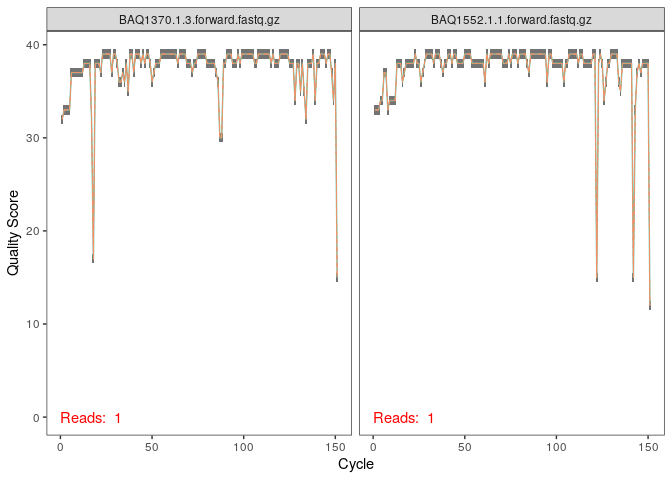
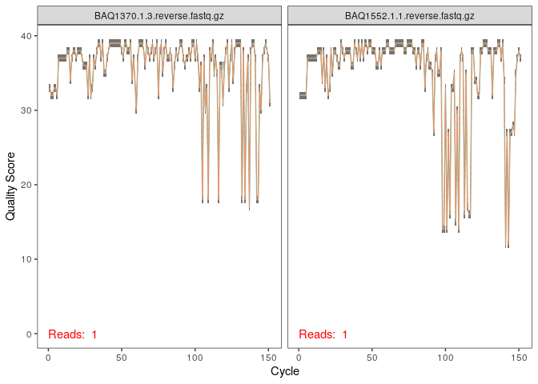
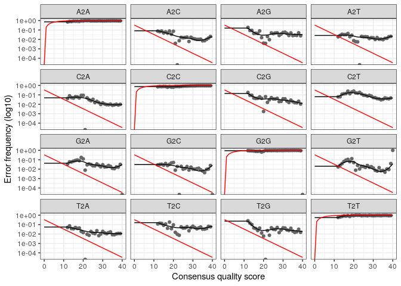
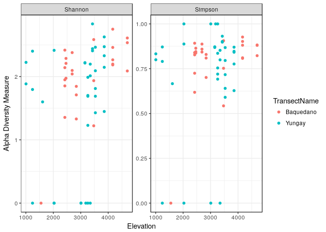
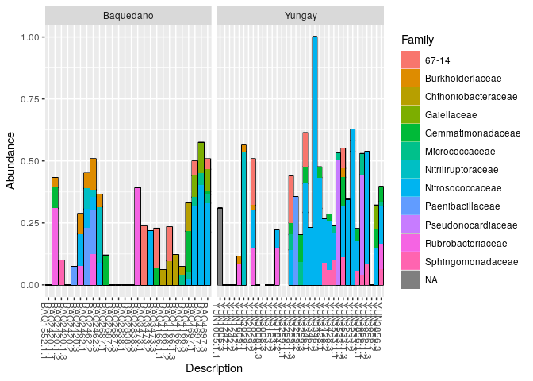

Here we walk through version 1.6 of the DADA2 pipeline on a small multi-sample dataset. Our starting point is a set of Illumina-sequenced paired-end fastq files that have been split (or "demultiplexed") by sample and from which the barcodes/adapters have already been removed. The end product is an **amplicon sequence variant (ASV) table**, a higher-resolution analogue of the traditional "OTU table", which records the number of times each amplicon sequence variant was observed in each sample. We also assign taxonomy to the output sequences, and demonstrate how the data can be imported into the popular [phyloseq](https://joey711.github.io/phyloseq/) R package for the analysis of microbiome data.

------------------------------------------------------------------------

Starting point
==============

This workflow assumes that your sequencing data meets certain criteria:

-   Samples have been demultiplexed, i.e. split into individual per-sample fastq files.
-   Non-biological nucleotides have been removed, e.g. primers, adapters, linkers, etc.
-   If paired-end sequencing data, the forward and reverse fastq files contain reads in matched order.

If these criteria are not true for your data (**are you sure there aren't any primers hanging around?**) you need to remedy those issues before beginning this workflow. See [the FAQ](faq.html) for some recommendations for common issues.

Getting ready
=============

First we load the `dada2` package If you don't already it, see the [dada2 installation instructions](dada-installation.html):

``` r
library(dada2); packageVersion("dada2")
```

    ## [1] '1.6.0'

``` r
library(readr)
```

*Older versions of this workflow associated with previous release versions or the dada2 R package are also available: [version 1.2](tutorial_1_2.html), [version 1.4](tutorial_1_4.html).*

The data we will work with are the same as those used in the [Mothur Miseq SOP](http://www.mothur.org/wiki/MiSeq_SOP). Download the [example data](http://www.mothur.org/w/images/d/d6/MiSeqSOPData.zip) and unzip. These fastq files were generated by amplicon sequencing (Illumina MiSeq, 2x250, V4 region of the 16S rRNA gene) of gut samples collected longitudinally from a mouse post-weaning, and one mock community control. For now just consider them paired-end fastq files to be processed. Define the following path variable so that it points to the extracted directory on **your** machine:

``` r
miseqsop.dir <- "/data/tutorial_data/MiSeq_SOP"
list.files(miseqsop.dir)
```

    ##  [1] "F3D0_S188_L001_R1_001.fastq"   "F3D0_S188_L001_R2_001.fastq"  
    ##  [3] "F3D141_S207_L001_R1_001.fastq" "F3D141_S207_L001_R2_001.fastq"
    ##  [5] "F3D142_S208_L001_R1_001.fastq" "F3D142_S208_L001_R2_001.fastq"
    ##  [7] "F3D143_S209_L001_R1_001.fastq" "F3D143_S209_L001_R2_001.fastq"
    ##  [9] "F3D144_S210_L001_R1_001.fastq" "F3D144_S210_L001_R2_001.fastq"
    ## [11] "F3D145_S211_L001_R1_001.fastq" "F3D145_S211_L001_R2_001.fastq"
    ## [13] "F3D146_S212_L001_R1_001.fastq" "F3D146_S212_L001_R2_001.fastq"
    ## [15] "F3D147_S213_L001_R1_001.fastq" "F3D147_S213_L001_R2_001.fastq"
    ## [17] "F3D148_S214_L001_R1_001.fastq" "F3D148_S214_L001_R2_001.fastq"
    ## [19] "F3D149_S215_L001_R1_001.fastq" "F3D149_S215_L001_R2_001.fastq"
    ## [21] "F3D150_S216_L001_R1_001.fastq" "F3D150_S216_L001_R2_001.fastq"
    ## [23] "F3D1_S189_L001_R1_001.fastq"   "F3D1_S189_L001_R2_001.fastq"  
    ## [25] "F3D2_S190_L001_R1_001.fastq"   "F3D2_S190_L001_R2_001.fastq"  
    ## [27] "F3D3_S191_L001_R1_001.fastq"   "F3D3_S191_L001_R2_001.fastq"  
    ## [29] "F3D5_S193_L001_R1_001.fastq"   "F3D5_S193_L001_R2_001.fastq"  
    ## [31] "F3D6_S194_L001_R1_001.fastq"   "F3D6_S194_L001_R2_001.fastq"  
    ## [33] "F3D7_S195_L001_R1_001.fastq"   "F3D7_S195_L001_R2_001.fastq"  
    ## [35] "F3D8_S196_L001_R1_001.fastq"   "F3D8_S196_L001_R2_001.fastq"  
    ## [37] "F3D9_S197_L001_R1_001.fastq"   "F3D9_S197_L001_R2_001.fastq"  
    ## [39] "HMP_MOCK.v35.fasta"            "Mock_S280_L001_R1_001.fastq"  
    ## [41] "Mock_S280_L001_R2_001.fastq"   "mouse.dpw.metadata"           
    ## [43] "mouse.time.design"             "stability.batch"              
    ## [45] "stability.files"

If the package successfully loaded and your listed files match those here, you are ready to go through the DADA2 pipeline.

We need to set up a "scratch" directory for saving files that we generate while running dada2, but don't need to save long term.

``` r
scratch.dir = path.expand("/tmp/scratch/dada2_tutorial")
dir.create(scratch.dir,recursive = TRUE)
```

    ## Warning in dir.create(scratch.dir, recursive = TRUE): '/tmp/scratch/
    ## dada2_tutorial' already exists

``` r
ps.rds = file.path(scratch.dir, "miseq_sop.rds")

silva.ref = "/data/references/dada/silva_nr_v128_train_set.fa.gz"
silva.species.ref = "/data/references/dada/silva_species_assignment_v128.fa.gz"
```

 

Filter and Trim
===============

First we read in the names of the fastq files, and perform some string manipulation to get lists of the forward and reverse fastq files in matched order:

``` r
# Forward and reverse fastq filenames have format: SAMPLENAME_R1_001.fastq and SAMPLENAME_R2_001.fastq
fnFs <- sort(list.files(miseqsop.dir, pattern="_R1_001.fastq", full.names = TRUE))
fnRs <- sort(list.files(miseqsop.dir, pattern="_R2_001.fastq", full.names = TRUE))
# Extract sample names, assuming filenames have format: SAMPLENAME_XXX.fastq
sample.names <- sapply(strsplit(basename(fnFs), "_"), `[`, 1)
```

**<span style="color:red">If using this workflow on your own data:</span>** The string manipulations may have to be modified if using a different filename format.

 

Examine quality profiles of forward and reverse reads
-----------------------------------------------------

We start by visualizing the quality profiles of the forward reads:

``` r
plotQualityProfile(fnFs[1:2])
```



The forward reads are good quality. We generally advise trimming the last few nucleotides to avoid less well-controlled errors that can arise there. These quality profiles do not suggest that any additional trimming is needed, so we will truncate the forward reads at position 240 (trimming the last 10 nucleotides).

Now we visualize the quality profile of the reverse reads:

``` r
plotQualityProfile(fnRs[1:2])
```



The reverse reads are of significantly worse quality, especially at the end, which is common in Illumina sequencing. This isn't too worrisome, as DADA2 incorporates quality information into its error model which makes the algorithm [robust to lower quality sequence](https://twitter.com/bejcal/status/771010634074820608), but trimming as the average qualities crash will improve the algorithm's sensitivity to rare sequence variants. Based on these profiles, we will truncate the reverse reads at position 160 where the quality distribution crashes.

**<span style="color:red">If using this workflow on your own data:</span>** **Your reads must still overlap after truncation in order to merge them later!** The tutorial is using 2x250 V4 sequence data, so the forward and reverse reads almost completely overlap and our trimming can be completely guided by the quality scores. If you are using a less-overlapping primer set, like V1-V2 or V3-V4, your `truncLen` must be large enough to maintain `20 + biological.length.variation` nucleotides of overlap between them.

Non-overlapping primer sets are supported as well with `mergePairs(..., justConcatenate=TRUE)` when performing merging.

 

Perform filtering and trimming
------------------------------

Assign the filenames for the filtered fastq.gz files.

``` r
filt_path <- file.path(scratch.dir, "filtered") # Place filtered files in filtered/ subdirectory
filtFs <- file.path(filt_path, paste0(sample.names, "_F_filt.fastq.gz"))
filtRs <- file.path(filt_path, paste0(sample.names, "_R_filt.fastq.gz"))
```

We'll use standard filtering parameters: `maxN=0` (DADA2 requires no Ns), `truncQ=2`, `rm.phix=TRUE` and `maxEE=2`. The `maxEE` parameter sets the maximum number of "expected errors" allowed in a read, which is [a better filter than simply averaging quality scores](http://www.drive5.com/usearch/manual/expected_errors.html).

**Filter the forward and reverse reads**

``` r
out <- filterAndTrim(fnFs, filtFs, fnRs, filtRs, truncLen=c(240,160),
              maxN=0, maxEE=c(2,2), truncQ=2, rm.phix=TRUE,
              compress=TRUE, multithread=TRUE) # On Windows set multithread=FALSE
head(out)
```

    ##                               reads.in reads.out
    ## F3D0_S188_L001_R1_001.fastq       7793      7113
    ## F3D141_S207_L001_R1_001.fastq     5958      5463
    ## F3D142_S208_L001_R1_001.fastq     3183      2914
    ## F3D143_S209_L001_R1_001.fastq     3178      2941
    ## F3D144_S210_L001_R1_001.fastq     4827      4312
    ## F3D145_S211_L001_R1_001.fastq     7377      6741

**<span style="color:red">If using this workflow on your own data:</span>** The standard filtering parameters are starting points, not set in stone. For example, if too few reads are passing the filter, considering relaxing `maxEE`, perhaps especially on the reverse reads (eg. `maxEE=c(2,5)`). If you want to speed up downstream computation, consider tightening `maxEE`. For paired-end reads consider the length of your amplicon when choosing `truncLen` as your reads must overlap after truncation in order to merge them later.

**<span style="color:red">If using this workflow on your own data:</span>** For common ITS amplicon strategies, it is undesirable to truncate reads to a fixed length due to the large amount of length variation at that locus. That is OK, just leave out `truncLen`. Make sure you removed the forward and reverse primers from both the forward and reverse reads though!

 

Learn the Error Rates
=====================

The DADA2 algorithm depends on a parametric error model (`err`) and every amplicon dataset has a different set of error rates. The `learnErrors` method learns the error model from the data, by alternating estimation of the error rates and inference of sample composition until they converge on a jointly consistent solution. As in many optimization problems, the algorithm must begin with an initial guess, for which the maximum possible error rates in this data are used (the error rates if only the most abundant sequence is correct and all the rest are errors).

*The following runs in about 4 minutes on a 2013 Macbook Pro:*

``` r
errF <- learnErrors(filtFs, multithread=TRUE)
```

    ## Initializing error rates to maximum possible estimate.
    ## Sample 1 - 7113 reads in 1979 unique sequences.
    ## Sample 2 - 5463 reads in 1477 unique sequences.
    ## Sample 3 - 2914 reads in 904 unique sequences.
    ## Sample 4 - 2941 reads in 939 unique sequences.
    ## Sample 5 - 4312 reads in 1267 unique sequences.
    ## Sample 6 - 6741 reads in 1756 unique sequences.
    ## Sample 7 - 4560 reads in 1438 unique sequences.
    ## Sample 8 - 15637 reads in 3590 unique sequences.
    ## Sample 9 - 11413 reads in 2762 unique sequences.
    ## Sample 10 - 12017 reads in 3021 unique sequences.
    ## Sample 11 - 5032 reads in 1566 unique sequences.
    ## Sample 12 - 5299 reads in 1639 unique sequences.
    ## Sample 13 - 18075 reads in 3707 unique sequences.
    ## Sample 14 - 6250 reads in 1479 unique sequences.
    ## Sample 15 - 4052 reads in 1195 unique sequences.
    ## Sample 16 - 7369 reads in 1832 unique sequences.
    ## Sample 17 - 4765 reads in 1183 unique sequences.
    ## Sample 18 - 4871 reads in 1382 unique sequences.
    ## Sample 19 - 6504 reads in 1709 unique sequences.
    ## Sample 20 - 4314 reads in 897 unique sequences.
    ##    selfConsist step 2 
    ##    selfConsist step 3 
    ##    selfConsist step 4 
    ##    selfConsist step 5 
    ## Convergence after  5  rounds.
    ## Total reads used:  139642

``` r
errR <- learnErrors(filtRs, multithread=TRUE)
```

    ## Initializing error rates to maximum possible estimate.
    ## Sample 1 - 7113 reads in 1660 unique sequences.
    ## Sample 2 - 5463 reads in 1335 unique sequences.
    ## Sample 3 - 2914 reads in 853 unique sequences.
    ## Sample 4 - 2941 reads in 880 unique sequences.
    ## Sample 5 - 4312 reads in 1286 unique sequences.
    ## Sample 6 - 6741 reads in 1803 unique sequences.
    ## Sample 7 - 4560 reads in 1265 unique sequences.
    ## Sample 8 - 15637 reads in 3414 unique sequences.
    ## Sample 9 - 11413 reads in 2522 unique sequences.
    ## Sample 10 - 12017 reads in 2771 unique sequences.
    ## Sample 11 - 5032 reads in 1415 unique sequences.
    ## Sample 12 - 5299 reads in 1349 unique sequences.
    ## Sample 13 - 18075 reads in 3290 unique sequences.
    ## Sample 14 - 6250 reads in 1390 unique sequences.
    ## Sample 15 - 4052 reads in 1134 unique sequences.
    ## Sample 16 - 7369 reads in 1635 unique sequences.
    ## Sample 17 - 4765 reads in 1084 unique sequences.
    ## Sample 18 - 4871 reads in 1161 unique sequences.
    ## Sample 19 - 6504 reads in 1502 unique sequences.
    ## Sample 20 - 4314 reads in 732 unique sequences.
    ##    selfConsist step 2 
    ##    selfConsist step 3 
    ##    selfConsist step 4 
    ##    selfConsist step 5 
    ##    selfConsist step 6 
    ## Convergence after  6  rounds.
    ## Total reads used:  139642

It is always worthwhile, as a sanity check if nothing else, to visualize the estimated error rates:

``` r
plotErrors(errF, nominalQ=TRUE)
```



The error rates for each possible transition (eg. A-&gt;C, A-&gt;G, ...) are shown. Points are the observed error rates for each consensus quality score. The black line shows the estimated error rates after convergence. The red line shows the error rates expected under the nominal definition of the Q-value. Here the black line (the estimated rates) fits the observed rates well, and the error rates drop with increased quality as expected. Everything looks reasonable and we proceed with confidence.

**<span style="color:red">If using this workflow on your own data:</span>** Parameter learning is computationally intensive, so by default the `learnErrors` function uses only a subset of the data (the first 1M reads). If the plotted error model does not look like a good fit, try increasing the `nreads` parameter to see if the fit improves.

 

Dereplication
=============

Dereplication combines all identical sequencing reads into into "unique sequences" with a corresponding "abundance": the number of reads with that unique sequence. Dereplication substantially reduces computation time by eliminating redundant comparisons.

Dereplication in the DADA2 pipeline has one crucial addition from other pipelines: **DADA2 retains a summary of the quality information associated with each unique sequence**. The consensus quality profile of a unique sequence is the average of the positional qualities from the dereplicated reads. These quality profiles inform the error model of the subsequent denoising step, significantly increasing DADA2's accuracy.

**Dereplicate the filtered fastq files**

``` r
derepFs <- derepFastq(filtFs, verbose=TRUE)
derepRs <- derepFastq(filtRs, verbose=TRUE)
# Name the derep-class objects by the sample names
names(derepFs) <- sample.names
names(derepRs) <- sample.names
```

**<span style="color:red">If using this workflow on your own data:</span>** The tutorial dataset is small enough to easily load into memory. If your dataset exceeds available RAM, it is preferable to process samples one-by-one in a streaming fashion: see the [DADA2 Workflow on Big Data](bigdata.html) for an example.

 

Sample Inference
================

We are now ready to apply the core sequence-variant inference algorithm to the dereplicated data.

**Infer the sequence variants in each sample**

``` r
dadaFs <- dada(derepFs, err=errF, multithread=TRUE)
```

    ## Sample 1 - 7113 reads in 1979 unique sequences.
    ## Sample 2 - 5463 reads in 1477 unique sequences.
    ## Sample 3 - 2914 reads in 904 unique sequences.
    ## Sample 4 - 2941 reads in 939 unique sequences.
    ## Sample 5 - 4312 reads in 1267 unique sequences.
    ## Sample 6 - 6741 reads in 1756 unique sequences.
    ## Sample 7 - 4560 reads in 1438 unique sequences.
    ## Sample 8 - 15637 reads in 3590 unique sequences.
    ## Sample 9 - 11413 reads in 2762 unique sequences.
    ## Sample 10 - 12017 reads in 3021 unique sequences.
    ## Sample 11 - 5032 reads in 1566 unique sequences.
    ## Sample 12 - 5299 reads in 1639 unique sequences.
    ## Sample 13 - 18075 reads in 3707 unique sequences.
    ## Sample 14 - 6250 reads in 1479 unique sequences.
    ## Sample 15 - 4052 reads in 1195 unique sequences.
    ## Sample 16 - 7369 reads in 1832 unique sequences.
    ## Sample 17 - 4765 reads in 1183 unique sequences.
    ## Sample 18 - 4871 reads in 1382 unique sequences.
    ## Sample 19 - 6504 reads in 1709 unique sequences.
    ## Sample 20 - 4314 reads in 897 unique sequences.

``` r
dadaRs <- dada(derepRs, err=errR, multithread=TRUE)
```

    ## Sample 1 - 7113 reads in 1660 unique sequences.
    ## Sample 2 - 5463 reads in 1335 unique sequences.
    ## Sample 3 - 2914 reads in 853 unique sequences.
    ## Sample 4 - 2941 reads in 880 unique sequences.
    ## Sample 5 - 4312 reads in 1286 unique sequences.
    ## Sample 6 - 6741 reads in 1803 unique sequences.
    ## Sample 7 - 4560 reads in 1265 unique sequences.
    ## Sample 8 - 15637 reads in 3414 unique sequences.
    ## Sample 9 - 11413 reads in 2522 unique sequences.
    ## Sample 10 - 12017 reads in 2771 unique sequences.
    ## Sample 11 - 5032 reads in 1415 unique sequences.
    ## Sample 12 - 5299 reads in 1349 unique sequences.
    ## Sample 13 - 18075 reads in 3290 unique sequences.
    ## Sample 14 - 6250 reads in 1390 unique sequences.
    ## Sample 15 - 4052 reads in 1134 unique sequences.
    ## Sample 16 - 7369 reads in 1635 unique sequences.
    ## Sample 17 - 4765 reads in 1084 unique sequences.
    ## Sample 18 - 4871 reads in 1161 unique sequences.
    ## Sample 19 - 6504 reads in 1502 unique sequences.
    ## Sample 20 - 4314 reads in 732 unique sequences.

Inspecting the dada-class object returned by dada:

``` r
dadaFs[[1]]
```

    ## dada-class: object describing DADA2 denoising results
    ## 128 sample sequences were inferred from 1979 input unique sequences.
    ## Key parameters: OMEGA_A = 1e-40, BAND_SIZE = 16, USE_QUALS = TRUE

The DADA2 algorithm inferred 128 real sequence variants from the 1979 unique sequences in the first sample. There is much more to the `dada-class` return object than this (see `help("dada-class")` for some info), including multiple diagnostics about the quality of each inferred sequence variant, but that is beyond the scope of an introductory tutorial.

**<span style="color:red">If using this workflow on your own data:</span>** All samples are simultaneously loaded into memory in the tutorial. If you are dealing with datasets that approach or exceed available RAM, it is preferable to process samples one-by-one in a streaming fashion: see the **[DADA2 Workflow on Big Data](bigdata.html)** for an example.

**<span style="color:red">If using this workflow on your own data:</span>** By default, the `dada` function processes each sample independently, but pooled processing is available with `pool=TRUE` and that may give better results for low sampling depths at the cost of increased computation time. See our [discussion about pooling samples for sample inference](pool.html).

**<span style="color:red">If using this workflow on your own data:</span>** DADA2 also supports 454 and Ion Torrent data, but [we recommend some minor parameter changes](faq.html#can-i-use-dada2-with-my-454-or-ion-torrent-data) for those sequencing technologies. The adventurous can explore `?setDadaOpt` for other adjustable algorithm parameters.

 

Merge paired reads
==================

Spurious sequence variants are further reduced by merging overlapping reads. The core function here is `mergePairs`, which depends on the forward and reverse reads being in matching order at the time they were dereplicated.

**Merge the denoised forward and reverse reads**:

``` r
mergers <- mergePairs(dadaFs, derepFs, dadaRs, derepRs, verbose=TRUE)
# Inspect the merger data.frame from the first sample
head(mergers[[1]])
```

    ##                                                                                                                                                                                                                                                       sequence
    ## 1 TACGGAGGATGCGAGCGTTATCCGGATTTATTGGGTTTAAAGGGTGCGCAGGCGGAAGATCAAGTCAGCGGTAAAATTGAGAGGCTCAACCTCTTCGAGCCGTTGAAACTGGTTTTCTTGAGTGAGCGAGAAGTATGCGGAATGCGTGGTGTAGCGGTGAAATGCATAGATATCACGCAGAACTCCGATTGCGAAGGCAGCATACCGGCGCTCAACTGACGCTCATGCACGAAAGTGTGGGTATCGAACAGG
    ## 2 TACGGAGGATGCGAGCGTTATCCGGATTTATTGGGTTTAAAGGGTGCGTAGGCGGCCTGCCAAGTCAGCGGTAAAATTGCGGGGCTCAACCCCGTACAGCCGTTGAAACTGCCGGGCTCGAGTGGGCGAGAAGTATGCGGAATGCGTGGTGTAGCGGTGAAATGCATAGATATCACGCAGAACCCCGATTGCGAAGGCAGCATACCGGCGCCCTACTGACGCTGAGGCACGAAAGTGCGGGGATCAAACAGG
    ## 3 TACGGAGGATGCGAGCGTTATCCGGATTTATTGGGTTTAAAGGGTGCGTAGGCGGGCTGTTAAGTCAGCGGTCAAATGTCGGGGCTCAACCCCGGCCTGCCGTTGAAACTGGCGGCCTCGAGTGGGCGAGAAGTATGCGGAATGCGTGGTGTAGCGGTGAAATGCATAGATATCACGCAGAACTCCGATTGCGAAGGCAGCATACCGGCGCCCGACTGACGCTGAGGCACGAAAGCGTGGGTATCGAACAGG
    ## 4 TACGGAGGATGCGAGCGTTATCCGGATTTATTGGGTTTAAAGGGTGCGTAGGCGGGCTTTTAAGTCAGCGGTAAAAATTCGGGGCTCAACCCCGTCCGGCCGTTGAAACTGGGGGCCTTGAGTGGGCGAGAAGAAGGCGGAATGCGTGGTGTAGCGGTGAAATGCATAGATATCACGCAGAACCCCGATTGCGAAGGCAGCCTTCCGGCGCCCTACTGACGCTGAGGCACGAAAGTGCGGGGATCGAACAGG
    ## 5 TACGGAGGATGCGAGCGTTATCCGGATTTATTGGGTTTAAAGGGTGCGCAGGCGGACTCTCAAGTCAGCGGTCAAATCGCGGGGCTCAACCCCGTTCCGCCGTTGAAACTGGGAGCCTTGAGTGCGCGAGAAGTAGGCGGAATGCGTGGTGTAGCGGTGAAATGCATAGATATCACGCAGAACTCCGATTGCGAAGGCAGCCTACCGGCGCGCAACTGACGCTCATGCACGAAAGCGTGGGTATCGAACAGG
    ## 6 TACGGAGGATGCGAGCGTTATCCGGATTTATTGGGTTTAAAGGGTGCGTAGGCGGGATGCCAAGTCAGCGGTAAAAAAGCGGTGCTCAACGCCGTCGAGCCGTTGAAACTGGCGTTCTTGAGTGGGCGAGAAGTATGCGGAATGCGTGGTGTAGCGGTGAAATGCATAGATATCACGCAGAACTCCGATTGCGAAGGCAGCATACCGGCGCCCTACTGACGCTGAGGCACGAAAGCGTGGGTATCGAACAGG
    ##   abundance forward reverse nmatch nmismatch nindel prefer accept
    ## 1       586       1       1    148         0      0      1   TRUE
    ## 2       471       2       2    148         0      0      2   TRUE
    ## 3       451       3       4    148         0      0      1   TRUE
    ## 4       433       4       3    148         0      0      2   TRUE
    ## 5       353       5       6    148         0      0      1   TRUE
    ## 6       285       6       5    148         0      0      2   TRUE

We now have a `data.frame` for each sample with the merged `$sequence`, its `$abundance`, and the indices of the merged `$forward` and `$reverse` denoised sequences. Paired reads that did not exactly overlap were removed by `mergePairs`.

**<span style="color:red">If using this workflow on your own data:</span>** Most of your **reads** should successfully merge. If that is not the case upstream parameters may need to be revisited: Did you trim away the overlap between your reads?

 

Construct sequence table
========================

We can now construct a sequence table of our mouse samples, a higher-resolution version of the OTU table produced by traditional methods.

``` r
seqtab <- makeSequenceTable(mergers)
```

    ## The sequences being tabled vary in length.

``` r
dim(seqtab)
```

    ## [1]  20 288

``` r
# Inspect distribution of sequence lengths
table(nchar(getSequences(seqtab)))
```

    ## 
    ## 251 252 253 254 255 
    ##   1  87 192   6   2

The sequence table is a `matrix` with rows corresponding to (and named by) the samples, and columns corresponding to (and named by) the sequence variants. The lengths of our merged sequences all fall within the expected range for this V4 amplicon.

**<span style="color:red">If using this workflow on your own data:</span>** Sequences that are much longer or shorter than expected may be the result of non-specific priming, and may be worth removing (eg. `seqtab2 <- seqtab[,nchar(colnames(seqtab)) %in% seq(250,256)]`). This is analogous to "cutting a band" in-silico to get amplicons of the targeted length.

 

Remove chimeras
===============

The core `dada` method removes substitution and indel errors, but chimeras remain. Fortunately, the accuracy of the sequences after denoising makes identifying chimeras simpler than it is when dealing with fuzzy OTUs: all sequences which can be exactly reconstructed as a bimera (two-parent chimera) from more abundant sequences.

**Remove chimeric sequences**:

``` r
seqtab.nochim <- removeBimeraDenovo(seqtab, method="consensus", multithread=TRUE, verbose=TRUE)
dim(seqtab.nochim)
```

    ## [1]  20 229

``` r
sum(seqtab.nochim)/sum(seqtab)
```

    ## [1] 0.9643085

The fraction of chimeras varies based on factors including experimental procedures and sample complexity, but can be substantial. Here chimeras make up about 20% of the inferred sequence variants, but those variants account for only about 4% of the total sequence reads.

**<span style="color:red">If using this workflow on your own data:</span>** Most of your **reads** should remain after chimera removal (it is not uncommon for a majority of **sequence variants** to be removed though). If most of your reads were removed as chimeric, upstream processing may need to be revisited. In almost all cases this is caused by primer sequences with ambiguous nucleotides that were not removed prior to beginning the DADA2 pipeline.

 

Track reads through the pipeline
================================

As a final check of our progress, we'll look at the number of reads that made it through each step in the pipeline:

``` r
getN <- function(x) sum(getUniques(x))
track <- cbind(out, sapply(dadaFs, getN), sapply(mergers, getN), rowSums(seqtab), rowSums(seqtab.nochim))
# If processing a single sample, remove the sapply calls: e.g. replace sapply(dadaFs, getN) with getN(dadaFs)
colnames(track) <- c("input", "filtered", "denoised", "merged", "tabled", "nonchim")
rownames(track) <- sample.names
head(track)
```

    ##        input filtered denoised merged tabled nonchim
    ## F3D0    7793     7113     7113   6600   6600    6588
    ## F3D141  5958     5463     5463   5047   5047    4928
    ## F3D142  3183     2914     2914   2663   2663    2600
    ## F3D143  3178     2941     2941   2575   2575    2550
    ## F3D144  4827     4312     4312   3668   3668    3527
    ## F3D145  7377     6741     6741   6203   6203    5897

Looks good, we kept the majority of our raw reads, and there is no over-large drop associated with any single step.

**<span style="color:red">If using this workflow on your own data:</span>** This is a great place to do a last **sanity check**. Outside of filtering (depending on how stringent you want to be) there should no step in which a majority of reads are lost. If a majority of reads failed to merge, you may need to revisit the `truncLen` parameter used in the filtering step and make sure that the truncated reads span your amplicon. If a majority of reads failed to pass the chimera check, you may need to revisit the removal of primers, as the ambiguous nucleotides in unremoved primers interfere with chimera identification.

 

Assign taxonomy
===============

It is common at this point, especially in 16S/18S/ITS amplicon sequencing, to classify sequence variants taxonomically. The DADA2 package provides a native implementation of [the RDP's naive Bayesian classifier](http://www.ncbi.nlm.nih.gov/pubmed/17586664) for this purpose. The `assignTaxonomy` function takes a set of sequences and a training set of taxonomically classified sequences, and outputs the taxonomic assignments with at least `minBoot` bootstrap confidence.

We maintain [formatted training fastas for the RDP training set, GreenGenes clustered at 97% identity, and the Silva reference database](training.html). For fungal taxonomy, the General Fasta release files from the [UNITE ITS database](https://unite.ut.ee/repository.php) can be used as is. To follow along, download the `silva_nr_v128_train_set.fa.gz` file, and place it in the directory with the fastq files.

``` r
taxa <- assignTaxonomy(seqtab.nochim, silva.ref, multithread=TRUE)
```

**Optional:** The dada2 package also implements a method to make [species level assignments based on **exact matching**](assign.html#species-assignment) between ASVs and sequenced reference strains. Currently species-assignment training fastas are available for the Silva and RDP 16S databases. To follow the optional species addition step, download the `silva_species_assignment_v128.fa.gz` file, and place it in the directory with the fastq files.

``` r
taxa <- addSpecies(taxa, silva.species.ref)
```

Let's inspect the taxonomic assignments:

``` r
taxa.print <- taxa # Removing sequence rownames for display only
rownames(taxa.print) <- NULL
head(taxa.print)
```

    ##      Kingdom    Phylum          Class         Order          
    ## [1,] "Bacteria" "Bacteroidetes" "Bacteroidia" "Bacteroidales"
    ## [2,] "Bacteria" "Bacteroidetes" "Bacteroidia" "Bacteroidales"
    ## [3,] "Bacteria" "Bacteroidetes" "Bacteroidia" "Bacteroidales"
    ## [4,] "Bacteria" "Bacteroidetes" "Bacteroidia" "Bacteroidales"
    ## [5,] "Bacteria" "Bacteroidetes" "Bacteroidia" "Bacteroidales"
    ## [6,] "Bacteria" "Bacteroidetes" "Bacteroidia" "Bacteroidales"
    ##      Family                      Genus         Species       
    ## [1,] "Bacteroidales_S24-7_group" NA            NA            
    ## [2,] "Bacteroidales_S24-7_group" NA            NA            
    ## [3,] "Bacteroidales_S24-7_group" NA            NA            
    ## [4,] "Bacteroidales_S24-7_group" NA            NA            
    ## [5,] "Bacteroidaceae"            "Bacteroides" "acidifaciens"
    ## [6,] "Bacteroidales_S24-7_group" NA            NA

Unsurprisingly, the Bacteroidetes are well represented among the most abundant taxa in these fecal samples. Few species assignments were made, both because it is often not possible to make unambiguous species assignments from segments of the 16S gene, and because there is surprisingly little coverage of the indigenous mouse gut microbiota in reference databases.

**<span style="color:red">If using this workflow on your own data:</span>** If your reads do not seem to be appropriately assigned, for example lots of your bacterial 16S sequences are being assigned as `Eukaryota NA NA NA NA NA`, your reads may be in the opposite orientation as the reference database. Tell dada2 to try the reverse-complement orientation with `assignTaxonomy(..., tryRC=TRUE)` and see if this fixes the assignments.

 

Evaluate accuracy
=================

One of the samples included here was a "mock community", in which a mixture of 20 known strains was sequenced (this mock community is supposed to be 21 strains, but *P. acnes* is absent). Reference sequences corresponding to these strains were provided in the downloaded zip archive. We return to that sample and compare the sequence variants inferred by DADA2 to the expected composition of the community.

**Evaluating DADA2's accuracy on the mock community**:

``` r
unqs.mock <- seqtab.nochim["Mock",]
unqs.mock <- sort(unqs.mock[unqs.mock>0], decreasing=TRUE) # Drop ASVs absent in the Mock
cat("DADA2 inferred", length(unqs.mock), "sample sequences present in the Mock community.\n")
```

    ## DADA2 inferred 20 sample sequences present in the Mock community.

``` r
mock.ref <- getSequences(file.path(miseqsop.dir, "HMP_MOCK.v35.fasta"))
match.ref <- sum(sapply(names(unqs.mock), function(x) any(grepl(x, mock.ref))))
cat("Of those,", sum(match.ref), "were exact matches to the expected reference sequences.\n")
```

    ## Of those, 20 were exact matches to the expected reference sequences.

This mock community contained **20** bacterial strains. DADA2 identified **20** ASVs all of which **exactly** match the reference genomes of the expected community members. The residual error rate after the DADA2 pipeline for this sample is **0%**.

In comparison, [the mothur pipeline finds 34 OTUs in this Mock community sample](http://www.mothur.org/wiki/MiSeq_SOP#Assessing_error_rates). DADA2 infers sequence variants exactly instead of fuzzy 97% OTUs, and outputs fewer false positives to boot!

**Here ends the DADA2 portion of the tutorial**.

------------------------------------------------------------------------

Bonus: Handoff to phyloseq
==========================

The [phyloseq R package is a powerful framework for further analysis of microbiome data](https://joey711.github.io/phyloseq/). We now demosntrate how to straightforwardly import the tables produced by the DADA2 pipeline into phyloseq. We'll also add the small amount of metadata we have -- the samples are named by the gender (G), mouse subject number (X) and the day post-weaning (Y) it was sampled (eg. GXDY).

**Import into phyloseq**:

``` r
library(phyloseq); packageVersion("phyloseq")
```

    ## [1] '1.22.3'

``` r
library(ggplot2); packageVersion("ggplot2")
```

    ## [1] '2.2.1'

We can construct a simple sample data.frame based on the filenames. Usually this step would instead involve reading the sample data in from a file.

``` r
samples.out <- rownames(seqtab.nochim)
subject <- sapply(strsplit(samples.out, "D"), `[`, 1)
gender <- substr(subject,1,1)
subject <- substr(subject,2,999)
day <- as.integer(sapply(strsplit(samples.out, "D"), `[`, 2))
samdf <- data.frame(Subject=subject, Gender=gender, Day=day)
samdf$When <- "Early"
samdf$When[samdf$Day>100] <- "Late"
rownames(samdf) <- samples.out
```

We can now construct a phyloseq object directly from the dada2 outputs.

``` r
ps <- phyloseq(otu_table(seqtab.nochim, taxa_are_rows=FALSE), 
               sample_data(samdf), 
               tax_table(taxa))
ps <- prune_samples(sample_names(ps) != "Mock", ps) # Remove mock sample
ps
```

    ## phyloseq-class experiment-level object
    ## otu_table()   OTU Table:         [ 229 taxa and 19 samples ]
    ## sample_data() Sample Data:       [ 19 samples by 4 sample variables ]
    ## tax_table()   Taxonomy Table:    [ 229 taxa by 7 taxonomic ranks ]

Any R object can be saved to an RDS file. It is a good idea to do this for any object that is time consuming to generate and is reasonably small in size. Even when the object was generated reproducibly, it can be frustrating to wait minutes or hours to regenerate when you are ready to perform downstream analyses.

We will do this for out phyloseq object to a file since it is quite small (especially compared to the size of the input FASTQ files), and there were several time consuming computational steps required to generate it.

``` r
write_rds(ps, ps.rds)
```

We can now confirm that it worked!

``` r
ps = read_rds(ps.rds)
```

We are now ready to use phyloseq!

**Visualize alpha-diversity**:

``` r
plot_richness(ps, x="Day", measures=c("Shannon", "Simpson"), color="When") + theme_bw()
```



No obvious systematic difference in alpha-diversity between early and late samples.

**Ordinate**:

``` r
ord.nmds.bray <- ordinate(ps, method="NMDS", distance="bray")
```

    ## Square root transformation
    ## Wisconsin double standardization
    ## Run 0 stress 0.08651203 
    ## Run 1 stress 0.08756857 
    ## Run 2 stress 0.0865121 
    ## ... Procrustes: rmse 0.0001344787  max resid 0.0004236942 
    ## ... Similar to previous best
    ## Run 3 stress 0.08651203 
    ## ... New best solution
    ## ... Procrustes: rmse 3.151007e-05  max resid 8.733974e-05 
    ## ... Similar to previous best
    ## Run 4 stress 0.08831085 
    ## Run 5 stress 0.08651223 
    ## ... Procrustes: rmse 6.408354e-05  max resid 0.000162515 
    ## ... Similar to previous best
    ## Run 6 stress 0.1459644 
    ## Run 7 stress 0.1439983 
    ## Run 8 stress 0.1564106 
    ## Run 9 stress 0.08756854 
    ## Run 10 stress 0.08651203 
    ## ... New best solution
    ## ... Procrustes: rmse 1.345937e-05  max resid 2.976993e-05 
    ## ... Similar to previous best
    ## Run 11 stress 0.08831087 
    ## Run 12 stress 0.08831095 
    ## Run 13 stress 0.08660949 
    ## ... Procrustes: rmse 0.005458465  max resid 0.01680393 
    ## Run 14 stress 0.08831081 
    ## Run 15 stress 0.1533471 
    ## Run 16 stress 0.1439975 
    ## Run 17 stress 0.1553112 
    ## Run 18 stress 0.08756848 
    ## Run 19 stress 0.08756848 
    ## Run 20 stress 0.1456187 
    ## *** Solution reached

``` r
plot_ordination(ps, ord.nmds.bray, color="When", title="Bray NMDS")
```


Ordination picks out a clear separation between the early and late samples.

**Bar plot**:

``` r
top20 <- names(sort(taxa_sums(ps), decreasing=TRUE))[1:20]
ps.top20 <- transform_sample_counts(ps, function(OTU) OTU/sum(OTU))
ps.top20 <- prune_taxa(top20, ps.top20)
plot_bar(ps.top20, x="Day", fill="Family") + facet_wrap(~When, scales="free_x")
```



Nothing glaringly obvious jumps out from the taxonomic distribution of the top 20 sequences to explain the early-late differentiation.

This was just a bare bones demonstration of how the data from DADA2 can be easily imported into phyloseq and interrogated. For further examples on the many analyses possible with phyloseq, see [the phyloseq web site](https://joey711.github.io/phyloseq/)!

Session Info
============

Always print `sessionInfo` for reproducibility!

``` r
sessionInfo()
```

    ## R version 3.4.1 (2017-06-30)
    ## Platform: x86_64-pc-linux-gnu (64-bit)
    ## Running under: Ubuntu 16.04.3 LTS
    ## 
    ## Matrix products: default
    ## BLAS: /usr/lib/openblas-base/libblas.so.3
    ## LAPACK: /usr/lib/libopenblasp-r0.2.18.so
    ## 
    ## locale:
    ##  [1] LC_CTYPE=en_US.UTF-8       LC_NUMERIC=C              
    ##  [3] LC_TIME=en_US.UTF-8        LC_COLLATE=en_US.UTF-8    
    ##  [5] LC_MONETARY=en_US.UTF-8    LC_MESSAGES=en_US.UTF-8   
    ##  [7] LC_PAPER=en_US.UTF-8       LC_NAME=C                 
    ##  [9] LC_ADDRESS=C               LC_TELEPHONE=C            
    ## [11] LC_MEASUREMENT=en_US.UTF-8 LC_IDENTIFICATION=C       
    ## 
    ## attached base packages:
    ## [1] datasets  utils     stats     grDevices graphics  methods   base     
    ## 
    ## other attached packages:
    ##  [1] phyloseq_1.22.3    readr_1.1.1        dada2_1.6.0       
    ##  [4] Rcpp_0.12.14       GGally_1.3.2       broom_0.4.3       
    ##  [7] openintro_1.7.1    rvest_0.3.2        xml2_1.1.1        
    ## [10] stringr_1.2.0      lubridate_1.6.0    googlesheets_0.2.2
    ## [13] ggplot2_2.2.1      rmarkdown_1.8.6    knitr_1.18        
    ## [16] downloader_0.4    
    ## 
    ## loaded via a namespace (and not attached):
    ##  [1] nlme_3.1-131               bitops_1.0-6              
    ##  [3] matrixStats_0.54.0         RColorBrewer_1.1-2        
    ##  [5] httr_1.3.1                 rprojroot_1.3-2           
    ##  [7] GenomeInfoDb_1.14.0        tools_3.4.1               
    ##  [9] backports_1.1.2            vegan_2.5-2               
    ## [11] R6_2.2.2                   mgcv_1.8-18               
    ## [13] lazyeval_0.2.0             BiocGenerics_0.24.0       
    ## [15] colorspace_1.3-2           permute_0.9-4             
    ## [17] ade4_1.7-11                mnormt_1.5-5              
    ## [19] compiler_3.4.1             Biobase_2.38.0            
    ## [21] DelayedArray_0.4.1         labeling_0.3              
    ## [23] scales_0.5.0               psych_1.7.8               
    ## [25] digest_0.6.13              Rsamtools_1.30.0          
    ## [27] foreign_0.8-69             XVector_0.18.0            
    ## [29] pkgconfig_2.0.1            htmltools_0.3.6           
    ## [31] rlang_0.1.6                bindr_0.1                 
    ## [33] hwriter_1.3.2              jsonlite_1.5              
    ## [35] BiocParallel_1.12.0        dplyr_0.7.4               
    ## [37] RCurl_1.95-4.8             magrittr_1.5              
    ## [39] GenomeInfoDbData_1.0.0     biomformat_1.6.0          
    ## [41] Matrix_1.2-10              munsell_0.4.3             
    ## [43] S4Vectors_0.16.0           ape_5.1                   
    ## [45] stringi_1.1.6              yaml_2.1.16               
    ## [47] MASS_7.3-47                SummarizedExperiment_1.8.1
    ## [49] zlibbioc_1.24.0            rhdf5_2.22.0              
    ## [51] plyr_1.8.4                 grid_3.4.1                
    ## [53] parallel_3.4.1             lattice_0.20-35           
    ## [55] Biostrings_2.46.0          splines_3.4.1             
    ## [57] multtest_2.34.0            hms_0.3                   
    ## [59] pillar_1.0.1               igraph_1.1.2              
    ## [61] GenomicRanges_1.30.3       reshape2_1.4.3            
    ## [63] codetools_0.2-15           stats4_3.4.1              
    ## [65] glue_1.2.0                 evaluate_0.10.1           
    ## [67] ShortRead_1.36.1           latticeExtra_0.6-28       
    ## [69] data.table_1.10.4-2        RcppParallel_4.4.1        
    ## [71] foreach_1.4.3              cellranger_1.1.0          
    ## [73] gtable_0.2.0               purrr_0.2.4               
    ## [75] tidyr_0.7.2                reshape_0.8.7             
    ## [77] assertthat_0.2.0           survival_2.41-3           
    ## [79] tibble_1.4.1               iterators_1.0.8           
    ## [81] GenomicAlignments_1.14.2   IRanges_2.12.0            
    ## [83] bindrcpp_0.2               cluster_2.0.6

------------------------------------------------------------------------

This tutorial is based on the [Official DADA2 v1.6 Tutorial](https://raw.githubusercontent.com/benjjneb/dada2/gh-pages/tutorial_1_6.Rmd)
