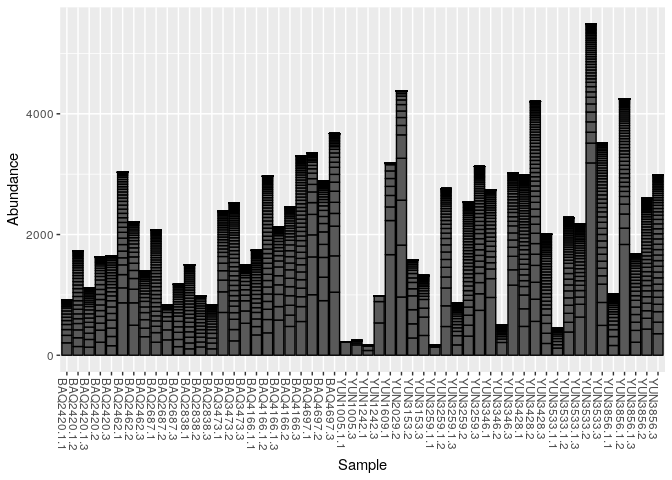

Data
----

This tutorial uses the 10% Atacama subset data (note that for the demux and dada2 tutorial we used the 1% Atacama subset)

Getting ready
=============

First we load libraries.

``` r
library(tidyverse)
library(vegan)
library(phyloseq)
```

``` r
# Directories
atacama.rds = "/data/tutorial_data/atacama_10pct.rds"
```

``` r
atacama.ps = read_rds(atacama.rds)
print(atacama.ps)
```

    ## phyloseq-class experiment-level object
    ## otu_table()   OTU Table:         [ 3388 taxa and 68 samples ]
    ## sample_data() Sample Data:       [ 68 samples by 22 sample variables ]
    ## tax_table()   Taxonomy Table:    [ 3388 taxa by 7 taxonomic ranks ]

Data Preprocessing
------------------

As with relative abundance plots, before performing ordination we will want to prune rare taxa and transform the data. We prune because we don't want small differences in rare taxa to swamp out major trends. The transformation is important because some methods depend on absolute numerical differences in abundance between samples. Since absolute counts are not meaningful in amplicon sequence data, we want to prevent such differences from affecting the ordination results.

### Prune

As with relative abundance plots, the decision about how to prune is important, we need to think about what we are throwing away, and how it might affect the analysis. For starters, we will use the same parameters as last time - only include taxa that have at least 3 reads in at least 10% of samples

``` r
sample_min_count = 50

atacama.ps %>%
  prune_samples(sample_sums(.)>=sample_min_count, .) ->
  atacama.sample_prune

sample_sums(atacama.sample_prune) %>% sort
```

    ## YUN3259.1.1   YUN3346.2 YUN3259.1.3   BAQ2838.3   BAQ2838.2   BAQ2838.1 
    ##         268        1020        1664        2023        2847        3052 
    ##   YUN3153.2   BAQ2462.3 BAQ2420.1.1   YUN1005.3 BAQ2420.1.3 BAQ2420.1.2 
    ##        3307        3330        3437        3569        4038        4092 
    ##   BAQ2420.3   BAQ2687.1 YUN3533.1.3 YUN3259.1.2   BAQ2420.2   YUN3153.3 
    ##        4247        4346        4408        4437        4462        4544 
    ##   BAQ2462.2 BAQ4166.1.1   YUN3259.2   BAQ2687.2   BAQ3473.2   YUN1242.1 
    ##        4595        4777        4807        4881        4884        4929 
    ##   YUN3346.1   YUN3346.3   YUN1609.1 YUN3533.1.2   BAQ2687.3   BAQ4697.2 
    ##        4998        5044        5129        5147        5302        5410 
    ## YUN3856.1.3 YUN3856.1.1 YUN3533.1.1   YUN1242.3   YUN3428.1   YUN3856.2 
    ##        5415        5427        5438        5468        5682        5840 
    ## BAQ4166.1.3   BAQ3473.1   YUN3428.3   BAQ2462.1   BAQ4697.1   YUN3259.3 
    ##        5905        5913        5938        6107        6281        6299 
    ## YUN3856.1.2   BAQ4166.2 BAQ4166.1.2   BAQ4166.3   YUN2029.2 YUN1005.1.1 
    ##        6562        6803        6959        7110        7190        7461 
    ##   BAQ3473.3   YUN3856.3   BAQ4697.3   YUN3533.3   YUN3533.2   YUN3428.2 
    ##        7596        7723        7891        7998        8173        9046

``` r
min_count = 3
min_sample_frac = 0.10

prune.vec = filter_taxa(atacama.sample_prune, 
                       function(x) sum(x >= min_count) >= (min_sample_frac*length(x)))
atacama.st_prune = prune_taxa(prune.vec, atacama.sample_prune)
ntaxa(atacama.st_prune)
```

    ## [1] 140

### Transform to even sampling depth.

Here we are performing the same fractional abundance transformation we did before, then multiplying by 1 x 10^6 to convert those proprotions back into whole numbers.

Pay attention to the y-axes in these plots of the raw counts, the pruned counts, and the transformed counts.

``` r
atacama.st_prune.even = transform_sample_counts(atacama.st_prune, function(x) 1E6 * x/sum(x))
plot_bar(atacama.ps)
```


``` r
plot_bar(atacama.sample_prune)
```


``` r
plot_bar(atacama.st_prune)
```



``` r
plot_bar(atacama.st_prune.even)
```


Ordination
----------

For ordination plots we have at least two major decisions:

1.  What disimilarity or distance measure will we use?
2.  What ordination method will we use?

For starters, we will use Bray-Curtis to calculate disimilarity between samples combined with NMDS for ordination.

### Bray-Curtis Dissimilarity and NMDS

``` r
atacama.st_prune.even.nmds_bc <- ordinate(atacama.st_prune.even, "NMDS", "bray")
```

    ## Square root transformation
    ## Wisconsin double standardization
    ## Run 0 stress 0.1601386 
    ## Run 1 stress 0.1780059 
    ## Run 2 stress 0.1840795 
    ## Run 3 stress 0.1695094 
    ## Run 4 stress 0.167067 
    ## Run 5 stress 0.1691798 
    ## Run 6 stress 0.1607586 
    ## Run 7 stress 0.1691767 
    ## Run 8 stress 0.1844179 
    ## Run 9 stress 0.1795469 
    ## Run 10 stress 0.1785305 
    ## Run 11 stress 0.1763524 
    ## Run 12 stress 0.1763673 
    ## Run 13 stress 0.1804962 
    ## Run 14 stress 0.1807272 
    ## Run 15 stress 0.1758542 
    ## Run 16 stress 0.1740072 
    ## Run 17 stress 0.181931 
    ## Run 18 stress 0.1776584 
    ## Run 19 stress 0.1638464 
    ## Run 20 stress 0.1805598 
    ## *** No convergence -- monoMDS stopping criteria:
    ##     20: stress ratio > sratmax

#### Converging

Often the above chunk does not converge. I say often, because NMDS is a random process, if you run it more than once you will get slightly different results. It is a good idea to set the random seed so that we get the same result each time.

``` r
# getting convergence
set.seed(1)
atacama.st_prune.even.nmds_bc <- ordinate(atacama.st_prune.even, "NMDS", "bray")
```

    ## Square root transformation
    ## Wisconsin double standardization
    ## Run 0 stress 0.1601386 
    ## Run 1 stress 0.1609302 
    ## Run 2 stress 0.1602061 
    ## ... Procrustes: rmse 0.008621961  max resid 0.04006075 
    ## Run 3 stress 0.1607535 
    ## Run 4 stress 0.1780738 
    ## Run 5 stress 0.1649294 
    ## Run 6 stress 0.1833276 
    ## Run 7 stress 0.160125 
    ## ... New best solution
    ## ... Procrustes: rmse 0.006761225  max resid 0.04266496 
    ## Run 8 stress 0.1758451 
    ## Run 9 stress 0.1643454 
    ## Run 10 stress 0.1845942 
    ## Run 11 stress 0.1663821 
    ## Run 12 stress 0.1776066 
    ## Run 13 stress 0.1722638 
    ## Run 14 stress 0.1727639 
    ## Run 15 stress 0.1643413 
    ## Run 16 stress 0.1813967 
    ## Run 17 stress 0.1771039 
    ## Run 18 stress 0.1813401 
    ## Run 19 stress 0.1609343 
    ## Run 20 stress 0.1690474 
    ## *** No convergence -- monoMDS stopping criteria:
    ##     20: stress ratio > sratmax

The NMDS did not converge so we can try some of the suggestions in the *Convergence Problems* section of the help for the NMDS: `help("metaMDS", "vegan")`. If none of those work, we need to take the NMDS results with a grain of salt or try a different ordination methods.

Let's inrease the values for `try` and `trymax` (according to help(metaMDS): "Minimum and maximum numbers of random starts in search of stable solution. After try has been reached, the iteration will stop when two convergent solutions were found or trymax was reached.")

``` r
set.seed(1)
atacama.st_prune.even.nmds_bc <- ordinate(atacama.st_prune.even, "NMDS", "bray",trymax=100,try=30)
```

    ## Square root transformation
    ## Wisconsin double standardization
    ## Run 0 stress 0.1601386 
    ## Run 1 stress 0.1609302 
    ## Run 2 stress 0.1602061 
    ## ... Procrustes: rmse 0.008621961  max resid 0.04006075 
    ## Run 3 stress 0.1607535 
    ## Run 4 stress 0.1780738 
    ## Run 5 stress 0.1649294 
    ## Run 6 stress 0.1833276 
    ## Run 7 stress 0.160125 
    ## ... New best solution
    ## ... Procrustes: rmse 0.006761225  max resid 0.04266496 
    ## Run 8 stress 0.1758451 
    ## Run 9 stress 0.1643454 
    ## Run 10 stress 0.1845942 
    ## Run 11 stress 0.1663821 
    ## Run 12 stress 0.1776066 
    ## Run 13 stress 0.1722638 
    ## Run 14 stress 0.1727639 
    ## Run 15 stress 0.1643413 
    ## Run 16 stress 0.1813967 
    ## Run 17 stress 0.1771039 
    ## Run 18 stress 0.1813401 
    ## Run 19 stress 0.1609343 
    ## Run 20 stress 0.1690474 
    ## Run 21 stress 0.1649203 
    ## Run 22 stress 0.1646563 
    ## Run 23 stress 0.173792 
    ## Run 24 stress 0.1610997 
    ## Run 25 stress 0.1617971 
    ## Run 26 stress 0.1772643 
    ## Run 27 stress 0.1678661 
    ## Run 28 stress 0.163596 
    ## Run 29 stress 0.1643408 
    ## Run 30 stress 0.1630994 
    ## Run 31 stress 0.1885259 
    ## Run 32 stress 0.1626361 
    ## Run 33 stress 0.1794987 
    ## Run 34 stress 0.1666282 
    ## Run 35 stress 0.1691485 
    ## Run 36 stress 0.1797762 
    ## Run 37 stress 0.169825 
    ## Run 38 stress 0.1825085 
    ## Run 39 stress 0.1828131 
    ## Run 40 stress 0.1601258 
    ## ... Procrustes: rmse 0.004293822  max resid 0.02738379 
    ## Run 41 stress 0.1839286 
    ## Run 42 stress 0.1607011 
    ## Run 43 stress 0.168181 
    ## Run 44 stress 0.1616216 
    ## Run 45 stress 0.1846355 
    ## Run 46 stress 0.1924433 
    ## Run 47 stress 0.1788834 
    ## Run 48 stress 0.1692784 
    ## Run 49 stress 0.1761192 
    ## Run 50 stress 0.1808283 
    ## Run 51 stress 0.177709 
    ## Run 52 stress 0.1645932 
    ## Run 53 stress 0.164423 
    ## Run 54 stress 0.1806484 
    ## Run 55 stress 0.1785098 
    ## Run 56 stress 0.1783959 
    ## Run 57 stress 0.1632178 
    ## Run 58 stress 0.169584 
    ## Run 59 stress 0.1730682 
    ## Run 60 stress 0.178001 
    ## Run 61 stress 0.166404 
    ## Run 62 stress 0.1693362 
    ## Run 63 stress 0.1815427 
    ## Run 64 stress 0.1645911 
    ## Run 65 stress 0.1796918 
    ## Run 66 stress 0.1798853 
    ## Run 67 stress 0.1654201 
    ## Run 68 stress 0.1852916 
    ## Run 69 stress 0.1645865 
    ## Run 70 stress 0.1603334 
    ## ... Procrustes: rmse 0.004746362  max resid 0.0173715 
    ## Run 71 stress 0.1616163 
    ## Run 72 stress 0.1616802 
    ## Run 73 stress 0.1800909 
    ## Run 74 stress 0.1792318 
    ## Run 75 stress 0.1609017 
    ## Run 76 stress 0.167541 
    ## Run 77 stress 0.1810276 
    ## Run 78 stress 0.1765591 
    ## Run 79 stress 0.1830025 
    ## Run 80 stress 0.1831821 
    ## Run 81 stress 0.1791602 
    ## Run 82 stress 0.1610899 
    ## Run 83 stress 0.1666162 
    ## Run 84 stress 0.1803701 
    ## Run 85 stress 0.1643497 
    ## Run 86 stress 0.1640628 
    ## Run 87 stress 0.1678246 
    ## Run 88 stress 0.178277 
    ## Run 89 stress 0.1757959 
    ## Run 90 stress 0.160852 
    ## Run 91 stress 0.1664125 
    ## Run 92 stress 0.1832047 
    ## Run 93 stress 0.1797479 
    ## Run 94 stress 0.1795434 
    ## Run 95 stress 0.1750479 
    ## Run 96 stress 0.1643434 
    ## Run 97 stress 0.1643397 
    ## Run 98 stress 0.1776586 
    ## Run 99 stress 0.1804818 
    ## Run 100 stress 0.1776036 
    ## *** No convergence -- monoMDS stopping criteria:
    ##      1: no. of iterations >= maxit
    ##     99: stress ratio > sratmax

That didn't work, but if we try a different random seed . . .

``` r
set.seed(6)
atacama.st_prune.even.nmds_bc <- ordinate(atacama.st_prune.even, "NMDS", "bray",trymax=100,try=30)
```

    ## Square root transformation
    ## Wisconsin double standardization
    ## Run 0 stress 0.1601386 
    ## Run 1 stress 0.1639074 
    ## Run 2 stress 0.1794261 
    ## Run 3 stress 0.1643421 
    ## Run 4 stress 0.1852355 
    ## Run 5 stress 0.1805739 
    ## Run 6 stress 0.1830855 
    ## Run 7 stress 0.1823216 
    ## Run 8 stress 0.1681262 
    ## Run 9 stress 0.1797623 
    ## Run 10 stress 0.1814811 
    ## Run 11 stress 0.1736983 
    ## Run 12 stress 0.1610989 
    ## Run 13 stress 0.1640604 
    ## Run 14 stress 0.1651869 
    ## Run 15 stress 0.1724782 
    ## Run 16 stress 0.1676058 
    ## Run 17 stress 0.1810137 
    ## Run 18 stress 0.1626694 
    ## Run 19 stress 0.1833834 
    ## Run 20 stress 0.1784873 
    ## Run 21 stress 0.1652235 
    ## Run 22 stress 0.1778414 
    ## Run 23 stress 0.1807486 
    ## Run 24 stress 0.1805183 
    ## Run 25 stress 0.1601191 
    ## ... New best solution
    ## ... Procrustes: rmse 0.006770562  max resid 0.0422558 
    ## Run 26 stress 0.1823349 
    ## Run 27 stress 0.161708 
    ## Run 28 stress 0.1796872 
    ## Run 29 stress 0.1779632 
    ## Run 30 stress 0.163913 
    ## Run 31 stress 0.1781275 
    ## Run 32 stress 0.179427 
    ## Run 33 stress 0.1688344 
    ## Run 34 stress 0.1778318 
    ## Run 35 stress 0.1785984 
    ## Run 36 stress 0.1800208 
    ## Run 37 stress 0.1845732 
    ## Run 38 stress 0.1843299 
    ## Run 39 stress 0.1741185 
    ## Run 40 stress 0.1737521 
    ## Run 41 stress 0.1823854 
    ## Run 42 stress 0.1610969 
    ## Run 43 stress 0.1601363 
    ## ... Procrustes: rmse 0.006765095  max resid 0.0424045 
    ## Run 44 stress 0.1754639 
    ## Run 45 stress 0.1809319 
    ## Run 46 stress 0.1839205 
    ## Run 47 stress 0.1683414 
    ## Run 48 stress 0.1916122 
    ## Run 49 stress 0.1821487 
    ## Run 50 stress 0.1756787 
    ## Run 51 stress 0.1761902 
    ## Run 52 stress 0.1609281 
    ## Run 53 stress 0.1783628 
    ## Run 54 stress 0.18076 
    ## Run 55 stress 0.1781357 
    ## Run 56 stress 0.1768521 
    ## Run 57 stress 0.1727562 
    ## Run 58 stress 0.1632296 
    ## Run 59 stress 0.1601154 
    ## ... New best solution
    ## ... Procrustes: rmse 0.0006914565  max resid 0.004387594 
    ## ... Similar to previous best
    ## *** Solution reached

Two important things to check are:

1.  Did the NMDS converge?
2.  What is the stress?

``` r
cat("Converged?", atacama.st_prune.even.nmds_bc$converged, fill=TRUE)
```

    ## Converged? TRUE

``` r
cat("Stress:", atacama.st_prune.even.nmds_bc$stress, fill=TRUE)
```

    ## Stress: 0.1601154

Stress is a measure of how well the NMDS procedure was able to represent the high dimensional data in the lower dimentionsional space. The stress is important in understanding how informative the NMDS results are, so should be presented with the NMDS plot.

> | Stress Range | Interpretation                       |
> |--------------|--------------------------------------|
> | &lt;0.1      | Great                                |
> | 0.1 - 0.2    | Good                                 |
> | 0.2 - 0.3    | Acceptable (treat with some caution) |
> | &gt; 0.3     | Unreliable                           |
>
#### Scree Plot

``` r
## NMDS Scree Plot
mds_stress_dplyr = function(df,rep_num, dimensions) {
  mds_result = metaMDS(df, autotransform=TRUE, k=dimensions)
  return(mds_result$stress)
}
set.seed(1)
scree.df = expand.grid(repnum=seq(1), dimensions=seq(6)) %>% 
  rowwise() %>% 
  mutate(stress = mds_stress_dplyr(otu_table(atacama.st_prune.even), repnum, dimensions))
```

    ## Square root transformation
    ## Wisconsin double standardization
    ## Run 0 stress 0.3373902 
    ## Run 1 stress 0.2367708 
    ## ... New best solution
    ## ... Procrustes: rmse 0.101801  max resid 0.4859679 
    ## Run 2 stress 0.2370575 
    ## ... Procrustes: rmse 0.004239045  max resid 0.02546442 
    ## Run 3 stress 0.2370769 
    ## ... Procrustes: rmse 0.004430261  max resid 0.01774357 
    ## Run 4 stress 0.236502 
    ## ... New best solution
    ## ... Procrustes: rmse 0.008309083  max resid 0.05213138 
    ## Run 5 stress 0.2899256 
    ## Run 6 stress 0.2889312 
    ## Run 7 stress 0.2675217 
    ## Run 8 stress 0.2371221 
    ## Run 9 stress 0.2472298 
    ## Run 10 stress 0.2365671 
    ## ... Procrustes: rmse 0.001647061  max resid 0.007140453 
    ## ... Similar to previous best
    ## Run 11 stress 0.2469598 
    ## Run 12 stress 0.2717212 
    ## Run 13 stress 0.2864838 
    ## Run 14 stress 0.2368102 
    ## ... Procrustes: rmse 0.003912596  max resid 0.01760958 
    ## Run 15 stress 0.2891876 
    ## Run 16 stress 0.2715887 
    ## Run 17 stress 0.2366412 
    ## ... Procrustes: rmse 0.002459106  max resid 0.006795335 
    ## ... Similar to previous best
    ## Run 18 stress 0.2891891 
    ## Run 19 stress 0.2896549 
    ## Run 20 stress 0.2370657 
    ## *** Solution reached
    ## Square root transformation
    ## Wisconsin double standardization
    ## Run 0 stress 0.1601386 
    ## Run 1 stress 0.1663821 
    ## Run 2 stress 0.1776066 
    ## Run 3 stress 0.1722638 
    ## Run 4 stress 0.1727639 
    ## Run 5 stress 0.1643413 
    ## Run 6 stress 0.1813967 
    ## Run 7 stress 0.1771039 
    ## Run 8 stress 0.1813401 
    ## Run 9 stress 0.1609343 
    ## Run 10 stress 0.1690474 
    ## Run 11 stress 0.1649203 
    ## Run 12 stress 0.1646563 
    ## Run 13 stress 0.173792 
    ## Run 14 stress 0.1610997 
    ## Run 15 stress 0.1617971 
    ## Run 16 stress 0.1772643 
    ## Run 17 stress 0.1678661 
    ## Run 18 stress 0.163596 
    ## Run 19 stress 0.1643408 
    ## Run 20 stress 0.1630994 
    ## *** No convergence -- monoMDS stopping criteria:
    ##     20: stress ratio > sratmax
    ## Square root transformation
    ## Wisconsin double standardization
    ## Run 0 stress 0.1225325 
    ## Run 1 stress 0.1222015 
    ## ... New best solution
    ## ... Procrustes: rmse 0.01568948  max resid 0.08913733 
    ## Run 2 stress 0.1266043 
    ## Run 3 stress 0.1222955 
    ## ... Procrustes: rmse 0.004250089  max resid 0.02026026 
    ## Run 4 stress 0.125109 
    ## Run 5 stress 0.126691 
    ## Run 6 stress 0.1225373 
    ## ... Procrustes: rmse 0.01708154  max resid 0.09405494 
    ## Run 7 stress 0.1322643 
    ## Run 8 stress 0.1222062 
    ## ... Procrustes: rmse 0.0005951417  max resid 0.003217885 
    ## ... Similar to previous best
    ## Run 9 stress 0.1225979 
    ## ... Procrustes: rmse 0.01781571  max resid 0.1116199 
    ## Run 10 stress 0.1222011 
    ## ... New best solution
    ## ... Procrustes: rmse 0.0006773314  max resid 0.002736377 
    ## ... Similar to previous best
    ## Run 11 stress 0.1222105 
    ## ... Procrustes: rmse 0.001399571  max resid 0.008194284 
    ## ... Similar to previous best
    ## Run 12 stress 0.1226013 
    ## ... Procrustes: rmse 0.01788181  max resid 0.1104065 
    ## Run 13 stress 0.1265747 
    ## Run 14 stress 0.1250817 
    ## Run 15 stress 0.125121 
    ## Run 16 stress 0.1319247 
    ## Run 17 stress 0.122207 
    ## ... Procrustes: rmse 0.00479439  max resid 0.02065518 
    ## Run 18 stress 0.1226082 
    ## ... Procrustes: rmse 0.01818502  max resid 0.1110372 
    ## Run 19 stress 0.1225512 
    ## ... Procrustes: rmse 0.01825789  max resid 0.0997069 
    ## Run 20 stress 0.1279016 
    ## *** Solution reached
    ## Square root transformation
    ## Wisconsin double standardization
    ## Run 0 stress 0.09908392 
    ## Run 1 stress 0.09913025 
    ## ... Procrustes: rmse 0.004068528  max resid 0.01721977 
    ## Run 2 stress 0.09923068 
    ## ... Procrustes: rmse 0.03193527  max resid 0.1393206 
    ## Run 3 stress 0.09921137 
    ## ... Procrustes: rmse 0.0258961  max resid 0.134278 
    ## Run 4 stress 0.09909089 
    ## ... Procrustes: rmse 0.03301458  max resid 0.1902488 
    ## Run 5 stress 0.09925109 
    ## ... Procrustes: rmse 0.02188802  max resid 0.1264982 
    ## Run 6 stress 0.1010965 
    ## Run 7 stress 0.1005049 
    ## Run 8 stress 0.09909686 
    ## ... Procrustes: rmse 0.01131274  max resid 0.05614857 
    ## Run 9 stress 0.09926205 
    ## ... Procrustes: rmse 0.0324206  max resid 0.1894578 
    ## Run 10 stress 0.09909454 
    ## ... Procrustes: rmse 0.007836688  max resid 0.04168976 
    ## Run 11 stress 0.09921543 
    ## ... Procrustes: rmse 0.02938677  max resid 0.1369824 
    ## Run 12 stress 0.09911312 
    ## ... Procrustes: rmse 0.03238635  max resid 0.1903884 
    ## Run 13 stress 0.09922777 
    ## ... Procrustes: rmse 0.0324689  max resid 0.1897777 
    ## Run 14 stress 0.1024834 
    ## Run 15 stress 0.1005915 
    ## Run 16 stress 0.1001288 
    ## Run 17 stress 0.09922584 
    ## ... Procrustes: rmse 0.03173132  max resid 0.1390033 
    ## Run 18 stress 0.1005058 
    ## Run 19 stress 0.09923729 
    ## ... Procrustes: rmse 0.03247865  max resid 0.1896472 
    ## Run 20 stress 0.09980144 
    ## *** No convergence -- monoMDS stopping criteria:
    ##     10: no. of iterations >= maxit
    ##     10: stress ratio > sratmax
    ## Square root transformation
    ## Wisconsin double standardization
    ## Run 0 stress 0.08189584 
    ## Run 1 stress 0.08346332 
    ## Run 2 stress 0.08201753 
    ## ... Procrustes: rmse 0.01779556  max resid 0.0417656 
    ## Run 3 stress 0.08232662 
    ## ... Procrustes: rmse 0.06025681  max resid 0.1615785 
    ## Run 4 stress 0.08238181 
    ## ... Procrustes: rmse 0.06175399  max resid 0.1557198 
    ## Run 5 stress 0.08201033 
    ## ... Procrustes: rmse 0.0566842  max resid 0.1898347 
    ## Run 6 stress 0.08283757 
    ## Run 7 stress 0.08303179 
    ## Run 8 stress 0.08284867 
    ## Run 9 stress 0.08200576 
    ## ... Procrustes: rmse 0.05543698  max resid 0.1897709 
    ## Run 10 stress 0.08310657 
    ## Run 11 stress 0.08241524 
    ## Run 12 stress 0.08238469 
    ## ... Procrustes: rmse 0.02025429  max resid 0.07704126 
    ## Run 13 stress 0.08186529 
    ## ... New best solution
    ## ... Procrustes: rmse 0.007026317  max resid 0.01944074 
    ## Run 14 stress 0.08206672 
    ## ... Procrustes: rmse 0.009105006  max resid 0.04300271 
    ## Run 15 stress 0.08232626 
    ## ... Procrustes: rmse 0.05914502  max resid 0.1513226 
    ## Run 16 stress 0.08189895 
    ## ... Procrustes: rmse 0.007602686  max resid 0.0216196 
    ## Run 17 stress 0.08248964 
    ## Run 18 stress 0.08233359 
    ## ... Procrustes: rmse 0.0607242  max resid 0.1548742 
    ## Run 19 stress 0.08265634 
    ## Run 20 stress 0.08249995 
    ## *** No convergence -- monoMDS stopping criteria:
    ##     11: no. of iterations >= maxit
    ##      9: stress ratio > sratmax
    ## Square root transformation
    ## Wisconsin double standardization
    ## Run 0 stress 0.0695478 
    ## Run 1 stress 0.07040242 
    ## Run 2 stress 0.0691114 
    ## ... New best solution
    ## ... Procrustes: rmse 0.03051704  max resid 0.1176351 
    ## Run 3 stress 0.07038665 
    ## Run 4 stress 0.07065892 
    ## Run 5 stress 0.07029684 
    ## Run 6 stress 0.07006203 
    ## Run 7 stress 0.06964244 
    ## Run 8 stress 0.07103317 
    ## Run 9 stress 0.06911394 
    ## ... Procrustes: rmse 0.006442286  max resid 0.02379767 
    ## Run 10 stress 0.06933791 
    ## ... Procrustes: rmse 0.009421557  max resid 0.0413969 
    ## Run 11 stress 0.07029317 
    ## Run 12 stress 0.06910107 
    ## ... New best solution
    ## ... Procrustes: rmse 0.002258035  max resid 0.00834841 
    ## ... Similar to previous best
    ## Run 13 stress 0.07124537 
    ## Run 14 stress 0.07171138 
    ## Run 15 stress 0.06914377 
    ## ... Procrustes: rmse 0.00526619  max resid 0.01808266 
    ## Run 16 stress 0.06910348 
    ## ... Procrustes: rmse 0.004410537  max resid 0.01675459 
    ## Run 17 stress 0.06928539 
    ## ... Procrustes: rmse 0.01495838  max resid 0.05586074 
    ## Run 18 stress 0.06945537 
    ## ... Procrustes: rmse 0.02548124  max resid 0.1069096 
    ## Run 19 stress 0.07077087 
    ## Run 20 stress 0.0700487 
    ## *** Solution reached

``` r
ggplot(data = scree.df, aes(x = dimensions, y = stress)) +
  geom_jitter(width = 0.05, alpha=1/3) +
  stat_summary(fun.y=mean, geom="line") +
theme_bw()
```


### NMDS Plots

Let's use the results of ordination to generate an NMDS plot where each datapoint represents a *sample*.

``` r
plot_ordination(atacama.st_prune.even, atacama.st_prune.even.nmds_bc, type="samples", color="TransectName") 
```

 It is good practice to label the figure with the stress, or include it in the figure caption. If this Rmd is knitted, then this inline code will tell us the stress by plugging the in value for the R code . . .

Stress: 0.1601154

#### Adding Stress

This figure adds the stress directly to the plot

``` r
plot_ordination(atacama.st_prune.even, 
                atacama.st_prune.even.nmds_bc, 
                type="samples", color="TransectName") +
  annotate("text",x=-Inf,y=-Inf,hjust=0,vjust=0,
           label= paste("Stress:", atacama.st_prune.even.nmds_bc$stress, 
                        "\nConverged:", atacama.st_prune.even.nmds_bc$converged))
```


#### Other Parameters

There seems to be some separation between transects, but not much. Let's look at other paramters

##### Sites

``` r
plot_ordination(atacama.st_prune.even, 
                atacama.st_prune.even.nmds_bc, 
                type="samples", color="SiteName") +
  annotate("text",x=-Inf,y=-Inf,hjust=0,vjust=0,
           label= paste("Stress:", atacama.st_prune.even.nmds_bc$stress, 
                        "\nConverged:", atacama.st_prune.even.nmds_bc$converged))
```


##### Vegetation

``` r
plot_ordination(atacama.st_prune.even, 
                atacama.st_prune.even.nmds_bc, 
                type="samples", color="Vegetation") +
  annotate("text",x=-Inf,y=-Inf,hjust=0,vjust=0,
           label= paste("Stress:", atacama.st_prune.even.nmds_bc$stress, 
                        "\nConverged:", atacama.st_prune.even.nmds_bc$converged))
```


Note that changing "color" only changes which metadata is used to determine color of sample data points, the locations of the points remains the same

### Helping Visualization

The large number of samples that are often found in amplicon sequence projects can make it difficult to visually process ordination plots, especially if the data is noisy (usually the case). There are a number of ways to improve the interpretability of ordination plots. These modifications can be useful, but should be used with care, because sometimes they make things worse or suggest paterns where none exist.

#### Confidence ellipses on NMDS Plots

You can add 95% confidence elipses to ordination plots by appending `+ stat_ellipse(type = "norm")` after the plotting function.

``` r
plot_ordination(atacama.st_prune.even, atacama.st_prune.even.nmds_bc, type="samples", color="Vegetation") + 
  stat_ellipse(type = "norm") +
  theme_bw()
```


#### Spider Plots ellipses on NMDS Plots

``` r
ordiplot (atacama.st_prune.even.nmds_bc, display = 'si', type = 'n')

ordispider (atacama.st_prune.even.nmds_bc, 
            groups = get_variable(atacama.st_prune.even, "Vegetation"), 
            col = 1:2)
```


#### Faceted NMDS Plots

Another option for improving ordination plots is to facet results. Let's make an NMDS plot faceted by Vegetation

``` r
plot_ordination(atacama.st_prune.even, atacama.st_prune.even.nmds_bc, type="samples", color="Vegetation") + 
  facet_wrap(~TransectName) 
```


Sometimes it is helpful to show all the points, but gray out the ones that are not the the focus

``` r
atacama.st_prune.even.nmds_bc.plot = plot_ordination(atacama.st_prune.even, 
                                                     atacama.st_prune.even.nmds_bc, 
                                                     type="samples", color="Vegetation")

ggplot(atacama.st_prune.even.nmds_bc.plot$data, aes(NMDS1, NMDS2)) +
  theme_bw() +
  geom_point(data = transform(atacama.st_prune.even.nmds_bc.plot$data, Vegetation = NULL, TransectName = NULL), 
             color = "grey90") +
  geom_point(aes(color = Vegetation)) + 
facet_grid(~Vegetation, labeller = "label_both")
```


``` r
atacama.st_prune.even.nmds_bc.plot = plot_ordination(atacama.st_prune.even, 
                                                     atacama.st_prune.even.nmds_bc, 
                                                     type="samples", color="Vegetation")

ggplot(atacama.st_prune.even.nmds_bc.plot$data, aes(NMDS1, NMDS2)) +
  theme_bw() +
  geom_point(data = transform(atacama.st_prune.even.nmds_bc.plot$data, Vegetation = NULL, TransectName = NULL), 
             color = "grey90") +
  geom_point(aes(color = Vegetation)) + 
facet_grid(Vegetation~TransectName, labeller = "label_both") +
      theme(plot.background = element_blank(),
        panel.grid.major = element_blank(),
        panel.grid.minor = element_blank())
```


### PCoA Plots

There are many other ordination methods supported by phyloseq. Let's make a PCoA plot using Bray-Curtis dissimilarity, coloring the data points by "Vegetation".

``` r
atacama.st_prune.even.pcoa_bc <- ordinate(atacama.st_prune.even, "PCoA", "bray")
plot_ordination(atacama.st_prune.even, atacama.st_prune.even.pcoa_bc, type="samples", color="Vegetation") 
```


sessionInfo
===========

It is always a good idea to capture the sessionInfo information so you know what versions of R and libraries you used!

``` r
sessionInfo()
```

    ## R version 3.4.4 (2018-03-15)
    ## Platform: x86_64-pc-linux-gnu (64-bit)
    ## Running under: Ubuntu 18.04.2 LTS
    ## 
    ## Matrix products: default
    ## BLAS: /usr/lib/x86_64-linux-gnu/blas/libblas.so.3.7.1
    ## LAPACK: /usr/lib/x86_64-linux-gnu/lapack/liblapack.so.3.7.1
    ## 
    ## locale:
    ##  [1] LC_CTYPE=en_US.UTF-8       LC_NUMERIC=C              
    ##  [3] LC_TIME=en_US.UTF-8        LC_COLLATE=en_US.UTF-8    
    ##  [5] LC_MONETARY=en_US.UTF-8    LC_MESSAGES=en_US.UTF-8   
    ##  [7] LC_PAPER=en_US.UTF-8       LC_NAME=C                 
    ##  [9] LC_ADDRESS=C               LC_TELEPHONE=C            
    ## [11] LC_MEASUREMENT=en_US.UTF-8 LC_IDENTIFICATION=C       
    ## 
    ## attached base packages:
    ## [1] stats     graphics  grDevices utils     datasets  methods   base     
    ## 
    ## other attached packages:
    ##  [1] phyloseq_1.22.3 vegan_2.5-4     lattice_0.20-35 permute_0.9-5  
    ##  [5] forcats_0.4.0   stringr_1.3.0   dplyr_0.8.0.1   purrr_0.3.1    
    ##  [9] readr_1.3.1     tidyr_0.8.0     tibble_2.0.1    ggplot2_2.2.1  
    ## [13] tidyverse_1.2.1
    ## 
    ## loaded via a namespace (and not attached):
    ##  [1] Biobase_2.38.0      httr_1.4.0          splines_3.4.4      
    ##  [4] jsonlite_1.5        foreach_1.4.4       modelr_0.1.4       
    ##  [7] assertthat_0.2.0    stats4_3.4.4        cellranger_1.1.0   
    ## [10] yaml_2.2.0          pillar_1.3.1        backports_1.1.1    
    ## [13] glue_1.3.1          digest_0.6.15       XVector_0.18.0     
    ## [16] rvest_0.3.2         colorspace_1.3-2    htmltools_0.3.6    
    ## [19] Matrix_1.2-12       plyr_1.8.4          pkgconfig_2.0.2    
    ## [22] broom_0.5.1         haven_2.1.0         zlibbioc_1.24.0    
    ## [25] scales_1.0.0        mgcv_1.8-23         generics_0.0.2     
    ## [28] IRanges_2.12.0      BiocGenerics_0.24.0 lazyeval_0.2.1     
    ## [31] cli_1.0.1           survival_2.41-3     magrittr_1.5       
    ## [34] crayon_1.3.4        readxl_1.3.0        evaluate_0.10.1    
    ## [37] nlme_3.1-131        MASS_7.3-49         xml2_1.2.0         
    ## [40] tools_3.4.4         data.table_1.10.4-3 hms_0.4.2          
    ## [43] S4Vectors_0.16.0    munsell_0.5.0       cluster_2.0.6      
    ## [46] Biostrings_2.46.0   ade4_1.7-13         compiler_3.4.4     
    ## [49] rlang_0.3.1         rhdf5_2.22.0        grid_3.4.4         
    ## [52] iterators_1.0.10    biomformat_1.6.0    rstudioapi_0.7     
    ## [55] igraph_1.2.4        labeling_0.3        rmarkdown_1.11     
    ## [58] multtest_2.34.0     gtable_0.2.0        codetools_0.2-15   
    ## [61] reshape2_1.4.2      R6_2.2.2            lubridate_1.7.4    
    ## [64] knitr_1.22          ape_5.2             stringi_1.1.6      
    ## [67] parallel_3.4.4      Rcpp_1.0.0          tidyselect_0.2.5   
    ## [70] xfun_0.5
