Data
----

This tutorial uses the 10% Atacama subset data (note that for the demux
and dada2 tutorial we used the 1% Atacama subset) There is a problem
when running `ordinate` on the 1% dataset. Not sure what it is!

Getting ready
=============

First we load libraries.

``` r
library(tidyverse)
library(vegan)
library(phyloseq)
```

``` r
# Directories

if(exists("params") && 
   !is.null(params[["atacama_ps_rds"]])){
  atacama.ps.rds=params[["atacama_ps_rds"]]
} else {
  atacama.ps.rds = "/data/tutorial_data/atacama_10pct.rds"
}
print(atacama.ps.rds)
```

    ## [1] "/data/tutorial_data/atacama_10pct.rds"

``` r
atacama.ps = read_rds(atacama.ps.rds)
print(atacama.ps)
```

    ## phyloseq-class experiment-level object
    ## otu_table()   OTU Table:         [ 3508 taxa and 68 samples ]
    ## sample_data() Sample Data:       [ 68 samples by 22 sample variables ]
    ## tax_table()   Taxonomy Table:    [ 3508 taxa by 7 taxonomic ranks ]

Data Preprocessing
------------------

As with relative abundance plots, before performing ordination we will
want to prune rare taxa and transform the data. We prune because we
don’t want small differences in rare taxa to swamp out major trends. The
transformation is important because some methods depend on absolute
numerical differences in abundance between samples. Since absolute
counts are not meaningful in amplicon sequence data, we want to prevent
such differences from affecting the ordination results.

### Prune

As with relative abundance plots, the decision about how to prune is
important, we need to think about what we are throwing away, and how it
might affect the analysis. For starters, we will use the same parameters
as last time - only include taxa that have at least 3 reads in at least
10% of samples

``` r
sample_min_count = 50

atacama.ps %>%
  prune_samples(sample_sums(.)>=sample_min_count, .) ->
  atacama.sample_prune

sample_sums(atacama.sample_prune) %>% sort
```

    ## YUN3259.1.1   YUN3346.2 YUN3259.1.3   BAQ2838.3   BAQ2838.2   BAQ2838.1 
    ##         149         950        1633        1942        2727        2945 
    ##   YUN3153.2 BAQ2420.1.1   BAQ2462.3   YUN1005.3 BAQ2420.1.2 BAQ2420.1.3 
    ##        3344        3353        3381        3564        4028        4042 
    ##   BAQ2420.3 YUN3533.1.3 YUN3259.1.2   BAQ2687.1   BAQ2420.2 BAQ4166.1.1 
    ##        4253        4267        4298        4325        4405        4505 
    ##   BAQ2462.2   YUN3153.3   YUN3259.2   BAQ3473.2   BAQ2687.2   YUN1242.1 
    ##        4574        4641        4648        4793        4946        4975 
    ##   YUN3346.1   YUN3346.3 YUN3533.1.2   YUN1609.1 YUN3533.1.1 YUN3856.1.1 
    ##        4986        4987        5015        5081        5190        5244 
    ##   BAQ2687.3 YUN3856.1.3   BAQ4697.2   YUN1242.3   BAQ3473.1   YUN3856.2 
    ##        5263        5270        5332        5422        5585        5638 
    ##   YUN3428.1 BAQ4166.1.3   YUN3428.3   BAQ4697.1   YUN3259.3   BAQ2462.1 
    ##        5649        5753        6064        6102        6198        6222 
    ## YUN3856.1.2   BAQ4166.2   BAQ4166.3 BAQ4166.1.2   YUN2029.2 YUN1005.1.1 
    ##        6354        6558        6838        6952        7232        7360 
    ##   BAQ3473.3   YUN3856.3   YUN3533.3   BAQ4697.3   YUN3533.2   YUN3428.2 
    ##        7617        7625        7743        7773        7971        8825

``` r
min_count = 3
min_sample = 2

prune.vec = filter_taxa(atacama.sample_prune, 
                       function(x) sum(x >= min_count) >= min_sample)
sum(prune.vec)
```

    ## [1] 1015

### Transform to even sampling depth.

Here we are performing the same fractional abundance transformation we
did before, then multiplying by 1 x 10^6 to convert those proprotions
back into whole numbers.

Pay attention to the y-axes in these plots of the raw counts, the pruned
counts, and the transformed counts.

``` r
atacama.even = transform_sample_counts(atacama.sample_prune, function(x) 1E6 * x/sum(x))

atacama.st_prune.even = prune_taxa(prune.vec, atacama.even)
ntaxa(atacama.st_prune.even)
```

    ## [1] 1015

``` r
# plot_bar(atacama.ps)
# plot_bar(atacama.sample_prune)
# plot_bar(atacama.st_prune)
plot_bar(atacama.st_prune.even)
```

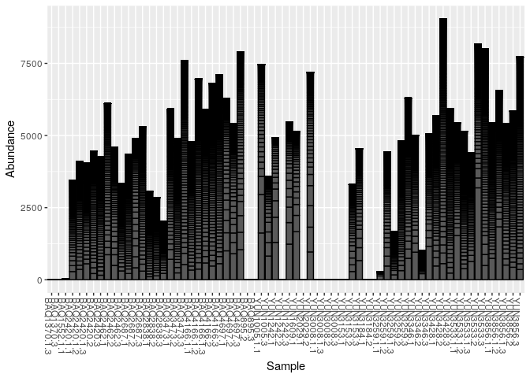

Ordination
----------

For ordination plots we have at least two major decisions:

1.  What disimilarity or distance measure will we use?
2.  What ordination method will we use?

For starters, we will use Bray-Curtis to calculate disimilarity between
samples combined with NMDS for ordination.

### Bray-Curtis Dissimilarity and NMDS

``` r
atacama.st_prune.even.nmds_bc <- ordinate(atacama.st_prune.even, "NMDS", "bray")
```

    ## Square root transformation
    ## Wisconsin double standardization
    ## Run 0 stress 0.1687009 
    ## Run 1 stress 0.1816958 
    ## Run 2 stress 0.1824443 
    ## Run 3 stress 0.1743918 
    ## Run 4 stress 0.1787274 
    ## Run 5 stress 0.1660364 
    ## ... New best solution
    ## ... Procrustes: rmse 0.0377437  max resid 0.1695759 
    ## Run 6 stress 0.1781953 
    ## Run 7 stress 0.1857875 
    ## Run 8 stress 0.176435 
    ## Run 9 stress 0.1859313 
    ## Run 10 stress 0.1792373 
    ## Run 11 stress 0.1652082 
    ## ... New best solution
    ## ... Procrustes: rmse 0.01059606  max resid 0.0735846 
    ## Run 12 stress 0.193935 
    ## Run 13 stress 0.1845916 
    ## Run 14 stress 0.176255 
    ## Run 15 stress 0.1762603 
    ## Run 16 stress 0.1819018 
    ## Run 17 stress 0.1694971 
    ## Run 18 stress 0.17924 
    ## Run 19 stress 0.1860009 
    ## Run 20 stress 0.1668548 
    ## *** No convergence -- monoMDS stopping criteria:
    ##      1: no. of iterations >= maxit
    ##     19: stress ratio > sratmax

#### Converging

Often the above chunk does not converge. I say often, because NMDS is a
random process, if you run it more than once you will get slightly
different results. It is a good idea to set the random seed so that we
get the same result each time.

``` r
# getting convergence
set.seed(1)
atacama.st_prune.even.nmds_bc <- ordinate(atacama.st_prune.even, "NMDS", "bray")
```

    ## Square root transformation
    ## Wisconsin double standardization
    ## Run 0 stress 0.1687009 
    ## Run 1 stress 0.1835944 
    ## Run 2 stress 0.1679563 
    ## ... New best solution
    ## ... Procrustes: rmse 0.02701949  max resid 0.148057 
    ## Run 3 stress 0.1660417 
    ## ... New best solution
    ## ... Procrustes: rmse 0.02076684  max resid 0.1163657 
    ## Run 4 stress 0.1652055 
    ## ... New best solution
    ## ... Procrustes: rmse 0.01110089  max resid 0.07413419 
    ## Run 5 stress 0.1680924 
    ## Run 6 stress 0.1934257 
    ## Run 7 stress 0.1840988 
    ## Run 8 stress 0.1782493 
    ## Run 9 stress 0.1680929 
    ## Run 10 stress 0.1856678 
    ## Run 11 stress 0.174169 
    ## Run 12 stress 0.1680928 
    ## Run 13 stress 0.1689374 
    ## Run 14 stress 0.1697128 
    ## Run 15 stress 0.1698423 
    ## Run 16 stress 0.189812 
    ## Run 17 stress 0.1824366 
    ## Run 18 stress 0.1660332 
    ## Run 19 stress 0.1822154 
    ## Run 20 stress 0.1929943 
    ## *** No convergence -- monoMDS stopping criteria:
    ##     20: stress ratio > sratmax

We can try a different random seed . . .

``` r
set.seed(6)
atacama.st_prune.even.nmds_bc <- ordinate(atacama.st_prune.even, "NMDS", "bray")
```

    ## Square root transformation
    ## Wisconsin double standardization
    ## Run 0 stress 0.1687009 
    ## Run 1 stress 0.1955705 
    ## Run 2 stress 0.186063 
    ## Run 3 stress 0.1698063 
    ## Run 4 stress 0.1794679 
    ## Run 5 stress 0.1860864 
    ## Run 6 stress 0.1915935 
    ## Run 7 stress 0.1706754 
    ## Run 8 stress 0.1760528 
    ## Run 9 stress 0.1668566 
    ## ... New best solution
    ## ... Procrustes: rmse 0.03964388  max resid 0.1690728 
    ## Run 10 stress 0.1861114 
    ## Run 11 stress 0.1744129 
    ## Run 12 stress 0.1652873 
    ## ... New best solution
    ## ... Procrustes: rmse 0.01692625  max resid 0.07895653 
    ## Run 13 stress 0.1781952 
    ## Run 14 stress 0.1652068 
    ## ... New best solution
    ## ... Procrustes: rmse 0.002457806  max resid 0.01585451 
    ## Run 15 stress 0.1857968 
    ## Run 16 stress 0.1813064 
    ## Run 17 stress 0.1884182 
    ## Run 18 stress 0.1944375 
    ## Run 19 stress 0.1933459 
    ## Run 20 stress 0.1911708 
    ## *** No convergence -- monoMDS stopping criteria:
    ##     20: stress ratio > sratmax

The we can also try some of the suggestions in the *Convergence
Problems* section of the help for the NMDS: `help("metaMDS", "vegan")`.
If none of those work, we need to take the NMDS results with a grain of
salt or try a different ordination methods.

Let’s inrease the values for `try` and `trymax` (according to
help(metaMDS): “Minimum and maximum numbers of random starts in search
of stable solution. After try has been reached, the iteration will stop
when two convergent solutions were found or trymax was reached.”)

``` r
set.seed(1)
atacama.st_prune.even.nmds_bc <- ordinate(atacama.st_prune.even, "NMDS", "bray",trymax=100,try=30)
```

    ## Square root transformation
    ## Wisconsin double standardization
    ## Run 0 stress 0.1687009 
    ## Run 1 stress 0.1835944 
    ## Run 2 stress 0.1679563 
    ## ... New best solution
    ## ... Procrustes: rmse 0.02701949  max resid 0.148057 
    ## Run 3 stress 0.1660417 
    ## ... New best solution
    ## ... Procrustes: rmse 0.02076684  max resid 0.1163657 
    ## Run 4 stress 0.1652055 
    ## ... New best solution
    ## ... Procrustes: rmse 0.01110089  max resid 0.07413419 
    ## Run 5 stress 0.1680924 
    ## Run 6 stress 0.1934257 
    ## Run 7 stress 0.1840988 
    ## Run 8 stress 0.1782493 
    ## Run 9 stress 0.1680929 
    ## Run 10 stress 0.1856678 
    ## Run 11 stress 0.174169 
    ## Run 12 stress 0.1680928 
    ## Run 13 stress 0.1689374 
    ## Run 14 stress 0.1697128 
    ## Run 15 stress 0.1698423 
    ## Run 16 stress 0.189812 
    ## Run 17 stress 0.1824366 
    ## Run 18 stress 0.1660332 
    ## Run 19 stress 0.1822154 
    ## Run 20 stress 0.1929943 
    ## Run 21 stress 0.1687018 
    ## Run 22 stress 0.190031 
    ## Run 23 stress 0.1679606 
    ## Run 24 stress 0.1745286 
    ## Run 25 stress 0.170672 
    ## Run 26 stress 0.1915868 
    ## Run 27 stress 0.1760545 
    ## Run 28 stress 0.1781984 
    ## Run 29 stress 0.1882062 
    ## Run 30 stress 0.1697136 
    ## Run 31 stress 0.1822141 
    ## Run 32 stress 0.1760461 
    ## Run 33 stress 0.1694972 
    ## Run 34 stress 0.1781944 
    ## Run 35 stress 0.1776851 
    ## Run 36 stress 0.1866769 
    ## Run 37 stress 0.1710316 
    ## Run 38 stress 0.1732479 
    ## Run 39 stress 0.1824601 
    ## Run 40 stress 0.1697128 
    ## Run 41 stress 0.1706728 
    ## Run 42 stress 0.1660345 
    ## Run 43 stress 0.1652041 
    ## ... New best solution
    ## ... Procrustes: rmse 0.0005233787  max resid 0.003493759 
    ## ... Similar to previous best
    ## *** Solution reached

Two important things to check are:

1.  Did the NMDS converge?
2.  What is the stress?

``` r
cat("Converged?", atacama.st_prune.even.nmds_bc$converged, fill=TRUE)
```

    ## Converged? TRUE

``` r
cat("Stress:", atacama.st_prune.even.nmds_bc$stress, fill=TRUE)
```

    ## Stress: 0.1652041

Stress is a measure of how well the NMDS procedure was able to represent
the high dimensional data in the lower dimentionsional space. The stress
is important in understanding how informative the NMDS results are, so
should be presented with the NMDS plot.

> | Stress Range | Interpretation                       |
> |--------------|--------------------------------------|
> | &lt;0.1      | Great                                |
> | 0.1 - 0.2    | Good                                 |
> | 0.2 - 0.3    | Acceptable (treat with some caution) |
> | &gt; 0.3     | Unreliable                           |
>
#### Scree Plot

``` r
## NMDS Scree Plot
mds_stress_dplyr = function(df,rep_num, dimensions) {
  mds_result = metaMDS(df, autotransform=TRUE, k=dimensions)
  return(mds_result$stress)
}
set.seed(1)
scree.df = expand.grid(repnum=seq(1), dimensions=seq(6)) %>% 
  rowwise() %>% 
  mutate(stress = mds_stress_dplyr(otu_table(atacama.st_prune.even), repnum, dimensions))
```

    ## Square root transformation
    ## Wisconsin double standardization
    ## Run 0 stress 0.406848 
    ## Run 1 stress 0.2592553 
    ## ... New best solution
    ## ... Procrustes: rmse 0.08827413  max resid 0.3011511 
    ## Run 2 stress 0.2592815 
    ## ... Procrustes: rmse 0.001821197  max resid 0.005994971 
    ## ... Similar to previous best
    ## Run 3 stress 0.2594411 
    ## ... Procrustes: rmse 0.003249558  max resid 0.01209385 
    ## Run 4 stress 0.2592925 
    ## ... Procrustes: rmse 0.00180986  max resid 0.005983249 
    ## ... Similar to previous best
    ## Run 5 stress 0.4084754 
    ## Run 6 stress 0.2590157 
    ## ... New best solution
    ## ... Procrustes: rmse 0.005661755  max resid 0.03450306 
    ## Run 7 stress 0.4092742 
    ## Run 8 stress 0.2595342 
    ## Run 9 stress 0.2815496 
    ## Run 10 stress 0.2823487 
    ## Run 11 stress 0.4078485 
    ## Run 12 stress 0.2592558 
    ## ... Procrustes: rmse 0.005578128  max resid 0.03431098 
    ## Run 13 stress 0.2821892 
    ## Run 14 stress 0.2591684 
    ## ... Procrustes: rmse 0.002509867  max resid 0.01307745 
    ## Run 15 stress 0.2816962 
    ## Run 16 stress 0.2592761 
    ## ... Procrustes: rmse 0.00500175  max resid 0.02934443 
    ## Run 17 stress 0.2592195 
    ## ... Procrustes: rmse 0.003733109  max resid 0.02240943 
    ## Run 18 stress 0.2592834 
    ## ... Procrustes: rmse 0.00602641  max resid 0.03435928 
    ## Run 19 stress 0.406863 
    ## Run 20 stress 0.2818921 
    ## *** No convergence -- monoMDS stopping criteria:
    ##      1: stress ratio > sratmax
    ##     19: scale factor of the gradient < sfgrmin
    ## Square root transformation
    ## Wisconsin double standardization
    ## Run 0 stress 0.1687009 
    ## Run 1 stress 0.174169 
    ## Run 2 stress 0.1680928 
    ## ... New best solution
    ## ... Procrustes: rmse 0.02442444  max resid 0.1418542 
    ## Run 3 stress 0.1689374 
    ## Run 4 stress 0.1697128 
    ## Run 5 stress 0.1698423 
    ## Run 6 stress 0.189812 
    ## Run 7 stress 0.1824366 
    ## Run 8 stress 0.1660332 
    ## ... New best solution
    ## ... Procrustes: rmse 0.02633575  max resid 0.1639585 
    ## Run 9 stress 0.1822154 
    ## Run 10 stress 0.1929943 
    ## Run 11 stress 0.1687018 
    ## Run 12 stress 0.190031 
    ## Run 13 stress 0.1679606 
    ## Run 14 stress 0.1745286 
    ## Run 15 stress 0.170672 
    ## Run 16 stress 0.1915868 
    ## Run 17 stress 0.1760545 
    ## Run 18 stress 0.1781984 
    ## Run 19 stress 0.1882062 
    ## Run 20 stress 0.1697136 
    ## *** No convergence -- monoMDS stopping criteria:
    ##     20: stress ratio > sratmax
    ## Square root transformation
    ## Wisconsin double standardization
    ## Run 0 stress 0.1320379 
    ## Run 1 stress 0.1322893 
    ## ... Procrustes: rmse 0.06596463  max resid 0.2204691 
    ## Run 2 stress 0.1327432 
    ## Run 3 stress 0.127983 
    ## ... New best solution
    ## ... Procrustes: rmse 0.06658126  max resid 0.1994074 
    ## Run 4 stress 0.1308909 
    ## Run 5 stress 0.1253459 
    ## ... New best solution
    ## ... Procrustes: rmse 0.02588663  max resid 0.1009701 
    ## Run 6 stress 0.1243041 
    ## ... New best solution
    ## ... Procrustes: rmse 0.04921667  max resid 0.2480085 
    ## Run 7 stress 0.1242763 
    ## ... New best solution
    ## ... Procrustes: rmse 0.009002282  max resid 0.04198069 
    ## Run 8 stress 0.1242897 
    ## ... Procrustes: rmse 0.006010492  max resid 0.03259623 
    ## Run 9 stress 0.1253428 
    ## Run 10 stress 0.1281379 
    ## Run 11 stress 0.1242787 
    ## ... Procrustes: rmse 0.003542458  max resid 0.01959082 
    ## Run 12 stress 0.1318886 
    ## Run 13 stress 0.1320735 
    ## Run 14 stress 0.1322905 
    ## Run 15 stress 0.1317972 
    ## Run 16 stress 0.1242812 
    ## ... Procrustes: rmse 0.003154166  max resid 0.01765447 
    ## Run 17 stress 0.1242781 
    ## ... Procrustes: rmse 0.0004184836  max resid 0.00161053 
    ## ... Similar to previous best
    ## Run 18 stress 0.1242914 
    ## ... Procrustes: rmse 0.005168253  max resid 0.02606112 
    ## Run 19 stress 0.1253926 
    ## Run 20 stress 0.1328184 
    ## *** Solution reached
    ## Square root transformation
    ## Wisconsin double standardization
    ## Run 0 stress 0.0993638 
    ## Run 1 stress 0.09938049 
    ## ... Procrustes: rmse 0.001716143  max resid 0.005564432 
    ## ... Similar to previous best
    ## Run 2 stress 0.09936341 
    ## ... New best solution
    ## ... Procrustes: rmse 0.0006903676  max resid 0.001831452 
    ## ... Similar to previous best
    ## Run 3 stress 0.099363 
    ## ... New best solution
    ## ... Procrustes: rmse 0.001294395  max resid 0.005034998 
    ## ... Similar to previous best
    ## Run 4 stress 0.1040314 
    ## Run 5 stress 0.1035104 
    ## Run 6 stress 0.1035083 
    ## Run 7 stress 0.1035028 
    ## Run 8 stress 0.09935751 
    ## ... New best solution
    ## ... Procrustes: rmse 0.002171277  max resid 0.006658208 
    ## ... Similar to previous best
    ## Run 9 stress 0.09935715 
    ## ... New best solution
    ## ... Procrustes: rmse 0.001100517  max resid 0.003284361 
    ## ... Similar to previous best
    ## Run 10 stress 0.104031 
    ## Run 11 stress 0.09936373 
    ## ... Procrustes: rmse 0.001656605  max resid 0.00675737 
    ## ... Similar to previous best
    ## Run 12 stress 0.1030507 
    ## Run 13 stress 0.1030557 
    ## Run 14 stress 0.099363 
    ## ... Procrustes: rmse 0.001311036  max resid 0.004625856 
    ## ... Similar to previous best
    ## Run 15 stress 0.09935394 
    ## ... New best solution
    ## ... Procrustes: rmse 0.001253201  max resid 0.002987939 
    ## ... Similar to previous best
    ## Run 16 stress 0.103069 
    ## Run 17 stress 0.1040323 
    ## Run 18 stress 0.09935393 
    ## ... New best solution
    ## ... Procrustes: rmse 0.0003362712  max resid 0.0009341148 
    ## ... Similar to previous best
    ## Run 19 stress 0.1040333 
    ## Run 20 stress 0.09935581 
    ## ... Procrustes: rmse 0.0008665936  max resid 0.003434998 
    ## ... Similar to previous best
    ## *** Solution reached
    ## Square root transformation
    ## Wisconsin double standardization
    ## Run 0 stress 0.08437767 
    ## Run 1 stress 0.08450464 
    ## ... Procrustes: rmse 0.05400447  max resid 0.1402339 
    ## Run 2 stress 0.08542052 
    ## Run 3 stress 0.08584205 
    ## Run 4 stress 0.08432073 
    ## ... New best solution
    ## ... Procrustes: rmse 0.01957655  max resid 0.06757443 
    ## Run 5 stress 0.08511424 
    ## Run 6 stress 0.08463046 
    ## ... Procrustes: rmse 0.05511351  max resid 0.1579715 
    ## Run 7 stress 0.08437364 
    ## ... Procrustes: rmse 0.0180498  max resid 0.06477216 
    ## Run 8 stress 0.08707384 
    ## Run 9 stress 0.08429093 
    ## ... New best solution
    ## ... Procrustes: rmse 0.00810273  max resid 0.03419196 
    ## Run 10 stress 0.08447775 
    ## ... Procrustes: rmse 0.04436285  max resid 0.1273095 
    ## Run 11 stress 0.08591653 
    ## Run 12 stress 0.08560538 
    ## Run 13 stress 0.08432483 
    ## ... Procrustes: rmse 0.01298627  max resid 0.0468305 
    ## Run 14 stress 0.08551822 
    ## Run 15 stress 0.08640009 
    ## Run 16 stress 0.08461074 
    ## ... Procrustes: rmse 0.05550703  max resid 0.1651832 
    ## Run 17 stress 0.08566115 
    ## Run 18 stress 0.08559375 
    ## Run 19 stress 0.0844827 
    ## ... Procrustes: rmse 0.05287064  max resid 0.1606999 
    ## Run 20 stress 0.08449816 
    ## ... Procrustes: rmse 0.05366902  max resid 0.1628455 
    ## *** No convergence -- monoMDS stopping criteria:
    ##     10: no. of iterations >= maxit
    ##     10: stress ratio > sratmax
    ## Square root transformation
    ## Wisconsin double standardization
    ## Run 0 stress 0.07244613 
    ## Run 1 stress 0.07305717 
    ## Run 2 stress 0.07242547 
    ## ... New best solution
    ## ... Procrustes: rmse 0.007439083  max resid 0.0235199 
    ## Run 3 stress 0.07191897 
    ## ... New best solution
    ## ... Procrustes: rmse 0.05978544  max resid 0.1603402 
    ## Run 4 stress 0.07366983 
    ## Run 5 stress 0.07242803 
    ## Run 6 stress 0.07239961 
    ## ... Procrustes: rmse 0.02775528  max resid 0.1244245 
    ## Run 7 stress 0.0726492 
    ## Run 8 stress 0.07251085 
    ## Run 9 stress 0.07245234 
    ## Run 10 stress 0.07486507 
    ## Run 11 stress 0.07298551 
    ## Run 12 stress 0.07255161 
    ## Run 13 stress 0.07312023 
    ## Run 14 stress 0.0724292 
    ## Run 15 stress 0.07273744 
    ## Run 16 stress 0.0722044 
    ## ... Procrustes: rmse 0.0116178  max resid 0.02870266 
    ## Run 17 stress 0.0722914 
    ## ... Procrustes: rmse 0.0145048  max resid 0.04032938 
    ## Run 18 stress 0.07242475 
    ## Run 19 stress 0.07265951 
    ## Run 20 stress 0.07285084 
    ## *** No convergence -- monoMDS stopping criteria:
    ##     12: no. of iterations >= maxit
    ##      8: stress ratio > sratmax

``` r
ggplot(data = scree.df, aes(x = dimensions, y = stress)) +
  geom_jitter(width = 0.05, alpha=1/3) +
  stat_summary(fun.y=mean, geom="line") +
theme_bw()
```

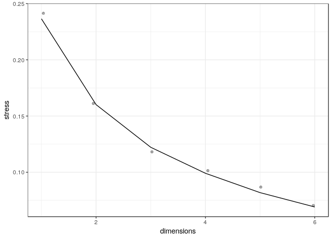

### NMDS Plots

Let’s use the results of ordination to generate an NMDS plot where each
datapoint represents a *sample*.

``` r
plot_ordination(atacama.st_prune.even, atacama.st_prune.even.nmds_bc, type="samples", color="TransectName") 
```

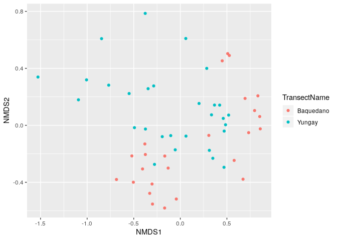 It
is good practice to label the figure with the stress, or include it in
the figure caption. If this Rmd is knitted, then this inline code will
tell us the stress by plugging the in value for the R code . . .

Stress: 0.1652041

#### Adding Stress

This figure adds the stress directly to the plot

``` r
plot_ordination(atacama.st_prune.even, 
                atacama.st_prune.even.nmds_bc, 
                type="samples", color="TransectName") +
  annotate("text",x=-Inf,y=-Inf,hjust=0,vjust=0,
           label= paste("Stress:", atacama.st_prune.even.nmds_bc$stress, 
                        "\nConverged:", atacama.st_prune.even.nmds_bc$converged))
```

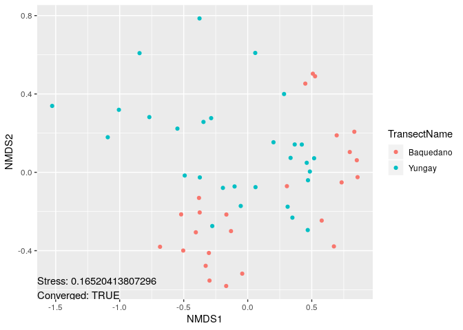

#### Other Parameters

There seems to be some separation between transects, but not much. Let’s
look at other paramters

##### Sites

``` r
plot_ordination(atacama.st_prune.even, 
                atacama.st_prune.even.nmds_bc, 
                type="samples", color="SiteName") +
  annotate("text",x=-Inf,y=-Inf,hjust=0,vjust=0,
           label= paste("Stress:", atacama.st_prune.even.nmds_bc$stress, 
                        "\nConverged:", atacama.st_prune.even.nmds_bc$converged))
```

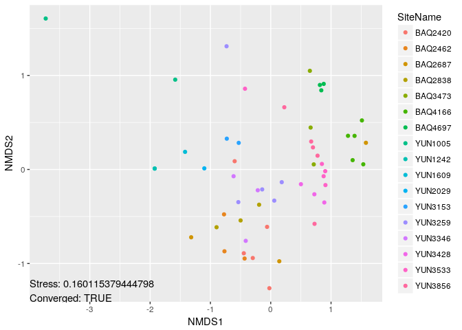

##### Vegetation

``` r
plot_ordination(atacama.st_prune.even, 
                atacama.st_prune.even.nmds_bc, 
                type="samples", color="Vegetation") +
  annotate("text",x=-Inf,y=-Inf,hjust=0,vjust=0,
           label= paste("Stress:", atacama.st_prune.even.nmds_bc$stress, 
                        "\nConverged:", atacama.st_prune.even.nmds_bc$converged))
```

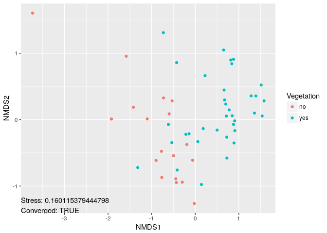

Note that changing “color” only changes which metadata is used to
determine color of sample data points, the locations of the points
remains the same

### Helping Visualization

The large number of samples that are often found in amplicon sequence
projects can make it difficult to visually process ordination plots,
especially if the data is noisy (usually the case). There are a number
of ways to improve the interpretability of ordination plots. These
modifications can be useful, but should be used with care, because
sometimes they make things worse or suggest paterns where none exist.

#### Confidence ellipses on NMDS Plots

You can add 95% confidence elipses to ordination plots by appending
`+ stat_ellipse(type = "norm")` after the plotting function.

``` r
plot_ordination(atacama.st_prune.even, atacama.st_prune.even.nmds_bc, type="samples", color="Vegetation") + 
  stat_ellipse(type = "norm") +
  theme_bw()
```

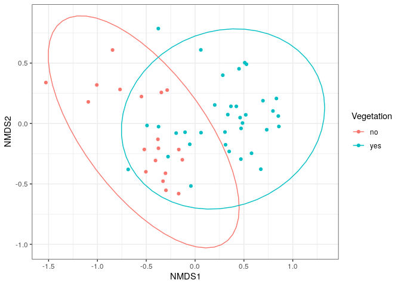

#### Spider Plots ellipses on NMDS Plots

``` r
ordiplot (atacama.st_prune.even.nmds_bc, display = 'si', type = 'n')

ordispider (atacama.st_prune.even.nmds_bc, 
            groups = get_variable(atacama.st_prune.even, "Vegetation"), 
            col = 1:2)
```

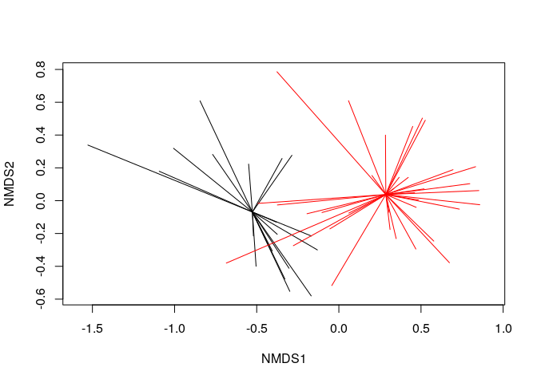

#### Faceted NMDS Plots

Another option for improving ordination plots is to facet results. Let’s
make an NMDS plot faceted by Vegetation

``` r
plot_ordination(atacama.st_prune.even, atacama.st_prune.even.nmds_bc, type="samples", color="Vegetation") + 
  facet_wrap(~TransectName) 
```

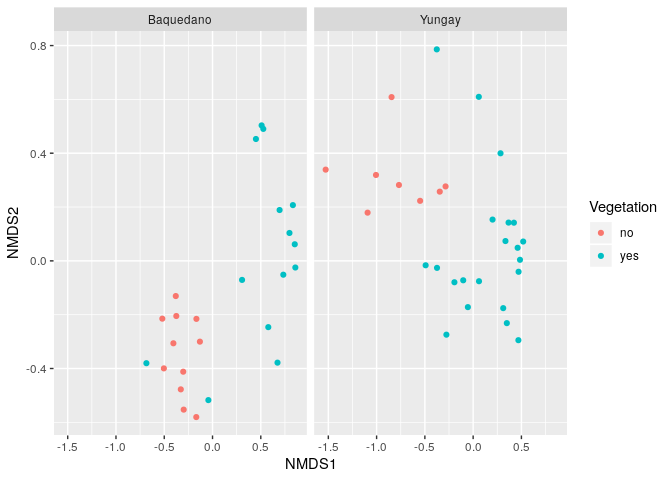

Sometimes it is helpful to show all the points, but gray out the ones
that are not the the focus

``` r
atacama.st_prune.even.nmds_bc.plot = plot_ordination(atacama.st_prune.even, 
                                                     atacama.st_prune.even.nmds_bc, 
                                                     type="samples", color="Vegetation")

ggplot(atacama.st_prune.even.nmds_bc.plot$data, aes(NMDS1, NMDS2)) +
  theme_bw() +
  geom_point(data = transform(atacama.st_prune.even.nmds_bc.plot$data, Vegetation = NULL, TransectName = NULL), 
             color = "grey90") +
  geom_point(aes(color = Vegetation)) + 
facet_grid(~Vegetation, labeller = "label_both")
```

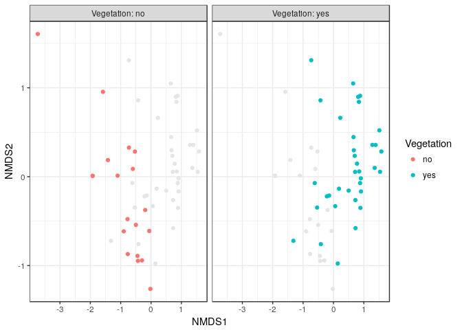

``` r
atacama.st_prune.even.nmds_bc.plot = plot_ordination(atacama.st_prune.even, 
                                                     atacama.st_prune.even.nmds_bc, 
                                                     type="samples", color="Vegetation")

ggplot(atacama.st_prune.even.nmds_bc.plot$data, aes(NMDS1, NMDS2)) +
  theme_bw() +
  geom_point(data = transform(atacama.st_prune.even.nmds_bc.plot$data, Vegetation = NULL, TransectName = NULL), 
             color = "grey90") +
  geom_point(aes(color = Vegetation)) + 
facet_grid(Vegetation~TransectName, labeller = "label_both") +
      theme(plot.background = element_blank(),
        panel.grid.major = element_blank(),
        panel.grid.minor = element_blank())
```

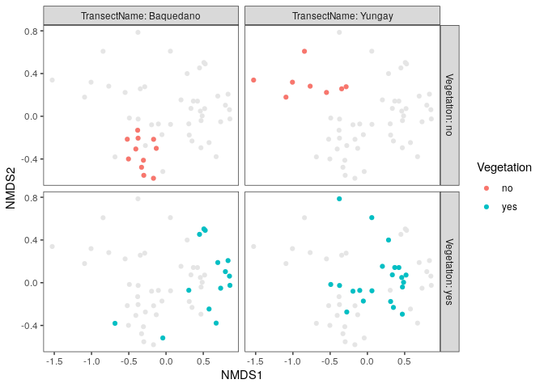

### PCoA Plots

There are many other ordination methods supported by phyloseq. Let’s
make a PCoA plot using Bray-Curtis dissimilarity, coloring the data
points by “Vegetation”.

``` r
atacama.st_prune.even.pcoa_bc <- ordinate(atacama.st_prune.even, "PCoA", "bray")
plot_ordination(atacama.st_prune.even, atacama.st_prune.even.pcoa_bc, type="samples", color="Vegetation") 
```

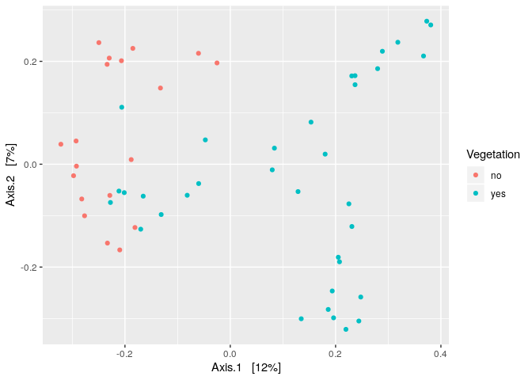

sessionInfo
===========

It is always a good idea to capture the sessionInfo information so you
know what versions of R and libraries you used!

``` r
sessionInfo()
```

    ## R version 3.6.1 (2019-07-05)
    ## Platform: x86_64-pc-linux-gnu (64-bit)
    ## Running under: Ubuntu 18.04.3 LTS
    ## 
    ## Matrix products: default
    ## BLAS:   /usr/lib/x86_64-linux-gnu/blas/libblas.so.3.7.1
    ## LAPACK: /usr/lib/x86_64-linux-gnu/lapack/liblapack.so.3.7.1
    ## 
    ## locale:
    ##  [1] LC_CTYPE=en_US.UTF-8       LC_NUMERIC=C              
    ##  [3] LC_TIME=en_US.UTF-8        LC_COLLATE=en_US.UTF-8    
    ##  [5] LC_MONETARY=en_US.UTF-8    LC_MESSAGES=en_US.UTF-8   
    ##  [7] LC_PAPER=en_US.UTF-8       LC_NAME=C                 
    ##  [9] LC_ADDRESS=C               LC_TELEPHONE=C            
    ## [11] LC_MEASUREMENT=en_US.UTF-8 LC_IDENTIFICATION=C       
    ## 
    ## attached base packages:
    ## [1] stats     graphics  grDevices utils     datasets  methods   base     
    ## 
    ## other attached packages:
    ##  [1] phyloseq_1.28.0 vegan_2.5-6     lattice_0.20-38 permute_0.9-5  
    ##  [5] forcats_0.4.0   stringr_1.4.0   dplyr_0.8.3     purrr_0.3.2    
    ##  [9] readr_1.3.1     tidyr_0.8.3     tibble_2.1.3    ggplot2_3.2.1  
    ## [13] tidyverse_1.2.1
    ## 
    ## loaded via a namespace (and not attached):
    ##  [1] Biobase_2.44.0      httr_1.4.1          jsonlite_1.6       
    ##  [4] splines_3.6.1       foreach_1.4.7       modelr_0.1.5       
    ##  [7] assertthat_0.2.1    stats4_3.6.1        cellranger_1.1.0   
    ## [10] yaml_2.2.0          pillar_1.4.2        backports_1.1.4    
    ## [13] glue_1.3.1          digest_0.6.20       XVector_0.24.0     
    ## [16] rvest_0.3.4         colorspace_1.4-1    htmltools_0.3.6    
    ## [19] Matrix_1.2-17       plyr_1.8.4          pkgconfig_2.0.2    
    ## [22] broom_0.5.2         haven_2.1.1         zlibbioc_1.30.0    
    ## [25] scales_1.0.0        mgcv_1.8-28         generics_0.0.2     
    ## [28] IRanges_2.18.2      withr_2.1.2         BiocGenerics_0.30.0
    ## [31] lazyeval_0.2.2      cli_1.1.0           survival_2.44-1.1  
    ## [34] magrittr_1.5        crayon_1.3.4        readxl_1.3.1       
    ## [37] evaluate_0.14       nlme_3.1-141        MASS_7.3-51.4      
    ## [40] xml2_1.2.2          data.table_1.12.2   tools_3.6.1        
    ## [43] hms_0.5.1           Rhdf5lib_1.6.0      S4Vectors_0.22.0   
    ## [46] munsell_0.5.0       cluster_2.1.0       Biostrings_2.52.0  
    ## [49] ade4_1.7-13         compiler_3.6.1      rlang_0.4.0        
    ## [52] rhdf5_2.28.0        grid_3.6.1          iterators_1.0.12   
    ## [55] biomformat_1.12.0   rstudioapi_0.10     igraph_1.2.4.1     
    ## [58] labeling_0.3        rmarkdown_1.15      multtest_2.40.0    
    ## [61] gtable_0.3.0        codetools_0.2-16    reshape2_1.4.3     
    ## [64] R6_2.4.0            lubridate_1.7.4     knitr_1.24         
    ## [67] zeallot_0.1.0       ape_5.3             stringi_1.4.3      
    ## [70] parallel_3.6.1      Rcpp_1.0.2          vctrs_0.2.0        
    ## [73] tidyselect_0.2.5    xfun_0.9
