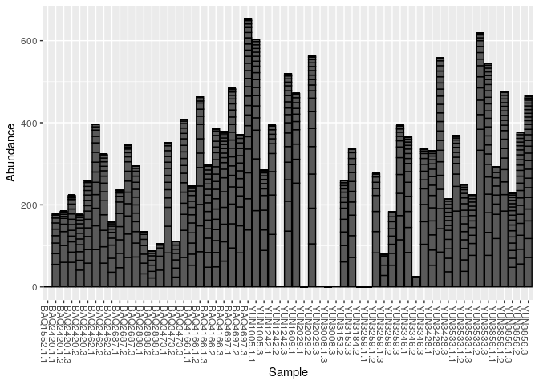
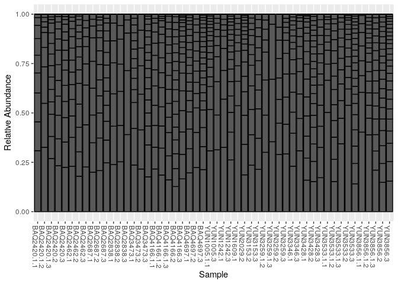
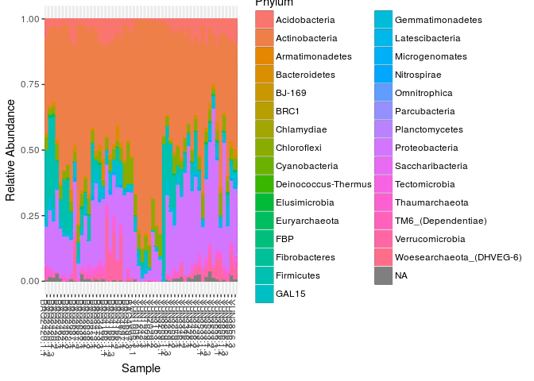
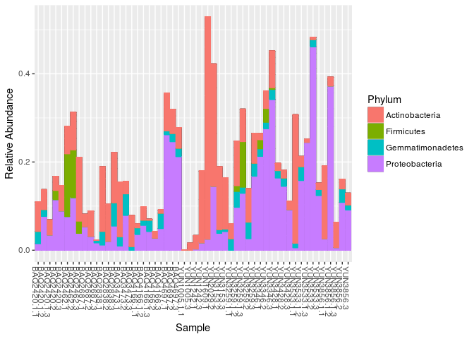
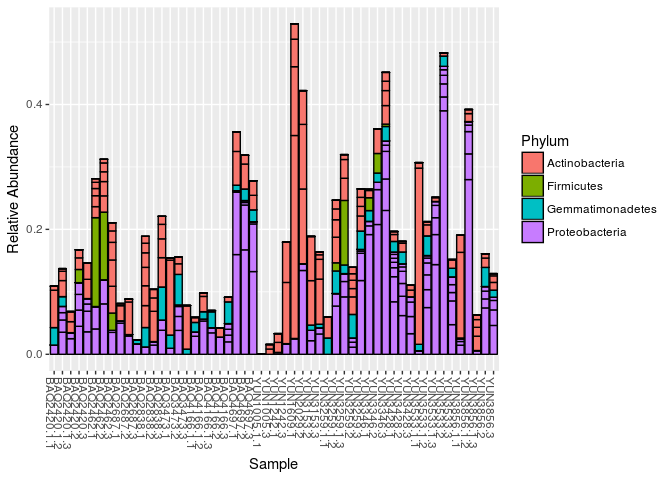
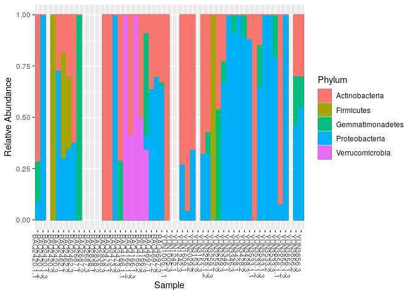
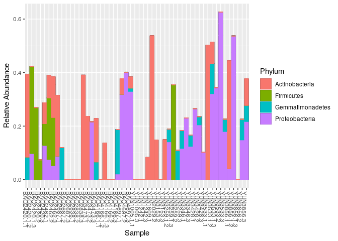
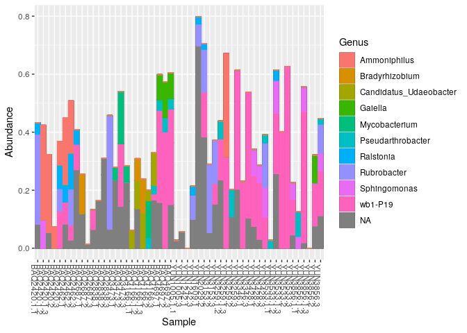
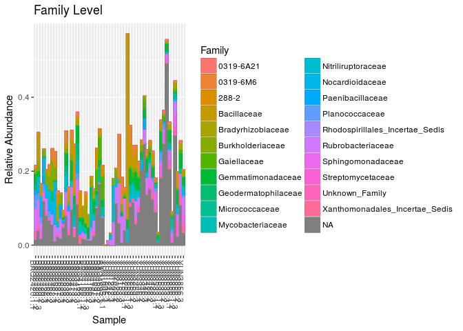

Data
----

This tutorial uses the 10% Atacama subset data (note that for the demux and dada2 tutorial we used the 1% Atacama subset)

Getting ready
=============

First we load libraries.

``` r
library(readr)
library(phyloseq)
library(tibble)
library(dplyr)
```

``` r
# Directories
atacama.rds = "/data/tutorial_data/atacama_10pct.rds"
```

``` r
atacama.ps = read_rds(atacama.rds)
print(atacama.ps)
```

    ## phyloseq-class experiment-level object
    ## otu_table()   OTU Table:         [ 3388 taxa and 68 samples ]
    ## sample_data() Sample Data:       [ 68 samples by 22 sample variables ]
    ## tax_table()   Taxonomy Table:    [ 3388 taxa by 7 taxonomic ranks ]

Relative Abundance
------------------

### Transform OTU table

Our OTU tables are currently raw counts

``` r
otu_table(atacama.ps)[1:10,1:10] %>%
  as.data.frame
```

    ##             GCGAGCGTTAATCGGAATCACTGGGCGTAAAGGGCGCGTAGGCGGTTAGGTAAGTCGGATGTGAAAGCCCTGGGCTTAACCTGGGAATGGCATTCGAGACTGTCTATCTAGAGTCTGGTAGAGGGAAGTGGAATTTCCGGTGTAGCGGTGAAATGTGTAGATATCGGAAGGAACACCAGTGGCGAAGGCGACTTCCTGGACCAAGACTGACGCTGAGGCGCGAAAGCGTGGGG
    ## BAQ1370.1.3                                                                                                                                                                                                                                         0
    ## BAQ1370.3                                                                                                                                                                                                                                           0
    ## BAQ1552.1.1                                                                                                                                                                                                                                         0
    ## BAQ2420.1.1                                                                                                                                                                                                                                         0
    ## BAQ2420.1.2                                                                                                                                                                                                                                         0
    ## BAQ2420.1.3                                                                                                                                                                                                                                         0
    ## BAQ2420.2                                                                                                                                                                                                                                           0
    ## BAQ2420.3                                                                                                                                                                                                                                           0
    ## BAQ2462.1                                                                                                                                                                                                                                           0
    ## BAQ2462.2                                                                                                                                                                                                                                           0
    ##             GCGAGCGTTAATCGGAATTACTGGGCGTAAAGGGCGCGTAGGCGGTTGGGTAAGTCGGGTGTGAAAGCCCTGGGCTTAACCTGGGAATGGCATTCGAGACTACCTAGCTAGAGTCTGGTAGAGGGAAGTGGAATTTCCGGTGTAGCGGTGAAATGTGTAGATATCGGAAGGAACACCAGTGGCGAAGGCGACTTCCTGGACCAAGACTGACGCTGAGGCGCGAAAGCGTGGGG
    ## BAQ1370.1.3                                                                                                                                                                                                                                         0
    ## BAQ1370.3                                                                                                                                                                                                                                           0
    ## BAQ1552.1.1                                                                                                                                                                                                                                         0
    ## BAQ2420.1.1                                                                                                                                                                                                                                         0
    ## BAQ2420.1.2                                                                                                                                                                                                                                         0
    ## BAQ2420.1.3                                                                                                                                                                                                                                        39
    ## BAQ2420.2                                                                                                                                                                                                                                         200
    ## BAQ2420.3                                                                                                                                                                                                                                         153
    ## BAQ2462.1                                                                                                                                                                                                                                         248
    ## BAQ2462.2                                                                                                                                                                                                                                         177
    ##             GCGAGCGTTGTCCGGAATTATTGGGCGTAAAGAGCGTGTAGGCGGTTCGGTAAGTCTGCCGTGAAAACCTGGGGCTCAACCCCGGGCGTGCGGTGGATACTGCCGGGCTAGAGGATGGTAGAGGCGAGTGGAATTCCCGGTGTAGCGGTGAAATGCGCAGATATCGGGAGGAACACCAGTAGCGAAGGCGGCTCGCTGGGCCATTCCTGACGCTGAGACGCGAAAGCTAGGGG
    ## BAQ1370.1.3                                                                                                                                                                                                                                         0
    ## BAQ1370.3                                                                                                                                                                                                                                           0
    ## BAQ1552.1.1                                                                                                                                                                                                                                         0
    ## BAQ2420.1.1                                                                                                                                                                                                                                       206
    ## BAQ2420.1.2                                                                                                                                                                                                                                       105
    ## BAQ2420.1.3                                                                                                                                                                                                                                        65
    ## BAQ2420.2                                                                                                                                                                                                                                           0
    ## BAQ2420.3                                                                                                                                                                                                                                         131
    ## BAQ2462.1                                                                                                                                                                                                                                           0
    ## BAQ2462.2                                                                                                                                                                                                                                         120
    ##             GCGAGCGTTGTCCGGAATCACTGGGCGTAAAGGGCGCGTAGGCGGCCTGATAAGTAGGGGGTGAAATCCTGCGGCTTAACCGCAGGGCTGCCTTCTAAACTGTCAGGCTCGAGCACAGTAGAGGCAGGTGGAATTCCCGGTGTAGCGGTGGAATGCGTAGAGATCGGGAAGAACATCAGTGGCGAAGGCGGCCTGCTGGGCTGTTGCTGACGCTGAGGCGCGACAGCGTGGGG
    ## BAQ1370.1.3                                                                                                                                                                                                                                         0
    ## BAQ1370.3                                                                                                                                                                                                                                           0
    ## BAQ1552.1.1                                                                                                                                                                                                                                         0
    ## BAQ2420.1.1                                                                                                                                                                                                                                        96
    ## BAQ2420.1.2                                                                                                                                                                                                                                        64
    ## BAQ2420.1.3                                                                                                                                                                                                                                         0
    ## BAQ2420.2                                                                                                                                                                                                                                           0
    ## BAQ2420.3                                                                                                                                                                                                                                           0
    ## BAQ2462.1                                                                                                                                                                                                                                           0
    ## BAQ2462.2                                                                                                                                                                                                                                           0
    ##             GCGAGCGTTAATCGGAATTACTGGGCGTAAAGGGCGCGTAGGCGGTGAAGTAAGTCGGGTGTGAAAGCCCCGGGCTCAACCTGGGAACTGCATTCGATACTGCTTCGCTAGAGTATGGTAGAGGGAAGCGGAATTCCGGGTGTAGCGGTGAAATGCGTAGATATCCGGAGGAACACCAGTGGCGAAGGCGGCTTCCTGGACCAATACTGACGCTGAGGCGCGAAAGCGTGGGG
    ## BAQ1370.1.3                                                                                                                                                                                                                                         0
    ## BAQ1370.3                                                                                                                                                                                                                                           0
    ## BAQ1552.1.1                                                                                                                                                                                                                                         0
    ## BAQ2420.1.1                                                                                                                                                                                                                                         0
    ## BAQ2420.1.2                                                                                                                                                                                                                                         0
    ## BAQ2420.1.3                                                                                                                                                                                                                                         0
    ## BAQ2420.2                                                                                                                                                                                                                                           0
    ## BAQ2420.3                                                                                                                                                                                                                                           0
    ## BAQ2462.1                                                                                                                                                                                                                                           0
    ## BAQ2462.2                                                                                                                                                                                                                                           0
    ##             GCGAGCGTTAATCGGAATTACTGGGCGTAAAGGGCGCGTAGGCGGTGAAGTAAGTCGGGTGTGAAAGCCCCGGGCTCAACCTGGGAACTGCATCCGATACTGCTTCGCTAGAGTATGGTAGAGGGAAGCGGAATTCCGGGTGTAGCGGTGAAATGCGTAGATATCCGGAGGAACACCAGTGGCGAAGGCGGCTTCCTGGACCAATACTGACGCTGAGGCGCGAAAGCGTGGGG
    ## BAQ1370.1.3                                                                                                                                                                                                                                         0
    ## BAQ1370.3                                                                                                                                                                                                                                           0
    ## BAQ1552.1.1                                                                                                                                                                                                                                         0
    ## BAQ2420.1.1                                                                                                                                                                                                                                         0
    ## BAQ2420.1.2                                                                                                                                                                                                                                         0
    ## BAQ2420.1.3                                                                                                                                                                                                                                         0
    ## BAQ2420.2                                                                                                                                                                                                                                           0
    ## BAQ2420.3                                                                                                                                                                                                                                           0
    ## BAQ2462.1                                                                                                                                                                                                                                           0
    ## BAQ2462.2                                                                                                                                                                                                                                           0
    ##             GCGAGCGTTAATCGGAATTACTGGGCGTAAAGGGCGCGTAGGCGGTGAAGTCAGTCGGGTGTGAAAGCCCCGGGCTCAACCTGGGAACTGCATCCGATACTGCTTCGCTAGAGTATGGTAGAGGGAAGCGGAATTCCGGGTGTAGCGGTGAAATGCGTAGATATCCGGAGGAACACCAGTGGCGAAGGCGGCTTCCTGGACCAATACTGACGCTGAGGCGCGAAAGCGTGGGG
    ## BAQ1370.1.3                                                                                                                                                                                                                                         0
    ## BAQ1370.3                                                                                                                                                                                                                                           0
    ## BAQ1552.1.1                                                                                                                                                                                                                                         0
    ## BAQ2420.1.1                                                                                                                                                                                                                                         0
    ## BAQ2420.1.2                                                                                                                                                                                                                                        41
    ## BAQ2420.1.3                                                                                                                                                                                                                                         0
    ## BAQ2420.2                                                                                                                                                                                                                                         116
    ## BAQ2420.3                                                                                                                                                                                                                                          49
    ## BAQ2462.1                                                                                                                                                                                                                                           0
    ## BAQ2462.2                                                                                                                                                                                                                                           0
    ##             GCAAGCGTTGTCCGGAATCATTGGGCGTAAAGAGCGTGTAGGCGGTCCGGTAAGTCGGCTGTGAAAGTCCAGGGCTCAACCCTGGGATGCCGGTCGATACTGCCGGACTAGAGTTCGGAAGAGGCGAGTGGAATTCCCGGTGTAGCGGTGAAATGCGCAGATATCGGGAGGAACACCTATGGCGAAGGCAGCTCGCTGGGACGTTACTGACGCTGAGACGCGAAAGCGTGGGG
    ## BAQ1370.1.3                                                                                                                                                                                                                                         0
    ## BAQ1370.3                                                                                                                                                                                                                                           0
    ## BAQ1552.1.1                                                                                                                                                                                                                                         0
    ## BAQ2420.1.1                                                                                                                                                                                                                                         0
    ## BAQ2420.1.2                                                                                                                                                                                                                                        17
    ## BAQ2420.1.3                                                                                                                                                                                                                                         0
    ## BAQ2420.2                                                                                                                                                                                                                                           0
    ## BAQ2420.3                                                                                                                                                                                                                                           0
    ## BAQ2462.1                                                                                                                                                                                                                                          35
    ## BAQ2462.2                                                                                                                                                                                                                                          27
    ##             GCAAGCGTTGTCCGGAATTATTGGGCGTAAAGAGCTCGTAGGCGGTCTGTCGCGTCGGCTGTGAAAACTCGGGGCTCAACTCCGAGCTTGCAGTCGATACGGGCAGGCTAGAGTTCGGCAGGGGAGACTGGAATTCCTGGTGTAGCGGTGAAATGCGCAGATATCAGGAGGAACACCGGTGGCGAAGGCGGGTCTCTGGGCCGATACTGACGCTGAGGAGCGAAAGCGTGGGG
    ## BAQ1370.1.3                                                                                                                                                                                                                                         0
    ## BAQ1370.3                                                                                                                                                                                                                                           0
    ## BAQ1552.1.1                                                                                                                                                                                                                                         0
    ## BAQ2420.1.1                                                                                                                                                                                                                                         0
    ## BAQ2420.1.2                                                                                                                                                                                                                                         0
    ## BAQ2420.1.3                                                                                                                                                                                                                                         0
    ## BAQ2420.2                                                                                                                                                                                                                                           0
    ## BAQ2420.3                                                                                                                                                                                                                                           0
    ## BAQ2462.1                                                                                                                                                                                                                                           0
    ## BAQ2462.2                                                                                                                                                                                                                                           0
    ##             GCTAGCGTTGTTCGGAATTACTGGGCGTAAAGCGCACGTAGGCGGCTTTGTAAGTTAGAGGTGAAAGCCCGGGGCTCAACTCCGGAATTGCCTTTAAGACTGCATCGCTAGAATTGTGGAGAGGTGAGTGGAATTCCGAGTGTAGAGGTGAAATTCGTAGATATTCGGAAGAACACCAGTGGCGAAGGCGACTCACTGGACACATATTGACGCTGAGGTGCGAAAGCGTGGGG
    ## BAQ1370.1.3                                                                                                                                                                                                                                         0
    ## BAQ1370.3                                                                                                                                                                                                                                           0
    ## BAQ1552.1.1                                                                                                                                                                                                                                         0
    ## BAQ2420.1.1                                                                                                                                                                                                                                         0
    ## BAQ2420.1.2                                                                                                                                                                                                                                       145
    ## BAQ2420.1.3                                                                                                                                                                                                                                       101
    ## BAQ2420.2                                                                                                                                                                                                                                         112
    ## BAQ2420.3                                                                                                                                                                                                                                          37
    ## BAQ2462.1                                                                                                                                                                                                                                           0
    ## BAQ2462.2                                                                                                                                                                                                                                           0

The first step in making relative abundance plots is to transform your OTU table from raw counts to relative abundance (also known as proportional or fractional abundance). Phyloseq provides the `transform_sample_counts` function for performing user defined transformations on the OTU table. We want to divide the counts for each taxa in each sample by the total number of counts for that sample. The phyloseq object returned has fractional "counts":

``` r
atacama.ps.rel  = transform_sample_counts(atacama.ps, function(x) x / sum(x) )
otu_table(atacama.ps.rel)[1:10,1:10] %>%
  as.data.frame
```

    ##             GCGAGCGTTAATCGGAATCACTGGGCGTAAAGGGCGCGTAGGCGGTTAGGTAAGTCGGATGTGAAAGCCCTGGGCTTAACCTGGGAATGGCATTCGAGACTGTCTATCTAGAGTCTGGTAGAGGGAAGTGGAATTTCCGGTGTAGCGGTGAAATGTGTAGATATCGGAAGGAACACCAGTGGCGAAGGCGACTTCCTGGACCAAGACTGACGCTGAGGCGCGAAAGCGTGGGG
    ## BAQ1370.1.3                                                                                                                                                                                                                                       NaN
    ## BAQ1370.3                                                                                                                                                                                                                                         NaN
    ## BAQ1552.1.1                                                                                                                                                                                                                                         0
    ## BAQ2420.1.1                                                                                                                                                                                                                                         0
    ## BAQ2420.1.2                                                                                                                                                                                                                                         0
    ## BAQ2420.1.3                                                                                                                                                                                                                                         0
    ## BAQ2420.2                                                                                                                                                                                                                                           0
    ## BAQ2420.3                                                                                                                                                                                                                                           0
    ## BAQ2462.1                                                                                                                                                                                                                                           0
    ## BAQ2462.2                                                                                                                                                                                                                                           0
    ##             GCGAGCGTTAATCGGAATTACTGGGCGTAAAGGGCGCGTAGGCGGTTGGGTAAGTCGGGTGTGAAAGCCCTGGGCTTAACCTGGGAATGGCATTCGAGACTACCTAGCTAGAGTCTGGTAGAGGGAAGTGGAATTTCCGGTGTAGCGGTGAAATGTGTAGATATCGGAAGGAACACCAGTGGCGAAGGCGACTTCCTGGACCAAGACTGACGCTGAGGCGCGAAAGCGTGGGG
    ## BAQ1370.1.3                                                                                                                                                                                                                                       NaN
    ## BAQ1370.3                                                                                                                                                                                                                                         NaN
    ## BAQ1552.1.1                                                                                                                                                                                                                               0.000000000
    ## BAQ2420.1.1                                                                                                                                                                                                                               0.000000000
    ## BAQ2420.1.2                                                                                                                                                                                                                               0.000000000
    ## BAQ2420.1.3                                                                                                                                                                                                                               0.009658247
    ## BAQ2420.2                                                                                                                                                                                                                                 0.044822949
    ## BAQ2420.3                                                                                                                                                                                                                                 0.036025430
    ## BAQ2462.1                                                                                                                                                                                                                                 0.040609137
    ## BAQ2462.2                                                                                                                                                                                                                                 0.038520131
    ##             GCGAGCGTTGTCCGGAATTATTGGGCGTAAAGAGCGTGTAGGCGGTTCGGTAAGTCTGCCGTGAAAACCTGGGGCTCAACCCCGGGCGTGCGGTGGATACTGCCGGGCTAGAGGATGGTAGAGGCGAGTGGAATTCCCGGTGTAGCGGTGAAATGCGCAGATATCGGGAGGAACACCAGTAGCGAAGGCGGCTCGCTGGGCCATTCCTGACGCTGAGACGCGAAAGCTAGGGG
    ## BAQ1370.1.3                                                                                                                                                                                                                                       NaN
    ## BAQ1370.3                                                                                                                                                                                                                                         NaN
    ## BAQ1552.1.1                                                                                                                                                                                                                                0.00000000
    ## BAQ2420.1.1                                                                                                                                                                                                                                0.05993599
    ## BAQ2420.1.2                                                                                                                                                                                                                                0.02565982
    ## BAQ2420.1.3                                                                                                                                                                                                                                0.01609708
    ## BAQ2420.2                                                                                                                                                                                                                                  0.00000000
    ## BAQ2420.3                                                                                                                                                                                                                                  0.03084530
    ## BAQ2462.1                                                                                                                                                                                                                                  0.00000000
    ## BAQ2462.2                                                                                                                                                                                                                                  0.02611534
    ##             GCGAGCGTTGTCCGGAATCACTGGGCGTAAAGGGCGCGTAGGCGGCCTGATAAGTAGGGGGTGAAATCCTGCGGCTTAACCGCAGGGCTGCCTTCTAAACTGTCAGGCTCGAGCACAGTAGAGGCAGGTGGAATTCCCGGTGTAGCGGTGGAATGCGTAGAGATCGGGAAGAACATCAGTGGCGAAGGCGGCCTGCTGGGCTGTTGCTGACGCTGAGGCGCGACAGCGTGGGG
    ## BAQ1370.1.3                                                                                                                                                                                                                                       NaN
    ## BAQ1370.3                                                                                                                                                                                                                                         NaN
    ## BAQ1552.1.1                                                                                                                                                                                                                                0.00000000
    ## BAQ2420.1.1                                                                                                                                                                                                                                0.02793134
    ## BAQ2420.1.2                                                                                                                                                                                                                                0.01564027
    ## BAQ2420.1.3                                                                                                                                                                                                                                0.00000000
    ## BAQ2420.2                                                                                                                                                                                                                                  0.00000000
    ## BAQ2420.3                                                                                                                                                                                                                                  0.00000000
    ## BAQ2462.1                                                                                                                                                                                                                                  0.00000000
    ## BAQ2462.2                                                                                                                                                                                                                                  0.00000000
    ##             GCGAGCGTTAATCGGAATTACTGGGCGTAAAGGGCGCGTAGGCGGTGAAGTAAGTCGGGTGTGAAAGCCCCGGGCTCAACCTGGGAACTGCATTCGATACTGCTTCGCTAGAGTATGGTAGAGGGAAGCGGAATTCCGGGTGTAGCGGTGAAATGCGTAGATATCCGGAGGAACACCAGTGGCGAAGGCGGCTTCCTGGACCAATACTGACGCTGAGGCGCGAAAGCGTGGGG
    ## BAQ1370.1.3                                                                                                                                                                                                                                       NaN
    ## BAQ1370.3                                                                                                                                                                                                                                         NaN
    ## BAQ1552.1.1                                                                                                                                                                                                                                         0
    ## BAQ2420.1.1                                                                                                                                                                                                                                         0
    ## BAQ2420.1.2                                                                                                                                                                                                                                         0
    ## BAQ2420.1.3                                                                                                                                                                                                                                         0
    ## BAQ2420.2                                                                                                                                                                                                                                           0
    ## BAQ2420.3                                                                                                                                                                                                                                           0
    ## BAQ2462.1                                                                                                                                                                                                                                           0
    ## BAQ2462.2                                                                                                                                                                                                                                           0
    ##             GCGAGCGTTAATCGGAATTACTGGGCGTAAAGGGCGCGTAGGCGGTGAAGTAAGTCGGGTGTGAAAGCCCCGGGCTCAACCTGGGAACTGCATCCGATACTGCTTCGCTAGAGTATGGTAGAGGGAAGCGGAATTCCGGGTGTAGCGGTGAAATGCGTAGATATCCGGAGGAACACCAGTGGCGAAGGCGGCTTCCTGGACCAATACTGACGCTGAGGCGCGAAAGCGTGGGG
    ## BAQ1370.1.3                                                                                                                                                                                                                                       NaN
    ## BAQ1370.3                                                                                                                                                                                                                                         NaN
    ## BAQ1552.1.1                                                                                                                                                                                                                                         0
    ## BAQ2420.1.1                                                                                                                                                                                                                                         0
    ## BAQ2420.1.2                                                                                                                                                                                                                                         0
    ## BAQ2420.1.3                                                                                                                                                                                                                                         0
    ## BAQ2420.2                                                                                                                                                                                                                                           0
    ## BAQ2420.3                                                                                                                                                                                                                                           0
    ## BAQ2462.1                                                                                                                                                                                                                                           0
    ## BAQ2462.2                                                                                                                                                                                                                                           0
    ##             GCGAGCGTTAATCGGAATTACTGGGCGTAAAGGGCGCGTAGGCGGTGAAGTCAGTCGGGTGTGAAAGCCCCGGGCTCAACCTGGGAACTGCATCCGATACTGCTTCGCTAGAGTATGGTAGAGGGAAGCGGAATTCCGGGTGTAGCGGTGAAATGCGTAGATATCCGGAGGAACACCAGTGGCGAAGGCGGCTTCCTGGACCAATACTGACGCTGAGGCGCGAAAGCGTGGGG
    ## BAQ1370.1.3                                                                                                                                                                                                                                       NaN
    ## BAQ1370.3                                                                                                                                                                                                                                         NaN
    ## BAQ1552.1.1                                                                                                                                                                                                                                0.00000000
    ## BAQ2420.1.1                                                                                                                                                                                                                                0.00000000
    ## BAQ2420.1.2                                                                                                                                                                                                                                0.01001955
    ## BAQ2420.1.3                                                                                                                                                                                                                                0.00000000
    ## BAQ2420.2                                                                                                                                                                                                                                  0.02599731
    ## BAQ2420.3                                                                                                                                                                                                                                  0.01153756
    ## BAQ2462.1                                                                                                                                                                                                                                  0.00000000
    ## BAQ2462.2                                                                                                                                                                                                                                  0.00000000
    ##             GCAAGCGTTGTCCGGAATCATTGGGCGTAAAGAGCGTGTAGGCGGTCCGGTAAGTCGGCTGTGAAAGTCCAGGGCTCAACCCTGGGATGCCGGTCGATACTGCCGGACTAGAGTTCGGAAGAGGCGAGTGGAATTCCCGGTGTAGCGGTGAAATGCGCAGATATCGGGAGGAACACCTATGGCGAAGGCAGCTCGCTGGGACGTTACTGACGCTGAGACGCGAAAGCGTGGGG
    ## BAQ1370.1.3                                                                                                                                                                                                                                       NaN
    ## BAQ1370.3                                                                                                                                                                                                                                         NaN
    ## BAQ1552.1.1                                                                                                                                                                                                                               0.000000000
    ## BAQ2420.1.1                                                                                                                                                                                                                               0.000000000
    ## BAQ2420.1.2                                                                                                                                                                                                                               0.004154448
    ## BAQ2420.1.3                                                                                                                                                                                                                               0.000000000
    ## BAQ2420.2                                                                                                                                                                                                                                 0.000000000
    ## BAQ2420.3                                                                                                                                                                                                                                 0.000000000
    ## BAQ2462.1                                                                                                                                                                                                                                 0.005731128
    ## BAQ2462.2                                                                                                                                                                                                                                 0.005875952
    ##             GCAAGCGTTGTCCGGAATTATTGGGCGTAAAGAGCTCGTAGGCGGTCTGTCGCGTCGGCTGTGAAAACTCGGGGCTCAACTCCGAGCTTGCAGTCGATACGGGCAGGCTAGAGTTCGGCAGGGGAGACTGGAATTCCTGGTGTAGCGGTGAAATGCGCAGATATCAGGAGGAACACCGGTGGCGAAGGCGGGTCTCTGGGCCGATACTGACGCTGAGGAGCGAAAGCGTGGGG
    ## BAQ1370.1.3                                                                                                                                                                                                                                       NaN
    ## BAQ1370.3                                                                                                                                                                                                                                         NaN
    ## BAQ1552.1.1                                                                                                                                                                                                                                         0
    ## BAQ2420.1.1                                                                                                                                                                                                                                         0
    ## BAQ2420.1.2                                                                                                                                                                                                                                         0
    ## BAQ2420.1.3                                                                                                                                                                                                                                         0
    ## BAQ2420.2                                                                                                                                                                                                                                           0
    ## BAQ2420.3                                                                                                                                                                                                                                           0
    ## BAQ2462.1                                                                                                                                                                                                                                           0
    ## BAQ2462.2                                                                                                                                                                                                                                           0
    ##             GCTAGCGTTGTTCGGAATTACTGGGCGTAAAGCGCACGTAGGCGGCTTTGTAAGTTAGAGGTGAAAGCCCGGGGCTCAACTCCGGAATTGCCTTTAAGACTGCATCGCTAGAATTGTGGAGAGGTGAGTGGAATTCCGAGTGTAGAGGTGAAATTCGTAGATATTCGGAAGAACACCAGTGGCGAAGGCGACTCACTGGACACATATTGACGCTGAGGTGCGAAAGCGTGGGG
    ## BAQ1370.1.3                                                                                                                                                                                                                                       NaN
    ## BAQ1370.3                                                                                                                                                                                                                                         NaN
    ## BAQ1552.1.1                                                                                                                                                                                                                               0.000000000
    ## BAQ2420.1.1                                                                                                                                                                                                                               0.000000000
    ## BAQ2420.1.2                                                                                                                                                                                                                               0.035434995
    ## BAQ2420.1.3                                                                                                                                                                                                                               0.025012382
    ## BAQ2420.2                                                                                                                                                                                                                                 0.025100852
    ## BAQ2420.3                                                                                                                                                                                                                                 0.008712032
    ## BAQ2462.1                                                                                                                                                                                                                                 0.000000000
    ## BAQ2462.2                                                                                                                                                                                                                                 0.000000000

> Why are there NaNs?

#### Exploring NaNs

Maybe division by zero? Let's check

``` r
sample_sums(atacama.ps) %>% sort
```

    ## BAQ1370.1.3   BAQ1370.3    BAQ895.2    BAQ895.3   YUN1242.2   YUN2029.1 
    ##           0           0           0           0           0           0 
    ## YUN3008.1.1   YUN3008.2   YUN3008.3   YUN3153.1   YUN3184.1   YUN3184.2 
    ##           0           0           0           0           0           0 
    ## YUN3008.1.3 BAQ1552.1.1 YUN3259.1.1   YUN3346.2 YUN3259.1.3   BAQ2838.3 
    ##           4          29         268        1020        1664        2023 
    ##   BAQ2838.2   BAQ2838.1   YUN3153.2   BAQ2462.3 BAQ2420.1.1   YUN1005.3 
    ##        2847        3052        3307        3330        3437        3569 
    ## BAQ2420.1.3 BAQ2420.1.2   BAQ2420.3   BAQ2687.1 YUN3533.1.3 YUN3259.1.2 
    ##        4038        4092        4247        4346        4408        4437 
    ##   BAQ2420.2   YUN3153.3   BAQ2462.2 BAQ4166.1.1   YUN3259.2   BAQ2687.2 
    ##        4462        4544        4595        4777        4807        4881 
    ##   BAQ3473.2   YUN1242.1   YUN3346.1   YUN3346.3   YUN1609.1 YUN3533.1.2 
    ##        4884        4929        4998        5044        5129        5147 
    ##   BAQ2687.3   BAQ4697.2 YUN3856.1.3 YUN3856.1.1 YUN3533.1.1   YUN1242.3 
    ##        5302        5410        5415        5427        5438        5468 
    ##   YUN3428.1   YUN3856.2 BAQ4166.1.3   BAQ3473.1   YUN3428.3   BAQ2462.1 
    ##        5682        5840        5905        5913        5938        6107 
    ##   BAQ4697.1   YUN3259.3 YUN3856.1.2   BAQ4166.2 BAQ4166.1.2   BAQ4166.3 
    ##        6281        6299        6562        6803        6959        7110 
    ##   YUN2029.2 YUN1005.1.1   BAQ3473.3   YUN3856.3   BAQ4697.3   YUN3533.3 
    ##        7190        7461        7596        7723        7891        7998 
    ##   YUN3533.2   YUN3428.2 
    ##        8173        9046

Yes, there are several samples that have no counts, and a few more that have very low counts

``` r
(sample_sums(atacama.ps) < 50) %>% sum
```

    ## [1] 14

``` r
plot_bar(atacama.ps)
```



Let's "prune" samples that have less counts of less than 50

``` r
sample_min_count = 50

atacama.ps %>%
  prune_samples(sample_sums(.)>=sample_min_count, .) ->
  atacama.prune_s.ps

sample_sums(atacama.prune_s.ps) %>% sort
```

    ## YUN3259.1.1   YUN3346.2 YUN3259.1.3   BAQ2838.3   BAQ2838.2   BAQ2838.1 
    ##         268        1020        1664        2023        2847        3052 
    ##   YUN3153.2   BAQ2462.3 BAQ2420.1.1   YUN1005.3 BAQ2420.1.3 BAQ2420.1.2 
    ##        3307        3330        3437        3569        4038        4092 
    ##   BAQ2420.3   BAQ2687.1 YUN3533.1.3 YUN3259.1.2   BAQ2420.2   YUN3153.3 
    ##        4247        4346        4408        4437        4462        4544 
    ##   BAQ2462.2 BAQ4166.1.1   YUN3259.2   BAQ2687.2   BAQ3473.2   YUN1242.1 
    ##        4595        4777        4807        4881        4884        4929 
    ##   YUN3346.1   YUN3346.3   YUN1609.1 YUN3533.1.2   BAQ2687.3   BAQ4697.2 
    ##        4998        5044        5129        5147        5302        5410 
    ## YUN3856.1.3 YUN3856.1.1 YUN3533.1.1   YUN1242.3   YUN3428.1   YUN3856.2 
    ##        5415        5427        5438        5468        5682        5840 
    ## BAQ4166.1.3   BAQ3473.1   YUN3428.3   BAQ2462.1   BAQ4697.1   YUN3259.3 
    ##        5905        5913        5938        6107        6281        6299 
    ## YUN3856.1.2   BAQ4166.2 BAQ4166.1.2   BAQ4166.3   YUN2029.2 YUN1005.1.1 
    ##        6562        6803        6959        7110        7190        7461 
    ##   BAQ3473.3   YUN3856.3   BAQ4697.3   YUN3533.3   YUN3533.2   YUN3428.2 
    ##        7596        7723        7891        7998        8173        9046

Now let's transform the counts in the pruned phyloseq object

``` r
atacama.ps.rel  = transform_sample_counts(atacama.prune_s.ps, function(x) x / sum(x) )
```

As a result, the sum of all fractional abundance values for each sample is should be *1*:

``` r
sample_sums(atacama.ps.rel)
```

    ## BAQ2420.1.1 BAQ2420.1.2 BAQ2420.1.3   BAQ2420.2   BAQ2420.3   BAQ2462.1 
    ##           1           1           1           1           1           1 
    ##   BAQ2462.2   BAQ2462.3   BAQ2687.1   BAQ2687.2   BAQ2687.3   BAQ2838.1 
    ##           1           1           1           1           1           1 
    ##   BAQ2838.2   BAQ2838.3   BAQ3473.1   BAQ3473.2   BAQ3473.3 BAQ4166.1.1 
    ##           1           1           1           1           1           1 
    ## BAQ4166.1.2 BAQ4166.1.3   BAQ4166.2   BAQ4166.3   BAQ4697.1   BAQ4697.2 
    ##           1           1           1           1           1           1 
    ##   BAQ4697.3 YUN1005.1.1   YUN1005.3   YUN1242.1   YUN1242.3   YUN1609.1 
    ##           1           1           1           1           1           1 
    ##   YUN2029.2   YUN3153.2   YUN3153.3 YUN3259.1.1 YUN3259.1.2 YUN3259.1.3 
    ##           1           1           1           1           1           1 
    ##   YUN3259.2   YUN3259.3   YUN3346.1   YUN3346.2   YUN3346.3   YUN3428.1 
    ##           1           1           1           1           1           1 
    ##   YUN3428.2   YUN3428.3 YUN3533.1.1 YUN3533.1.2 YUN3533.1.3   YUN3533.2 
    ##           1           1           1           1           1           1 
    ##   YUN3533.3 YUN3856.1.1 YUN3856.1.2 YUN3856.1.3   YUN3856.2   YUN3856.3 
    ##           1           1           1           1           1           1

### Relative Abundance Plots

Now let's make a basic relative abundance plot.

``` r
plot_bar(atacama.ps.rel) +
  labs(y = "Relative Abundance")
```



How about coloring by taxa as we did for absolute abundance plots 

Prune Taxa
----------

How many different taxa do we have?

``` r
ntaxa(atacama.ps.rel)
```

    ## [1] 3388

How many different Families?

``` r
length(get_taxa_unique(atacama.ps.rel,"Family"))
```

    ## [1] 154

How many different taxa at each level?

``` r
tibble(rank = rank_names(atacama.ps.rel)) %>%
  rowwise %>%
  mutate(num_taxa = length(get_taxa_unique(atacama.ps.rel,rank)))
```

    ## Source: local data frame [7 x 2]
    ## Groups: <by row>
    ## 
    ## # A tibble: 7 x 2
    ##   rank    num_taxa
    ##   <chr>      <int>
    ## 1 Kingdom        4
    ## 2 Phylum        31
    ## 3 Class         83
    ## 4 Order         90
    ## 5 Family       154
    ## 6 Genus        216
    ## 7 Species       40

Let's play with pruning taxa to make plots more manangeable. Let's start by pruning all but the 20 taxa with the most counts

``` r
top20 <- names(sort(taxa_sums(atacama.ps), decreasing=TRUE))[1:20]

atacama.prune_s.ps %>%
  transform_sample_counts(function(x) x / sum(x) ) %>%
  prune_taxa(top20, .) ->
  atacama.prune_s_t20.rel
```

``` r
print(atacama.ps)
```

    ## phyloseq-class experiment-level object
    ## otu_table()   OTU Table:         [ 3388 taxa and 68 samples ]
    ## sample_data() Sample Data:       [ 68 samples by 22 sample variables ]
    ## tax_table()   Taxonomy Table:    [ 3388 taxa by 7 taxonomic ranks ]

``` r
print(atacama.prune_s.ps)
```

    ## phyloseq-class experiment-level object
    ## otu_table()   OTU Table:         [ 3388 taxa and 54 samples ]
    ## sample_data() Sample Data:       [ 54 samples by 22 sample variables ]
    ## tax_table()   Taxonomy Table:    [ 3388 taxa by 7 taxonomic ranks ]

``` r
print(atacama.prune_s_t20.rel)
```

    ## phyloseq-class experiment-level object
    ## otu_table()   OTU Table:         [ 20 taxa and 54 samples ]
    ## sample_data() Sample Data:       [ 54 samples by 22 sample variables ]
    ## tax_table()   Taxonomy Table:    [ 20 taxa by 7 taxonomic ranks ]

``` r
plot_bar(atacama.prune_s_t20.rel, fill="Phylum") +
  labs(y = "Relative Abundance") +
  geom_bar(aes(color=Phylum, fill=Phylum), stat="identity", position="stack")
```



### Where have all the taxa gone?

We trimmed to the top 20 taxa, but in this plot we only see 4. Why? Try looking at `tax_table` to figure out what is going on. It may also help to do one of the "default" plots that includes the annoying sub-bar outlines.

``` r
plot_bar(atacama.prune_s_t20.rel, fill="Phylum") +
  labs(y = "Relative Abundance")
```



### Why transform first?

What happens if we prune taxa, then transform?

``` r
atacama.prune_s.ps %>%
  prune_taxa(top20, .) %>%
  transform_sample_counts(function(x) x / sum(x) ) %>%
  plot_bar(fill="Phylum") +
    labs(y = "Relative Abundance") +
    geom_bar(aes(color=Phylum, fill=Phylum), stat="identity", position="stack")
```

    ## Warning: Removed 20 rows containing missing values (position_stack).

    ## Warning: Removed 20 rows containing missing values (position_stack).



### Other Ways to Prune Taxa

We can use the `filter_taxa` function to prune taxa by average fractional abundance, for example, we can choose to only show taxa that, on average across all samples, have a relative abundance of at least 1%.

#### Average Relative Abundance

``` r
mean_cutoff = 0.01
mean_test = function(x) {
  mean(x) >= mean_cutoff
}

atacama.prune_s.ps %>%
  transform_sample_counts(function(x) x / sum(x) ) %>%
  filter_taxa(mean_test, prune = TRUE) ->
  atacama.prune_s_1pct.rel

print(atacama.prune_s_1pct.rel)
```

    ## phyloseq-class experiment-level object
    ## otu_table()   OTU Table:         [ 7 taxa and 54 samples ]
    ## sample_data() Sample Data:       [ 54 samples by 22 sample variables ]
    ## tax_table()   Taxonomy Table:    [ 7 taxa by 7 taxonomic ranks ]

That `filter_taxa` command can be a little hard to understand, so let's look at what its actually doing

``` r
filter_taxa
```

    ## function (physeq, flist, prune = FALSE) 
    ## {
    ##     OTU <- access(physeq, "otu_table", TRUE)
    ##     if (!taxa_are_rows(OTU)) {
    ##         OTU <- t(OTU)
    ##     }
    ##     OTU <- as(OTU, "matrix")
    ##     ans <- apply(OTU, 1, flist)
    ##     if (ntaxa(physeq) != length(ans)) {
    ##         stop("Logic error in applying function(s). Logical result not same length as ntaxa(physeq)")
    ##     }
    ##     if (prune) {
    ##         return(prune_taxa(ans, physeq))
    ##     }
    ##     else {
    ##         return(ans)
    ##     }
    ## }
    ## <environment: namespace:phyloseq>

Let's break it down:

1.  It gets the otu table from the phyloseq object (`physeq`) that is passed to it (basically the same as `otu_table(physeq)`)
2.  It uses `apply` to run `mean_test` on each row of the otu table. `mean_test` calculates the mean of the abundance values in the row, then tests if the mean is greater-than-or-equal-to `mean_cutoff`. So by running it with `apply`, we get a logical vector with "TRUE" or "FALSE" for each taxon indicating whether the mean of abundance values for that taxon are greater-than-or-equal-to `mean_cutoff`.
3.  Since we are calling it with `prune = TRUE`, it runs `prune_taxa` on `physeq` using the results from `mean_test`. If `prune=FALSE`, it just returns the results from \#2.

Let's try this by hand. First generate a random matrix

``` r
set.seed(1)
vals = matrix(runif(30, max = 0.02), nrow=10)
print(vals)
```

    ##              [,1]        [,2]         [,3]
    ##  [1,] 0.005310173 0.004119491 0.0186941046
    ##  [2,] 0.007442478 0.003531135 0.0042428504
    ##  [3,] 0.011457067 0.013740457 0.0130334753
    ##  [4,] 0.018164156 0.007682074 0.0025111019
    ##  [5,] 0.004033639 0.015396828 0.0053444134
    ##  [6,] 0.017967794 0.009953985 0.0077222819
    ##  [7,] 0.018893505 0.014352370 0.0002678067
    ##  [8,] 0.013215956 0.019838122 0.0076477591
    ##  [9,] 0.012582281 0.007600704 0.0173938169
    ## [10,] 0.001235725 0.015548904 0.0068069799

Now try running `mean_test` on the first row

``` r
mean_test(vals[1,])
```

    ## [1] FALSE

Now let's use apply to run `mean_test` row-by-row

``` r
apply(vals, 1, mean_test)
```

    ##  [1] FALSE FALSE  TRUE FALSE FALSE  TRUE  TRUE  TRUE  TRUE FALSE

Now let's plot relative abundance for the taxa that pass `mean_cutoff`

``` r
atacama.prune_s_1pct.rel %>%
  plot_bar(fill="Phylum") +
    labs(y = "Relative Abundance") +
    geom_bar(aes(color=Phylum, fill=Phylum), stat="identity", position="stack")
```



Compare this with the pruning top20 plot above. Notice any important differences?

#### Complex Pruning

We can use more complex rules for pruning taxa. Instead of requiring a minimum average across all samples, we can require that each taxon contstitutes at least `min_fraction` of the counts in at least `min_samples` of the samples.

``` r
min_fraction = 0.05
min_samples = 3
atacama.ps.rel.minfrac = filter_taxa(atacama.ps.rel, 
                       function(x) sum(x >= min_fraction) >= min_samples,
                       prune=TRUE)

ntaxa(atacama.ps.rel.minfrac)
```

    ## [1] 8

Let's look again at the `filter_taxa` call. Last time we made a function named `mean_test`, and called `filter_taxa` with `mean_test` as an argument. Here we are using an anonymous function, in other words instead of defining a function, giving it a name, and passing that function name as an argument, we are defining the function on the fly, which can be more convenient if we are only ever using the function here, but also more confusing.

Let's break down that function. First we will make our matrix

``` r
set.seed(1)
vals = matrix(runif(30, max = 0.1), nrow=10)
print(vals)
```

    ##              [,1]       [,2]        [,3]
    ##  [1,] 0.026550866 0.02059746 0.093470523
    ##  [2,] 0.037212390 0.01765568 0.021214252
    ##  [3,] 0.057285336 0.06870228 0.065167377
    ##  [4,] 0.090820779 0.03841037 0.012555510
    ##  [5,] 0.020168193 0.07698414 0.026722067
    ##  [6,] 0.089838968 0.04976992 0.038611409
    ##  [7,] 0.094467527 0.07176185 0.001339033
    ##  [8,] 0.066079779 0.09919061 0.038238796
    ##  [9,] 0.062911404 0.03800352 0.086969085
    ## [10,] 0.006178627 0.07774452 0.034034900

Now lets just run the `x >= min_fraction` part on the first row

``` r
vals[1,] >= min_fraction
```

    ## [1] FALSE FALSE  TRUE

Here we are testing *each value in the row* to see if it is greater-than-or-equal-to min\_fraction, so for the row, we get a logical vector back that is the same length. Now let's build on that

``` r
sum(vals[1,] >= min_fraction)
```

    ## [1] 1

`sum` calculates the sum of the vector. How do you calculate the sum of a logical vector? Convert it to zeroes and ones (sum does this on the fly):

``` r
as.numeric(vals[1,] >= min_fraction)
```

    ## [1] 0 0 1

So the result of `sum(x >= min_fraction)` is just a tally of how many samples in the row have values greater-than-or-equal-to `min_fraction`

Now its pretty straightforward, just test whether the number of samples in the row that pass the test is at least `min_samples`

``` r
sum(vals[1,] >= min_fraction) >= min_samples
```

    ## [1] FALSE

Now let's use apply to run `sum(x >= min_fraction) >= min_samples` row-by-row

``` r
apply(vals, 1, function(x) sum(x >= min_fraction) >= min_samples)
```

    ##  [1] FALSE FALSE  TRUE FALSE FALSE FALSE FALSE FALSE FALSE FALSE

Now let's plot relative abundance for the taxa that pass the test

``` r
plot_bar(atacama.ps.rel.minfrac, fill="Genus") + 
  geom_bar(aes(color=Genus, fill=Genus), stat="identity", position="stack")
```



#### Agglomerating Taxa

Another approach we can consider is agglomerating taxa. So far we have individually considered taxa for pruning. However we might want to recognize the fact that closely related taxa can be functionally redundant. Here we use the `tax_glom` function to agglomerate taxa at the Genus level.

First lets filter by mean relative abundance (this is the same as our `mean_test` filtering above, we are just using a anonymous function) and see how many genera pass the filter.

``` r
atacama.ps.rel %>% 
  filter_taxa(function(x) mean(x) > 0.01, prune=TRUE) %>%
  get_taxa_unique("Genus") %>%
  length
```

    ## [1] 3

Now lets do the same with taxa agglomerated at the genus level

``` r
atacama.ps.rel %>% 
  tax_glom(taxrank="Genus",NArm=FALSE) %>%
  filter_taxa(function(x) mean(x) > 0.01, prune=TRUE) %>%
  get_taxa_unique("Genus") %>%
  length
```

    ## [1] 10

#### Count Based Pruning

Sometimes it makes more sense to prune based directly on counts, instead of relative abundance. For example, we might not want to pay attention to a taxon that doesn't show up in most samples, and the few samples that do have it only have 1 or 2 counts.

It is slight more complicated to use counts to prune the relative abundance data, but phyloseq still makes this pretty easy. So far we have been using `filter_taxa` with `prune=TRUE`. This returns a new phyloseq object that has been pruned according to the filtering function we provide. When `filter_taxa` is called with `prune=FALSE` (the default), it returns a logical vector describing which taxa pass the filter function. This boolean vector can then be passed to `prune_taxa` to generate a pruned phyloseq object. So, we can call `filter_taxa` on the original *raw count phyloseq object* to generate the logical vector, then call `prune_taxa` with the boolean vector and the *relative abundance phyloseq object* to prune it based on the raw counts.

Here we are identifying the taxa that have at least `min_count` reads in at least `min_sample_frac` of the samples, then using the logical vector that is returned to prune.

``` r
min_count = 2
min_sample_frac = 0.2
filt_vec = filter_taxa(atacama.prune_s.ps, 
                       function(x) sum(x >= min_count) >= (min_sample_frac*length(x)))
atacama.ps.rel.countprune = prune_taxa(filt_vec, atacama.ps.rel)
ntaxa(atacama.ps.rel.countprune)
```

    ## [1] 42



Session Info
============

Always print `sessionInfo` for reproducibility!

``` r
sessionInfo()
```

    ## R version 3.4.1 (2017-06-30)
    ## Platform: x86_64-pc-linux-gnu (64-bit)
    ## Running under: Ubuntu 16.04.3 LTS
    ## 
    ## Matrix products: default
    ## BLAS: /usr/lib/openblas-base/libblas.so.3
    ## LAPACK: /usr/lib/libopenblasp-r0.2.18.so
    ## 
    ## locale:
    ##  [1] LC_CTYPE=en_US.UTF-8       LC_NUMERIC=C              
    ##  [3] LC_TIME=en_US.UTF-8        LC_COLLATE=en_US.UTF-8    
    ##  [5] LC_MONETARY=en_US.UTF-8    LC_MESSAGES=en_US.UTF-8   
    ##  [7] LC_PAPER=en_US.UTF-8       LC_NAME=C                 
    ##  [9] LC_ADDRESS=C               LC_TELEPHONE=C            
    ## [11] LC_MEASUREMENT=en_US.UTF-8 LC_IDENTIFICATION=C       
    ## 
    ## attached base packages:
    ## [1] datasets  utils     stats     grDevices graphics  methods   base     
    ## 
    ## other attached packages:
    ##  [1] bindrcpp_0.2       dplyr_0.7.4        tibble_1.4.1      
    ##  [4] phyloseq_1.22.3    readr_1.1.1        GGally_1.3.2      
    ##  [7] broom_0.4.3        openintro_1.7.1    rvest_0.3.2       
    ## [10] xml2_1.1.1         stringr_1.2.0      lubridate_1.6.0   
    ## [13] googlesheets_0.2.2 ggplot2_2.2.1      rmarkdown_1.8.6   
    ## [16] knitr_1.18         downloader_0.4    
    ## 
    ## loaded via a namespace (and not attached):
    ##  [1] Biobase_2.38.0      httr_1.3.1          tidyr_0.7.2        
    ##  [4] jsonlite_1.5        splines_3.4.1       foreach_1.4.3      
    ##  [7] assertthat_0.2.0    stats4_3.4.1        cellranger_1.1.0   
    ## [10] yaml_2.1.16         pillar_1.0.1        backports_1.1.2    
    ## [13] lattice_0.20-35     glue_1.2.0          digest_0.6.13      
    ## [16] RColorBrewer_1.1-2  XVector_0.18.0      colorspace_1.3-2   
    ## [19] htmltools_0.3.6     Matrix_1.2-10       plyr_1.8.4         
    ## [22] psych_1.7.8         pkgconfig_2.0.1     zlibbioc_1.24.0    
    ## [25] purrr_0.2.4         scales_0.5.0        mgcv_1.8-18        
    ## [28] IRanges_2.12.0      BiocGenerics_0.24.0 lazyeval_0.2.0     
    ## [31] cli_1.0.0           mnormt_1.5-5        crayon_1.3.4       
    ## [34] survival_2.41-3     magrittr_1.5        evaluate_0.10.1    
    ## [37] nlme_3.1-131        MASS_7.3-47         foreign_0.8-69     
    ## [40] vegan_2.5-3         tools_3.4.1         data.table_1.10.4-2
    ## [43] hms_0.3             S4Vectors_0.16.0    munsell_0.4.3      
    ## [46] cluster_2.0.6       Biostrings_2.46.0   ade4_1.7-13        
    ## [49] compiler_3.4.1      rlang_0.1.6         rhdf5_2.22.0       
    ## [52] grid_3.4.1          RCurl_1.95-4.8      iterators_1.0.8    
    ## [55] biomformat_1.6.0    igraph_1.1.2        labeling_0.3       
    ## [58] bitops_1.0-6        gtable_0.2.0        codetools_0.2-15   
    ## [61] multtest_2.34.0     reshape_0.8.7       reshape2_1.4.3     
    ## [64] R6_2.2.2            utf8_1.1.3          bindr_0.1          
    ## [67] rprojroot_1.3-2     permute_0.9-4       ape_5.2            
    ## [70] stringi_1.1.6       parallel_3.4.1      Rcpp_0.12.14
